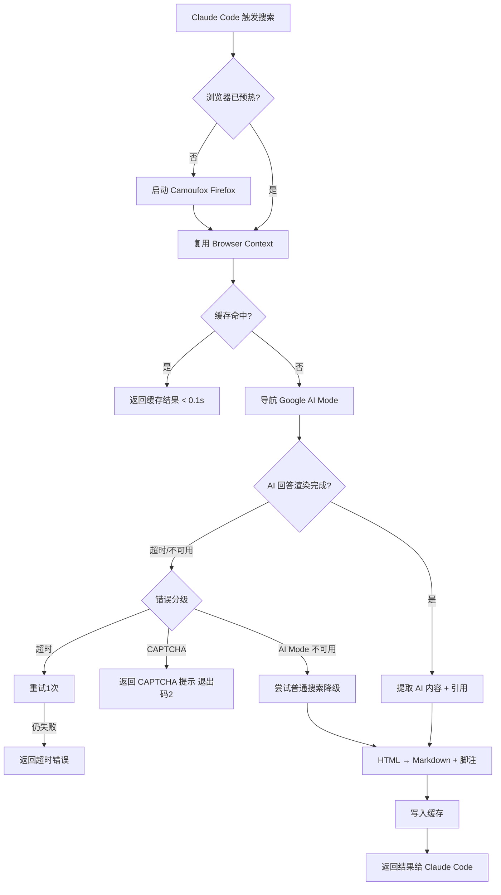

# 产品需求文档 (PRD) v1.0

**项目名称**: Google AI Mode Skill — Camoufox 迁移与性能优化
**文档状态**: 草稿 (Draft)
**版本号**: 1.0
**创建日期**: 2026-05-19

---

## 1. 执行摘要 (Executive Summary)

将 google-ai-mode-skill 的浏览器引擎从 Patchright (Chromium) 迁移到 Camoufox (Firefox 反检测)，实现全链路 ≤3 秒搜索性能。

---

## 2. 背景与上下文 (Background & Context)

### 2.1 问题陈述 (Problem Statement)
- **当前痛点**: 底层依赖 Patchright (Playwright 变体)，Chrome 启动慢、内存占用高、反检测能力弱
- **影响范围**: Claude Code 中所有使用 google-ai-mode skill 的 web research 场景
- **业务影响**: 搜索等待时间长（5-7s），频繁触发 CAPTCHA，维护困难

### 2.2 核心机会 (Opportunity)
- Camoufox 原生反指纹能力 → CAPTCHA 率进一步降低
- Firefox 引擎比 Chrome 轻量 → 内存/CPU 占用更低
- Git Submodule 管理 → Camoufox 上游更新一键同步
- 全链路优化 → 用户体验从 5-7s 降到 ≤3s

### 2.3 竞品与参考 (Reference & Competitors)
- **原项目 (PleasePrompto/google-ai-mode-skill)**: Patchright + Chrome，成熟但慢
- **Camoufox (daijro/camoufox)**: Firefox 反检测浏览器，API 接近 Playwright，学习成本低
- **我们的护城河**: Camoufox 反指纹 + 预热常驻 + LRU 缓存 = 更快更稳更低调

---

## 3. 目标与范围 (Goals & Non-Goals)

### 3.1 目标 (Goals)

- **[G1]**: 全链路搜索端到端延迟 ≤ 3 秒 (P95，含浏览器导航→AI 等待→提取→转换)
- **[G2]**: Camoufox 通过 Git Submodule 管理，`git submodule update` 即可同步上游
- **[G3]**: 浏览器实例预热常驻，首搜免冷启动
- **[G4]**: 内存 LRU 缓存，相同查询 TTL 内命中直接返回（< 0.1s）
- **[G5]**: 分级错误降级：CAPTCHA / 网络超时 / AI Mode 不可用各有对应策略

### 3.2 非目标 (Non-Goals)

- **[NG1]**: 不支持 MCP Server 模式（仅 Claude Code Skill）
- **[NG2]**: 不做多浏览器引擎并存（只支持 Camoufox/Firefox）
- **[NG3]**: 不改造 Google AI Mode 的搜索结果内容（Google 的 AI 回答内容不由我们控制）
- **[NG4]**: 不做并发多查询（单次搜索单查询）
- **[NG5]**: 不做用户登录态云端同步（仅本地持久化）

---

## 4. 用户故事与需求清单 (User Stories)

### US-001: Camoufox 引擎替换 [REQ-001] (优先级: P0)

*   **故事描述**: 作为 Claude Code 用户，当我触发 google-ai-mode skill 搜索时，底层使用 Camoufox (Firefox) 而非 Patchright (Chrome)，获得更好的反检测能力和更低资源占用。
*   **用户价值**: Capatcha 更少，搜索更稳定。
*   **独立可测性**: 替换后的 BrowserFactory 能独立启动 Camoufox、导航到 google.com、执行基本页面操作，不依赖搜索流程。
*   **涉及系统**: BrowserEngine
*   **验收标准 (Acceptance Criteria)**:
    *   [ ] **Given** skill 已安装且 Camoufox submodule 已初始化, **When** BrowserFactory 启动浏览器, **Then** 成功启动 Firefox 实例（非 Chrome），且 `browser_type.name` 为 `"firefox"`。
    *   [ ] **Given** 浏览器已启动, **When** 导航到 `https://www.google.com`, **Then** 页面成功加载，不会被 Google 识别为自动化工具。
    *   [ ] **异常处理**: 当 Camoufox 二进制未找到时，系统必须报清晰错误 `Camoufox not found. Run: git submodule update --init` 并退出码 1。
*   **边界与极限情况**:
    *   首次安装时 Camoufox submodule 未初始化
    *   macOS / Linux 下 Firefox 路径差异
    *   Camoufox 上游 breaking change 兼容性

### US-002: 浏览器预热常驻 [REQ-002] (优先级: P0)

*   **故事描述**: 作为 Claude Code 用户，当我首次触发搜索后，浏览器实例保持 alive，后续搜索无需等待冷启动。
*   **用户价值**: 第二次及以后的搜索免去 1-2s 浏览器启动时间。
*   **独立可测性**: 第一次搜索后检查进程列表中是否存在 Firefox 实例；第二次搜索观察是否复用同一实例。
*   **涉及系统**: BrowserEngine
*   **验收标准 (Acceptance Criteria)**:
    *   [ ] **Given** 首次搜索已完成, **When** 发起第二次搜索, **Then** 复用已有浏览器 context（不重新启动进程），页面导航时间 < 500ms。
    *   [ ] **Given** 浏览器闲置超过 5 分钟, **When** 下次搜索时, **Then** 自动检测 context 状态，若已失效则重新启动。
    *   [ ] **异常处理**: 当浏览器进程意外崩溃时，系统必须自动重新启动，用户无感知。
*   **边界与极限情况**:
    *   浏览器进程被用户手动 kill
    *   系统休眠/唤醒后 context 状态
    *   内存压力下 OS kill 浏览器进程

### US-003: 内存 LRU 缓存 [REQ-003] (优先级: P1)

*   **故事描述**: 作为 Claude Code 用户，当我在短时间内重复搜索相同内容时，结果直接从缓存返回，无需等待网络请求。
*   **用户价值**: 重复查询 < 0.1s 返回，节省等待时间。
*   **独立可测性**: 执行相同查询两次，第二次耗时 < 0.1s 且结果与第一次一致。
*   **涉及系统**: SearchEngine, CacheManager
*   **验收标准 (Acceptance Criteria)**:
    *   [ ] **Given** 查询 "React hooks 2026" 已完成并缓存, **When** 5 分钟内再次查询 "React hooks 2026", **Then** 直接返回缓存结果，耗时 < 100ms。
    *   [ ] **Given** 缓存已满 (默认最大 50 条 [ASSUMPTION: 内存占用约 5-10MB，适合本地 Skill 场景]), **When** 新查询写入缓存, **Then** 最少使用的条目被淘汰 (LRU)。
    *   [ ] **Given** 缓存条目超过 TTL (默认 5 分钟), **When** 再次查询相同关键词, **Then** 缓存过期，重新执行搜索。
    *   [ ] **异常处理**: 当内存不足时，缓存自动缩容而不触发 OOM。
*   **边界与极限情况**:
    *   查询参数完全相同但大小写不同
    *   TTL 边界（刚好到期的瞬间）
    *   缓存条目的 Markdown 内容过大

### US-004: 分级错误降级 [REQ-004] (优先级: P1)

*   **故事描述**: 作为 Claude Code 用户，当搜索遇到问题时，系统根据错误类型智能处理，而非一律崩溃。
*   **用户价值**: 不同类型的失败有不同的优雅处理，提高搜索成功率。
*   **独立可测性**: 模拟各类错误场景，验证系统响应符合预期。
*   **涉及系统**: SearchEngine
*   **验收标准 (Acceptance Criteria)**:
    *   [ ] **Given** Google 返回 CAPTCHA, **When** 检测到 CAPTCHA 页面, **Then** 返回明确错误信息 "CAPTCHA 触发，请运行 `--show-browser` 手动解决"，退出码 2。
    *   [ ] **Given** 网络请求超时 (15s), **When** 超时发生, **Then** 自动重试 1 次，若仍失败返回 "网络超时，请检查连接"。
    *   [ ] **Given** AI Mode 不可用（地区限制）, **When** 页面无 AI overview 元素且超时, **Then** 尝试提取普通搜索结果摘要作为降级输出，标记 `[ASSUMPTION: 非 AI 结果]`。
    *   [ ] **异常处理**: 连续 3 次任意失败后，系统放弃并返回聚合错误摘要，不进入无限重试。
*   **边界与极限情况**:
    *   Google A/B 测试导致 DOM 结构变化
    *   网络间歇性断开（非完全超时）
    *   CAPTCHA 与 AI Mode 不可用同时发生

### US-005: 全链路性能达标 [REQ-005] (优先级: P0)

*   **故事描述**: 作为 Claude Code 用户，一次完整搜索（从触发到拿到 Markdown 结果）P95 不超过 3 秒。
*   **用户价值**: 等待时间减半，工作效率提升。
*   **独立可测性**: 运行 10 次不同查询，统计 P95 端到端延迟，验证 ≤ 3s。
*   **涉及系统**: 全部（BrowserEngine → SearchEngine → ContentExtractor → MarkdownConverter）
*   **验收标准 (Acceptance Criteria)**:
    *   [ ] **Given** 浏览器已预热, **When** 执行 10 次不同查询, **Then** P95 端到端延迟 ≤ 3000ms。
    *   [ ] **Given** 首次搜索（含冷启动）, **When** 执行搜索, **Then** 端到端延迟 ≤ 8000ms（含 Firefox 冷启动）。
    *   [ ] **异常处理**: 当任一环节超过其分配的时间预算时，记录性能日志但不中断搜索。
*   **边界与极限情况**:
    *   网络波动导致页面加载变慢
    *   Google 搜索结果页特别大（AI 回答很长）
    *   机器低电量/性能模式下 CPU 降频

### US-006: Camoufox Submodule 管理 [REQ-006] (优先级: P1)

*   **故事描述**: 作为项目维护者，我可以通过 `git submodule update --remote` 一键更新 Camoufox 到最新上游版本。
*   **用户价值**: 上游 bug 修复和反指纹更新能快速同步到本项目。
*   **独立可测性**: 添加 submodule 后执行 `git submodule update --init`，验证 Camoufox 可正常 import 和使用。
*   **涉及系统**: BrowserEngine
*   **验收标准 (Acceptance Criteria)**:
    *   [ ] **Given** 仓库已 clone, **When** 执行 `git submodule update --init`, **Then** Camoufox 源码出现在 `libs/camoufox/` 目录且可被 Python import。
    *   [ ] **Given** Camoufox 上游有新版本, **When** 执行 `git submodule update --remote`, **Then** 本地 Camoufox 更新到最新 commit。
    *   [ ] **异常处理**: 当 Camoufox 上游 breaking change 导致脚本运行失败时，报错信息包含 Camoufox 版本号和兼容性提示。
*   **边界与极限情况**:
    *   Camoufox 子模块在浅克隆 (shallow clone) 场景下的行为
    *   上游仓库被删除或重命名
    *   submodule 版本锁定与 SKILL.md 版本号的对应关系

### US-007: 登录状态本地持久化 [REQ-007] (优先级: P1)

*   **故事描述**: 作为 Claude Code 用户，我的 Google 登录状态保存在本地浏览器 Profile 中，跨搜索、跨重启保持。
*   **用户价值**: 一次登录/一次 CAPTCHA 解决后，后续搜索免验证。
*   **独立可测性**: 执行一次搜索（含 CAPTCHA 解决），关闭 Claude Code，重新打开搜索，验证不需要重新 CAPTCHA。
*   **涉及系统**: BrowserEngine (BrowserProfile)
*   **验收标准 (Acceptance Criteria)**:
    *   [ ] **Given** 已成功执行过一次搜索, **When** 重启 Claude Code 后再次搜索, **Then** 使用同一浏览器 Profile（cookies/session 保持），无需重新登录。
    *   [ ] **Given** 浏览器 Profile 目录不存在, **When** 首次搜索, **Then** 自动创建 Profile 目录于 `~/.cache/google-ai-mode-skill/`（与原项目路径兼容）。
    *   [ ] **异常处理**: 当 Profile 目录损坏时，自动备份损坏 Profile 并创建全新 Profile，提示用户可能需要重新登录。
*   **边界与极限情况**:
    *   Profile 目录权限问题（只读文件系统）
    *   Chrome 旧 Profile 与新 Camoufox Firefox Profile 格式不兼容 → 自动迁移或提示重建
    *   磁盘空间不足

---

## 5. 用户体验与设计 (User Experience)

### 5.1 关键用户旅程 (Key User Flows)

### 5.2 交互规范 (Design Guidelines)
- **视觉风格**: 无 GUI，纯命令行 + Markdown 输出
- **响应模式**: `--debug` 模式打印每步耗时，`--save` 保存结果到文件
- **平台兼容**: macOS / Linux，Python 3.8+

---

## 6. 约束与限制 (Constraint Analysis)

### 6.1 技术约束 (Technical Constraints)
*   **浏览器引擎**: Camoufox (Firefox 133+) 仅支持，不再兼容 Patchright/Chrome
*   **性能底线**: 端到端 P95 ≤ 3s（预热后），首次冷启动 ≤ 8s
*   **扩展性预期**: 单用户单查询，不做并发设计
*   **Python 版本**: ≥ 3.8（与原项目一致）
*   **部署位置**: `~/.claude/skills/google-ai-mode/`（仓库即 Skill）

### 6.2 安全与合规 (Security & Compliance)
*   **数据安全**: 浏览器 Profile 仅本地存储，不上传
*   **搜索合规**: 使用公共 Google Search，尊重 rate limit
*   **隐私**: 搜索日志（`--debug`）仅本地保存，用户自行管理

### 6.3 时间与资源 (Time & Resources)
*   **交付死线**: 无硬性 deadline
*   **依赖**: Camoufox PyPI 包 / Git Submodule 可用性

---

## 7. 成功指标 (Success Metrics)

| 核心指标 (Metric) | 目标值 (Target) | 测量方式 (Measurement Method) |
| ----------------- | --------------- | ----------------------------- |
| 端到端搜索延迟 (P95) | ≤ 3000ms | `--debug` 日志中的计时 |
| 缓存命中率 (5min窗口) | > 30% | CacheManager stats |
| CAPTCHA 触发率 | < 5% | 搜索日志统计 |
| 错误恢复成功率 | > 80% | 分级降级后的成功/失败比 |

---

## 8. 完成标准 (Definition of Done)

*   [ ] 所有 7 条 User Story 的验收标准全部测试通过
*   [ ] Camoufox Submodule 在 `libs/camoufox/` 可正常 import
*   [ ] 10 次搜索 P95 ≤ 3s（预热后）
*   [ ] LRU 缓存命中返回 < 100ms
*   [ ] CAPTCHA / 超时 / AI Mode 不可用三种错误场景均有正确响应
*   [ ] SKILL.md 更新为 Camoufox 版本的说明
*   [ ] `--debug` 日志包含每环节时间戳
*   [ ] 旧 Chrome Profile → Firefox Profile 迁移或提示

---

## 9. 附录 (Appendix)

### 9.1 术语表 (Glossary)
- **Camoufox**: 基于 Firefox 的反检测浏览器自动化库 (daijro/camoufox)
- **Patchright**: 旧版浏览器引擎 (Playwright/Chromium 变体)，本次被替换
- **Google AI Mode**: Google `udm=50` 搜索模式，返回 AI 综合摘要+引用
- **LRU**: Least Recently Used 缓存淘汰策略
- **TTL**: Time To Live，缓存过期时间
- **Browser Profile**: Firefox 持久化配置文件，保存 cookies/session/偏好

### 9.2 参考资料 (References)
- [原项目 google-ai-mode-skill](https://github.com/PleasePrompto/google-ai-mode-skill)
- [Camoufox 仓库](https://github.com/daijro/camoufox)
- [Camoufox 文档](https://camoufox.com)
- 概念模型: `.anws/v1/concept_model.json`
