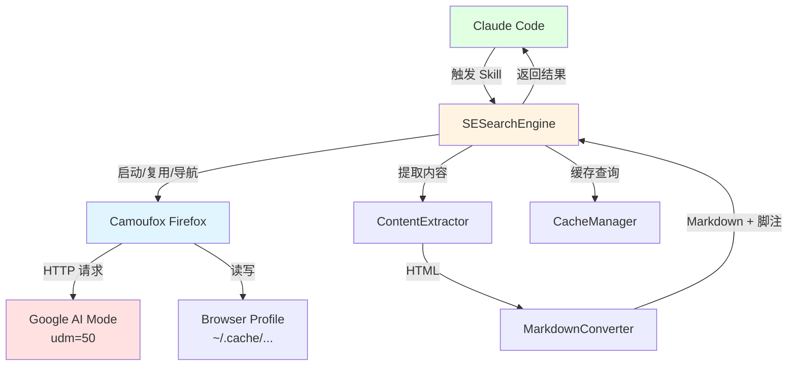
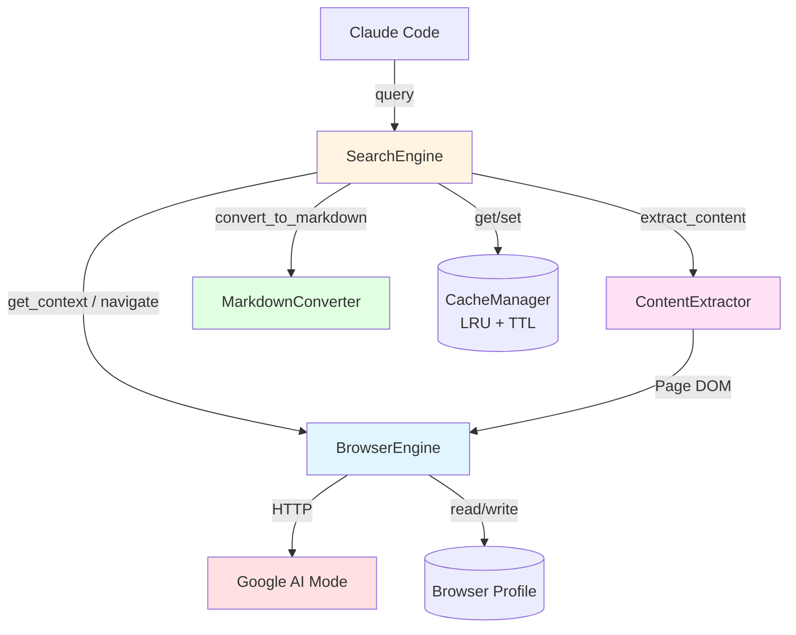

# 系统架构总览 (Architecture Overview)

**项目**: Google AI Mode Skill — Camoufox 迁移
**版本**: 1.0
**日期**: 2026-05-19

---

## 1. 系统上下文 (System Context)

### 1.1 C4 Level 1 - 系统上下文图



### 1.2 关键用户 (Key Users)
- **Claude Code Agent**: 唯一"用户"，通过 Skill 协议触发搜索
- **开发者/维护者**: 通过 `git submodule update` 管理 Camoufox 版本

### 1.3 外部系统 (External Systems)
- **Google AI Mode**: `google.com/search?udm=50`，返回 AI 综合摘要
- **Camoufox (daijro/camoufox)**: Git Submodule 管理的浏览器引擎

---

## 2. 系统清单 (System Inventory)

### System 1: BrowserEngine
**系统ID**: `browser-engine`

**职责 (Responsibility)**:
- Camoufox/Firefox 实例生命周期管理（启动、预热常驻、关闭）
- 浏览器 Profile 持久化（cookies、session、偏好设置）
- 反检测配置（UA、指纹、语言区域）
- 页面导航与等待

**边界 (Boundary)**:
- **输入**: SearchEngine 调用的 `get_context()`, `navigate(url)`, `wait_for_ai()`
- **输出**: 已加载 Google AI Mode 页面的 Page 对象
- **依赖**: Camoufox (外部, Git Submodule)

**关联需求**: [REQ-001] 引擎替换, [REQ-002] 预热常驻, [REQ-007] 登录持久化

**技术栈**:
- Camoufox (Firefox 133+)
- Python 3.8+ (camoufox Python bindings)
- 进程管理: subprocess + 心跳检测

**源码路径**: `src/browser/`

**设计文档**: `04_SYSTEM_DESIGN/browser-engine.md` (待创建)

---

### System 2: SearchEngine
**系统ID**: `search-engine`

**职责 (Responsibility)**:
- 搜索全流程编排（协调 BrowserEngine → ContentExtractor → MarkdownConverter）
- 查询优化（关键词改写、年份追加、语言指定）
- LRU 内存缓存管理（命中检查、TTL 过期、淘汰写入）
- 分级错误降级（CAPTCHA 检测 / 超时重试 / 降级提取）
- CLI 参数解析（`--query`, `--save`, `--debug`, `--show-browser`）

**边界 (Boundary)**:
- **输入**: 用户查询字符串 + CLI 参数
- **输出**: Markdown 搜索结果（含脚注引用） + 退出码
- **依赖**: browser-engine, content-extractor, markdown-converter

**关联需求**: [REQ-003] LRU 缓存, [REQ-004] 分级降级, [REQ-005] 性能达标

**技术栈**:
- Python 3.8+ (argparse, asyncio)
- LRU Cache: `collections.OrderedDict` + TTL timestamp

**源码路径**: `src/search/`

**设计文档**: `04_SYSTEM_DESIGN/search-engine.md` (待创建)

---

### System 3: ContentExtractor
**系统ID**: `content-extractor`

**职责 (Responsibility)**:
- 从 Google AI Mode 页面 DOM 提取 AI 概述正文
- 多语言引用链接提取（17 个选择器回退链）
- AI 回答完成检测（SVG thumbs-up / aria-label / 文本 / 超时）
- HTML 内容清洗（去广告、去导航、去无关元素）

**边界 (Boundary)**:
- **输入**: Page 对象（Camoufox 渲染完成的 Google AI 页面）
- **输出**: 结构化数据 `{ai_text: str, citations: [{title, url}], raw_html: str}`
- **依赖**: browser-engine (Page 对象来源)

**关联需求**: [REQ-005] 性能达标

**技术栈**:
- BeautifulSoup4 (HTML 解析)
- JavaScript 注入 (Camoufox evaluate)

**源码路径**: `src/extractor/`

**设计文档**: `04_SYSTEM_DESIGN/content-extractor.md` (待创建)

---

### System 4: MarkdownConverter
**系统ID**: `markdown-converter`

**职责 (Responsibility)**:
- HTML → Markdown 转换
- 引用脚注内联格式化 (`[1][2][3]`)
- 源列表生成 (Sources 段落)
- 输出文件保存 (`--save` 到 `results/`)

**边界 (Boundary)**:
- **输入**: ContentExtractor 输出的 `{ai_text_html, citations}`
- **输出**: 完整 Markdown 字符串（含脚注 + Sources）
- **依赖**: 无（纯函数，无外部系统依赖）

**关联需求**: [REQ-005] 性能达标

**技术栈**:
- html-to-markdown / markdownify (转换库)

**源码路径**: `src/converter/`

**设计文档**: `04_SYSTEM_DESIGN/markdown-converter.md` (待创建)

---

## 3. 系统边界矩阵 (System Boundary Matrix)

| 系统 | 输入 | 输出 | 依赖系统 | 关联需求 |
|------|------|------|---------|---------|
| BrowserEngine | `get_context()`, `navigate(url)` | Page 对象 | Camoufox (外部) | REQ-001, 002, 007 |
| SearchEngine | 查询字符串 + CLI args | Markdown 结果 | BrowserEngine, ContentExtractor, MarkdownConverter | REQ-003, 004, 005 |
| ContentExtractor | Page 对象 | `{ai_text, citations, html}` | BrowserEngine | REQ-005 |
| MarkdownConverter | `{html, citations}` | Markdown 字符串 | 无 | REQ-005 |

---

## 4. 系统依赖图 (System Dependency Graph)



**依赖关系说明**:
- **SearchEngine 是唯一编排者** — 单向依赖所有子系统，子系统间无直接依赖
- **BrowserEngine 被 SearchEngine 和 ContentExtractor 共同依赖** — Page 对象是共享资源
- **MarkdownConverter 无依赖** — 纯转换函数，可独立测试
- **无循环依赖** ✅

---

## 5. 技术栈总览 (Technology Stack Overview)

| Layer | Technology | Used By |
|-------|-----------|---------|
| **Browser** | Camoufox (Firefox 133+) | BrowserEngine |
| **Orchestrator** | Python 3.8+ (argparse, asyncio) | SearchEngine |
| **HTML Parser** | BeautifulSoup4 | ContentExtractor |
| **Markdown** | html-to-markdown | MarkdownConverter |
| **Cache** | collections.OrderedDict + TTL | SearchEngine (CacheManager) |
| **Profile** | Firefox 持久化文件系统 Profile | BrowserEngine |
| **Submodule** | Git Submodule (daijro/camoufox) | Repo 根 |

---

## 6. 物理代码结构 (Physical Code Structure)

```text
google-ai-mode-skill/              # 仓库根 = Skill 部署位置
├── SKILL.md                       # Claude Code Skill 定义
├── README.md                      # 项目说明
├── requirements.txt               # Python 依赖
├── setup.sh                       # 首次安装脚本
├── .gitignore
├── .gitmodules                    # Camoufox submodule 声明
│
├── libs/                          # 外部依赖 (Git Submodules)
│   └── camoufox/                  # daijro/camoufox (submodule)
│
├── src/                           # 项目源码 (从原 google-ai-mode 复制演进)
│   ├── browser/                   # System 1: BrowserEngine
│   │   ├── __init__.py
│   │   ├── browser_factory.py     # Camoufox 启动/配置/预热
│   │   ├── profile_manager.py     # Profile 持久化
│   │   └── stealth.py             # 反检测配置
│   │
│   ├── search/                    # System 2: SearchEngine
│   │   ├── __init__.py
│   │   ├── engine.py              # 搜索编排主逻辑
│   │   ├── cache.py               # LRU + TTL 缓存
│   │   ├── error_handler.py       # 分级降级处理
│   │   ├── cli.py                 # argparse CLI 入口
│   │   └── run.py                 # venv 包装器 (兼容原接口)
│   │
│   ├── extractor/                 # System 3: ContentExtractor
│   │   ├── __init__.py
│   │   ├── ai_detector.py         # AI 完成检测 (多语言)
│   │   ├── citation_extractor.py  # 引用提取 (17 选择器)
│   │   └── dom_cleaner.py         # HTML 清洗
│   │
│   └── converter/                 # System 4: MarkdownConverter
│       ├── __init__.py
│       ├── html_to_md.py          # HTML → Markdown
│       └── footnote_formatter.py  # [1][2][3] 脚注格式化
│
├── results/                       # 搜索结果保存 (--save)
├── logs/                          # 调试日志 (--debug)
├── .cache/                        # 本地缓存 (浏览器 Profile)
│   └── chrome_profile/ → firefox_profile/  # 兼容旧路径名
│
├── .anws/                         # 架构文档
└── .claude/                       # Claude Code 工作流
```

**关键路径约定**:
- `libs/camoufox/` → Git Submodule，`PYTHONPATH` 添加此路径
- `src/` → 核心代码，从原 `~/.claude/skills/google-ai-mode/scripts/` 复制重构
- 旧路径 `.cache/chrome_profile/` → 新路径 `.cache/firefox_profile/`（首次运行自动迁移）

---

## 7. 拆分原则与理由 (Decomposition Rationale)

### 为什么拆分为 4 个系统？

**职责维度**:
- BrowserEngine (浏览器管理) vs ContentExtractor (内容提取) vs MarkdownConverter (格式转换) — 职责边界清晰，各自独立可测

**变化频率**:
- SearchEngine (编排逻辑) 最频繁变更 — 新增参数、优化流程
- MarkdownConverter (格式转换) 最稳定 — 格式规范确定后极少改动
- BrowserEngine 随 Camoufox 上游更新而变化

**测试独立性**:
- MarkdownConverter 纯函数，100% 单元测试，无需浏览器
- ContentExtractor 可 mock Page 对象做单元测试
- BrowserEngine 需要 E2E 集成测试（真浏览器）

### 为什么不进一步拆分？

- **CacheManager 不独立为系统**: 它是 SearchEngine 内部的 LRU 字典，50 行代码，独立系统过度拆分
- **BrowserProfile 属于 BrowserEngine**: Profile 是浏览器实例的持久化状态，不是独立部署单元
- **VenVManager (setup_environment.py) 不是系统**: 它是安装引导脚本，非运行时组件

---

## 8. 系统复杂度评估 (Complexity Assessment)

**系统数量**: 4 个系统

**评估**:
- ✅ 数量合理 (< 10)
- ✅ 边界清晰：每个系统有明确的输入/输出定义
- ✅ 无循环依赖：单向依赖树
- ✅ 每个系统可独立测试

**单点风险**:
- SearchEngine 是唯一编排者 — 若出错影响全链路（通过分级降级缓解）
- BrowserEngine 依赖外部 Camoufox 上游 — 通过 Submodule 版本锁定缓解

---

## 9. 下一步行动 (Next Steps)

1. **ADR 写入**: 将 Step 3 技术评估结果写入 `.anws/v1/03_ADR/ADR_001_TECH_STACK.md`
2. **系统详细设计**: 运行 `/design-system` 为 4 个系统分别设计
3. **任务拆解**: 运行 `/blueprint` 生成 `.anws/v1/05_TASKS.md`
