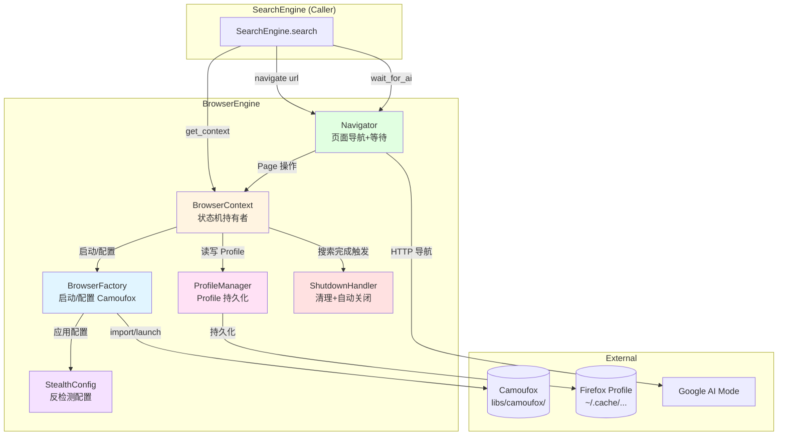
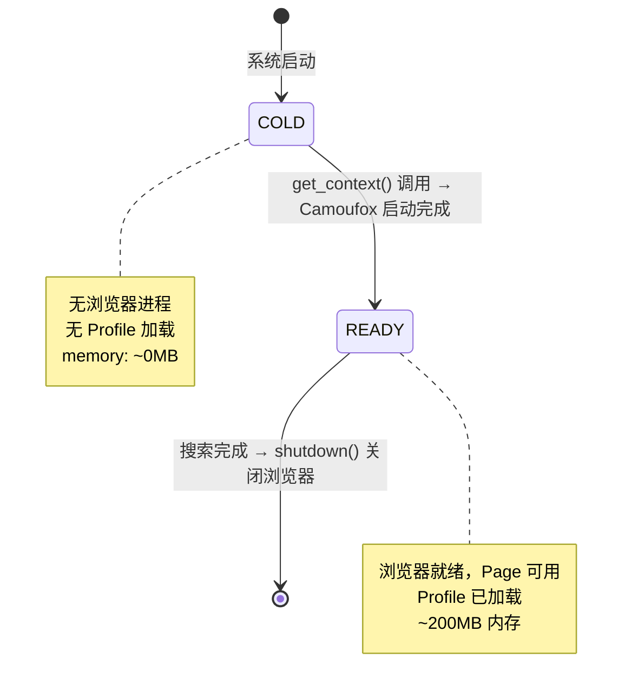
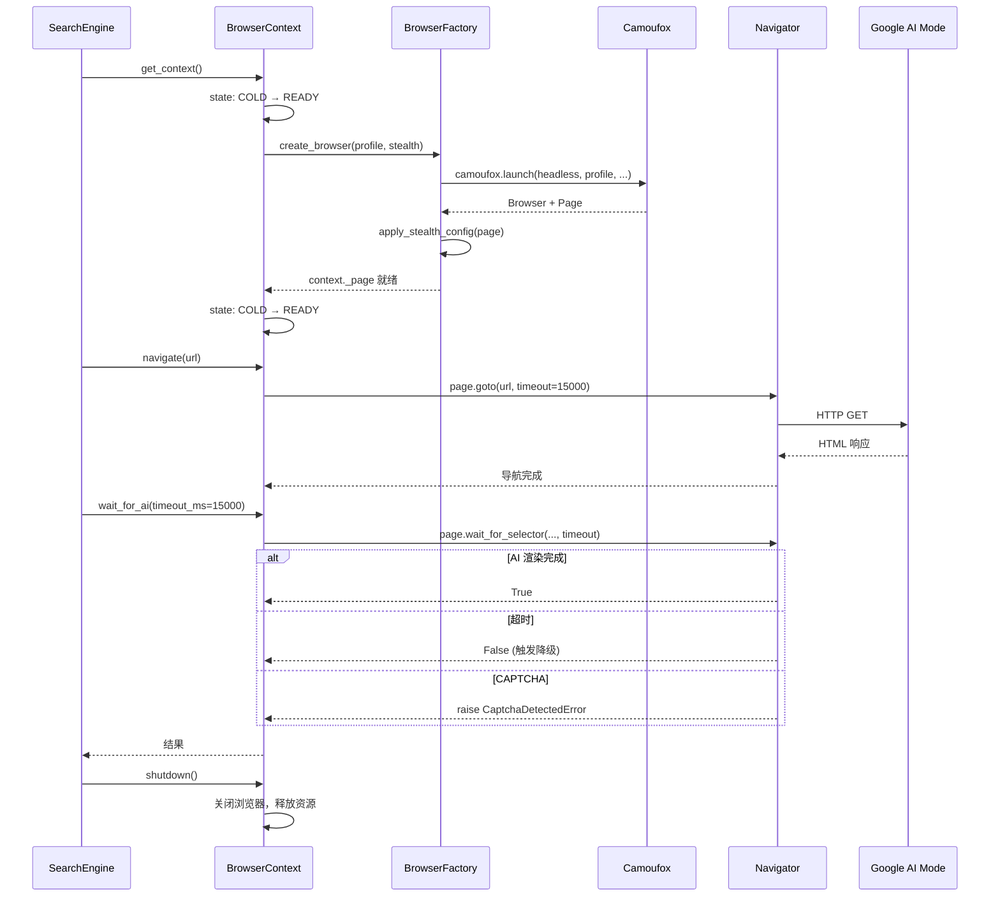
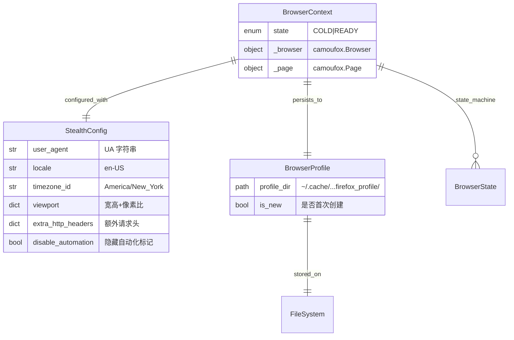
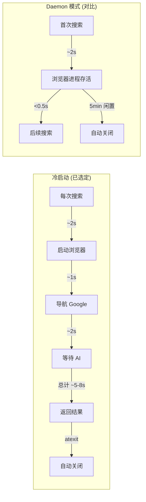
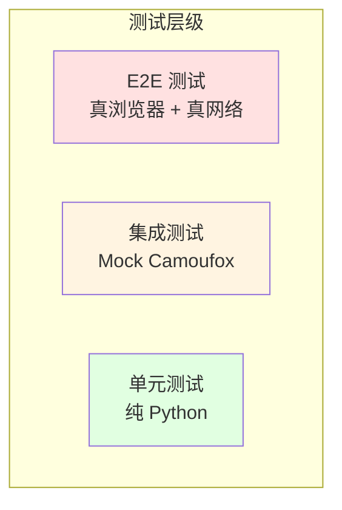

# System Design: BrowserEngine

---

**系统 ID**: `browser-engine`
**设计版本**: 1.0
**创建日期**: 2026-05-19
**状态**: Draft

---

## 1. 概览 (Overview)

BrowserEngine 是 google-ai-mode-skill 的浏览器管理子系统，负责 Camoufox/Firefox 实例的完整生命周期管理。它向上层 SearchEngine 提供稳定的浏览器上下文抽象，向下管理 Camoufox 进程、Profile 持久化和反检测配置。

核心能力：
- **浏览器生命周期管理**: 启动、按需使用、自动关闭
- **Profile 持久化**: 跨会话保持 cookies/login/偏好
- **反检测配置**: UA 伪装、指纹隐藏、自动化标记移除
- **页面导航与等待**: URL 导航 + AI Mode 加载完成检测

---

## 2. 目标与非目标 (Goals & Non-Goals)

### 2.1 目标

- **[G-BE-1]** 提供稳定的 `BrowserContext` 接口，SearchEngine 无需感知底层是 Camoufox/Firefox
- **[G-BE-2]** 实现 COLD -> READY 简化状态机，状态转换可观测
- **[G-BE-3]** 每次搜索冷启动浏览器，搜索完成后自动关闭（关联 [REQ-002]）
- **[G-BE-4]** Profile 持久化于 `~/.cache/google-ai-mode-skill/firefox_profile/`，跨重启保持登录态（关联 [REQ-007]）
- **[G-BE-5]** 反检测配置可组合、可审计，每次启动打印当前 fingerprint 配置（`--debug` 模式）
- **[G-BE-6]** 进程异常崩溃时 finally + atexit 兜底清理，确保无残留进程

### 2.2 非目标

- **[NG-BE-1]** 不支持多浏览器引擎并存（仅 Camoufox，关联 PRD [NG2]）
- **[NG-BE-2]** 不支持并发多 Tab/多 Page（单次搜索单 Page，关联 PRD [NG4]）
- **[NG-BE-3]** 不提供 CDP (Chrome DevTools Protocol) 兼容层
- **[NG-BE-4]** 不做浏览器集群/分布式管理（无 selenium-grid 等效）
- **[NG-BE-5]** 不封装 Camoufox 上游未提供的 API（如本地 AI 模型注入）

---

## 3. 背景 (Background)

### 3.1 问题域

google-ai-mode-skill 原使用 Patchright (Chromium) 驱动 Google AI Mode 搜索，面临三重挑战：

1. **反检测弱**: Patchright 是 Playwright fork，反检测依赖手动 stealth 配置（UA 伪装、`--disable-blink-features=AutomationControlled`），Google 反自动化策略持续升级，CAPTCHA 触发率上升
2. **冷启动慢**: Chrome 无头模式启动 ~2s，CLI 模式下每次 `python run.py --query "..."` 都是新进程，预热常驻无法跨进程生效
3. **维护不确定**: Patchright 社区小，上游更新节奏不可控

技术选型决策见 [ADR-001: 浏览器引擎选型 -- Camoufox](../03_ADR/ADR_001_TECH_STACK.md)，集成方式见 [ADR-002: Camoufox 集成方式 -- Git Submodule](../03_ADR/ADR_002_CAMOUFOX_INTEGRATION.md)。

### 3.2 关键假设

- [ASSUMPTION] 用户机器已安装 Firefox 133+，Camoufox 的 `./camoufox fetch` 会下载对应二进制
- [ASSUMPTION] Google AI Mode (`udm=50`) 不同地区渲染相同 DOM 结构（验证点：多语言处理在 ContentExtractor 层）
- [ASSUMPTION] 单用户单进程，无并发安全风险（关联 PRD [NG4]）
- [ASSUMPTION] Profile 目录 `~/.cache/` 有读写权限
- [ASSUMPTION] 网络可以直连 `google.com`（不走代理时 `--proxy` 可选）

---

## 4. 系统架构 (System Architecture)

### 4.1 组件架构图



### 4.2 组件职责拆分

| 组件 | 文件 | 职责 |
|------|------|------|
| **BrowserContext** | `browser_factory.py` (类 `BrowserContext`) | 状态机持有者，管理 `_state` 枚举，协调所有子组件 |
| **BrowserFactory** | `browser_factory.py` (函数 `create_browser`) | Camoufox 实例化、launch/connect、反检测配置注入 |
| **ProfileManager** | `profile_manager.py` | Profile 路径管理、创建/恢复/备份、Chrome->Firefox 迁移提示 |
| **StealthConfig** | `stealth.py` | 反检测配置对象，聚合 UA/locale/headers/flags |
| **ShutdownHandler** | `browser_factory.py` (函数 `shutdown`) | atexit + finally 兜底，确保浏览器进程干净退出 |
| **Navigator** | `browser_factory.py` (函数 `navigate`, `wait_for_ai`) | 页面导航 + Google AI Mode 加载完成等待 |

---

## 5. 状态机设计 (State Machine)

### 5.1 状态定义



### 5.2 状态转换决策表

| 事件 | 当前状态 | 下一状态 | 前置条件 | 副作用 |
|------|---------|---------|---------|--------|
| `get_context()` 调用 | COLD | READY | Camoufox launch 无异常 | 触发 `create_browser()`，记录启动耗时 |
| `create_browser()` 失败 | COLD | [*] | 异常抛出 | 清理残留进程 |
| `shutdown()` | READY | [*] | 搜索完成后主动调用 | 关闭进程，保存 Profile |

### 5.3 伪代码实现框架

```python
from enum import Enum, auto
import asyncio
import time
from pathlib import Path

class BrowserState(Enum):
    COLD = auto()
    READY = auto()

class BrowserContext:
    """浏览器实例上下文，持有 Camoufox 进程和 Page 引用。
       每次搜索新实例，用完即关。"""
    
    def __init__(self):
        self._state = BrowserState.COLD
        self._browser = None
        self._page = None
        self._context = None
        self._stealth_config = StealthConfig.load()
        self._profile = ProfileManager(resolve_profile_path())
    
    async def get_context(self) -> BrowserContext:
        """启动浏览器并返回就绪的 BrowserContext"""
        if self._state == BrowserState.READY:
            return self
        
        return await self._cold_start()
    
    async def _cold_start(self) -> BrowserContext:
        self._browser, self._context, self._page = await create_browser(
            headless=not SHOW_BROWSER,
            profile=self._profile,
            stealth=self._stealth_config,
        )
        self._state = BrowserState.READY
        return self
    
    async def shutdown(self):
        """关闭浏览器，释放资源"""
        if self._browser:
            await self._browser.close()
            self._state = BrowserState.COLD
```

---

## 6. 接口设计 (Interface Design)

### 6.1 操作契约表

BrowserEngine 向上层 SearchEngine 暴露三个核心操作，外加一个初始化和一个清理操作：

| 操作 | 输入参数 | 返回值 | 调用时机 | 错误模式 | 关联需求 |
|------|---------|--------|---------|---------|---------|
| **`get_context()`** | 无 | `BrowserContext` (持有 `self._page`) | 每次搜索开始时调用（触发冷启动） | `BrowserLaunchError` — Camoufox 未找到; `ProfileError` — Profile 损坏 | [REQ-001], [REQ-002] |
| **`navigate(url: str)`** | `url`: 目标 URL（Google AI Mode `udm=50`） | `None`（副作用: `context._page` 已导航） | `get_context()` 之后 | `NavigationTimeoutError` — 15s 超时; `ConnectionError` — 网络不可达 | [REQ-001] |
| **`wait_for_ai(timeout_ms: int = 15000)`** | `timeout_ms`: 最大等待时间 (ms) | `bool` — True=AI 完成, False=超时 | `navigate()` 之后 | `TimeoutError` — 超时未检测到 AI; `CaptchaDetectedError` — 检测到 CAPTCHA | [REQ-004] |
| **`shutdown()`** | 无 | `None` | 搜索完成后必须调用，atexit + finally 兜底 | 无（尽力清理，不抛异常） | [REQ-002] (资源释放) |
| **`health_check()`** | 无 | `bool` | 无（简化后不再需要心跳，移除） | 无 | - |

### 6.2 类型定义 (Typing Interface)

```python
from dataclasses import dataclass, field
from typing import Optional, Protocol
from pathlib import Path

class BrowserEngineProtocol(Protocol):
    """BrowserEngine 对外接口协议 (Structural Typing)"""
    
    async def get_context(self) -> "BrowserContext":
        """获取就绪的浏览器上下文"""
        ...
    
    async def navigate(self, url: str) -> None:
        """导航到目标 URL"""
        ...
    
    async def wait_for_ai(self, timeout_ms: int = 15000) -> bool:
        """等待 Google AI Mode 回答渲染完成"""
        ...
    
    async def shutdown(self) -> None:
        """优雅关闭浏览器"""
        ...
    
    async def health_check(self) -> bool:
        """检查浏览器连接健康"""
        ...

@dataclass
class StealthConfig:
    """反检测配置"""
    user_agent: str = (
        "Mozilla/5.0 (Macintosh; Intel Mac OS X 10_15_7) "
        "AppleWebKit/537.36 (KHTML, like Gecko) "
        "Chrome/125.0.0.0 Safari/537.36"
    )
    locale: str = "en-US"
    timezone_id: str = "America/New_York"
    viewport: dict = field(default_factory=lambda: {
        "width": 1280, "height": 800
    })
    extra_http_headers: dict = field(default_factory=lambda: {
        "Accept-Language": "en-US,en;q=0.9",
        "Accept": "text/html,application/xhtml+xml,application/xml;q=0.9,*/*;q=0.8",
    })
    disable_automation_flags: bool = True
    geoip: dict = field(default_factory=lambda: {
        "latitude": 40.7128, "longitude": -74.0060
    })

@dataclass
class BrowserProfile:
    """浏览器 Profile 配置"""
    path: Path
    is_new: bool = False

class BrowserContext:
    """浏览器上下文"""
    _state: "BrowserState"
    _browser: object  # camoufox.Browser
    _page: object     # camoufox.Page
    _context: object  # camoufox.BrowserContext
    _stealth: StealthConfig
    _profile: BrowserProfile

# 自定义异常层级
class BrowserEngineError(Exception):
    """浏览器引擎基础异常"""

class BrowserLaunchError(BrowserEngineError):
    """浏览器启动失败"""

class ProfileError(BrowserEngineError):
    """Profile 读写错误"""

class NavigationTimeoutError(BrowserEngineError):
    """页面导航超时"""

class CaptchaDetectedError(BrowserEngineError):
    """检测到 CAPTCHA"""
```

### 6.3 SearchEngine 调用时序



---

## 7. 数据模型 (Data Model)

### 7.1 核心数据结构



### 7.2 Profile 文件结构

```text
~/.cache/google-ai-mode-skill/firefox_profile/
├── prefs.js                 # Firefox 偏好设置
├── cookies.sqlite           # 持久的 cookies (登录态)
├── places.sqlite            # 书签/历史
├── key4.db / logins.json    # 保存的密码
├── permissions.sqlite       # 站点权限
├── storage/                 # localStorage / IndexedDB
│   └── default/
│       └── https+++www.google.com/
├── sessionstore-backups/    # 会话恢复
└── .profile.json            # BrowserEngine 元信息
    ├── version: 1
    ├── created_at: iso8601
    └── last_used: iso8601
```

### 7.3 Profile 迁移策略

当检测到旧路径 `~/.cache/google-ai-mode-skill/chrome_profile/` 存在时：

1. **检测阶段**: `ProfileManager` 在 `resolve_profile_path()` 时检查旧路径
2. **警告阶段**: `--debug` 模式下打印提示: `"Chrome Profile 已弃用，请重新登录 Google"`
3. **不自动迁移**: Chrome Profile 与 Firefox Profile 格式不兼容，不尝试迁移数据
4. **保留旧目录**: 不删除 `chrome_profile/`，用户自行处理

```python
def resolve_profile_path() -> Path:
    """解析 Profile 路径，处理旧 Chrome Profile 兼容"""
    firefox_profile = BASE_CACHE_DIR / "firefox_profile"
    chrome_profile = BASE_CACHE_DIR / "chrome_profile"
    
    if chrome_profile.exists() and not firefox_profile.exists():
        logger.warning(
            "检测到旧版 Chrome Profile: %s。"
            "Firefox Profile 与 Chrome 不兼容，将创建新 Profile。"
            "旧目录不会被删除，可手动清理。",
            chrome_profile
        )
    
    return firefox_profile
```

---

## 8. 反检测配置详解 (Stealth Configuration)

### 8.1 配置清单

Camoufox 在浏览器内核层做反检测，但 BrowserEngine 仍需显式配置以下项目以确保一致性：

| 配置项 | Camoufox 参数 | 值 | 目的 |
|--------|-------------|-----|------|
| `user_agent` | `user_agent=` | 真实 Chrome macOS UA | 与正常浏览器 UA 一致 |
| `locale` | `locale=` | `en-US` | Google 语言适配 |
| `timezone_id` | `timezone_id=` | `America/New_York` | 与时区指纹一致 |
| `viewport` | `viewport=` | `{width:1280, height:800}` | 常见桌面分辨率 |
| `extra_http_headers` | `extra_http_headers=` | Accept-Language, Accept | 正常浏览器请求头 |
| `geoip` | `geoip=` | NY 坐标 | IP 地理位置伪装 |
| `disable_automation` | 内置 | Camoufox 自动处理 | 移除 `navigator.webdriver` |
| Canvas 指纹 | 内置 | Camoufox 自动随机化 | 每次启动不同 canvas hash |
| WebGL 指纹 | 内置 | Camoufox 自动伪装 | vendor/renderer 伪装 |
| Font 指纹 | 内置 | Camoufox 自动标准化 | 与系统字体列表一致 |
| `--enable-automation` | 去除 | Camoufox 默认去除 | Firefox 启动参数清理 |

### 8.2 配置注入流程

```python
# stealth.py
class StealthConfig:
    """反检测配置，Camoufox launch 时注入"""
    
    @classmethod
    def load(cls, locale: str = "en-US") -> "StealthConfig":
        """加载默认反检测配置"""
        return cls(
            user_agent=cls._get_chrome_ua(),  # 动态版本号
            locale=locale,
            timezone_id="America/New_York",
            viewport={"width": 1280, "height": 800},
            extra_http_headers={
                "Accept-Language": f"{locale},{locale.split('-')[0]};q=0.9",
                "Accept": (
                    "text/html,application/xhtml+xml,"
                    "application/xml;q=0.9,*/*;q=0.8"
                ),
                "Upgrade-Insecure-Requests": "1",
            },
            disable_automation_flags=True,
            geoip={"latitude": 40.7128, "longitude": -74.0060},
        )

# browser_factory.py
async def create_browser(
    headless: bool,
    profile: BrowserProfile,
    stealth: StealthConfig,
) -> tuple:
    """创建 Camoufox 浏览器实例"""
    from camoufox import AsyncCamoufox
    
    browser = await AsyncCamoufox.launch(
        headless=headless,
        firefox_user_prefs={
            "dom.webdriver.enabled": False,      # [REQ-001] 反检测
            "dom.webnotifications.enabled": False, # 禁用通知
        },
        user_agent=stealth.user_agent,
        locale=stealth.locale,
        timezone_id=stealth.timezone_id,
        viewport=stealth.viewport,
        extra_http_headers=stealth.extra_http_headers,
        geoip=stealth.geoip,
        user_data_dir=str(profile.path),
        disable_automation_controlled=True,
    )
    
    context = await browser.new_context()
    page = await context.new_page()
    return browser, context, page
```

---

## 9. 技术选型 (Technology Decisions)

### 9.1 核心依赖

| 技术 | 版本 | 用途 | 选型依据 |
|------|------|------|---------|
| **Camoufox** | upstream main | 浏览器引擎 | [ADR-001](../03_ADR/ADR_001_TECH_STACK.md) |
| **Python** | 3.8+ | 运行时 | PRD 约束，与原项目一致 |
| **asyncio** | stdlib | 异步管理 | Camoufox API 为 async，asyncio 零依赖 |
| **Git Submodule** | - | 版本管理 | [ADR-002](../03_ADR/ADR_002_CAMOUFOX_INTEGRATION.md) |
| **pip install -e** | - | Python import | 编辑模式安装，无需发布 PyPI |

### 9.2 为什么不用其他方案

| 方案 | 排除原因 |
|------|---------|
| Selenium + undetected-chromedriver | Chrome 仍会被检测，反检测效果不如 Camoufox 内核级方案 |
| Playwright + playwright-stealth | 第三方 patch，上游不可控 |
| Puppeteer (Node.js) | 项目全栈 Python，引入 Node.js 增加部署复杂度 |
| browserless/chrome (Docker) | 需要 Docker 运行时，增加用户依赖 |
| 纯 HTTP requests + 无头 | Google AI Mode 需 JS 渲染，纯 HTTP 无法获取 |

---

## 10. Trade-offs (权衡分析)

### 10.1 Trade-off 1: 冷启动 vs Daemon 模式

**选择**: 冷启动（已选定）。



| 维度 | 冷启动 (已选定) | Daemon 模式 |
|------|---------|--------|
| P95 延迟 | 5-8s | < 3s (非首次) |
| 内存占用 | 按需 ~200MB，用完释放 | ~200MB 常驻 |
| 进程管理复杂度 | 简单，无状态 | 需要 HealthMonitor + 跨进程通信 |
| CLI 兼容性 | 天然适配 `python run.py` 新进程模式 | 需要后台 daemon 进程 + IPC |
| 崩溃恢复 | 自然恢复（每次新进程） | 需要 STALE/DEAD 状态处理 |
| 适用场景 | CLI 单次搜索 | 长时间运行的服务/并发搜索 |

**决策**: 选择冷启动。CLI 模式下每次 `python run.py --query "..."` 都是新进程，daemon 模式的常驻浏览器无法跨进程复用。冷启动虽然每次需要 2s 浏览器启动时间，但实现简单、无状态、天然适合 CLI 场景，且进程退出自动释放所有资源。

### 10.2 Trade-off 2: Camoufox vs Patchright API 差异

| API | Camoufox | Patchright (旧) | 差异 | 迁移影响 |
|-----|----------|----------------|------|---------|
| `launch()` | `AsyncCamoufox.launch(headless=...)` | `patchright.chromium.launch(headless=...)` | 类名不同,参数一致 | 替换 import |
| `new_page()` | `context.new_page()` | `context.new_page()` | 完全相同 | 无影响 |
| `goto()` | `page.goto(url, timeout=)` | `page.goto(url, timeout=)` | 完全相同 | 无影响 |
| `wait_for_selector()` | `page.wait_for_selector(...)` | `page.wait_for_selector(...)` | 完全相同 | 无影响 |
| `evaluate()` | `page.evaluate(js)` | `page.evaluate(js)` | 完全相同 | 无影响 |
| `is_connected()` | `browser.is_connected()` | `browser.is_connected()` | 完全相同 | 无影响 |
| User Data Dir | `user_data_dir=str(path)` | `user_data_dir=str(path)` | 参数名一致 | 路径从 chrome_profile 改为 firefox_profile |
| 反检测 | 内核级,大部分自动 | 手动 stealth 配置 | Camoufox 更简单 | 减少配置代码 |

**结论**: Camoufox 兼容 Playwright API，迁移成本低。主要变化是 `launch()` 函数名和反检测配置方式。

### 10.3 Trade-off 3: 主动关闭

**选择**: 每次搜索后主动关闭（已随冷启动方案确定）。

| 维度 | 主动关闭 (已选定) | 惰性关闭 |
|------|---------|-------------|
| 资源利用 | 每次搜索后释放 | 5min 空闲才释放 |
| 下次响应 | 每次都需冷启动 ~2s | 免冷启动 < 0.5s |
| 进程泄漏风险 | 风险低, atexit 兜底 | 需 HealthMonitor |
| 实现复杂度 | 低 | 中等（需要状态机 + 心跳） |

---

## 11. 安全考虑 (Security Considerations)

### 11.1 数据安全

| 风险 | 缓解措施 |
|------|---------|
| Profile 包含 Google 登录 cookies | 仅存储于 `~/.cache/` 本地，不上传，不共享 |
| Profile 目录权限过于开放 | 部署脚本 `chmod 700` 设置 Profile 目录 |
| `--save` 输出文件含搜索结果 | 保存到仓库内 `results/`，`.gitignore` 排除 |
| `--debug` 日志可能含敏感 URL | 仅本地 `logs/`，用户自行管理 |

### 11.2 反检测合规

| 风险 | 缓解措施 |
|------|---------|
| Camoufox 被 Google 识别 | 上游持续更新反指纹技术，通过 submodule 快速同步 |
| UA 过期 | `user_agent` 使用动态版本号生成，跟随主流 Chrome 版本 |
| 请求频率过高触发 rate limit | SearchEngine 层控制频率（非 BrowserEngine 职责） |

### 11.3 进程安全

| 风险 | 缓解措施 |
|------|---------|
| Firefox 进程逃逸 | Camoufox 使用标准 Firefox 二进制，非自定义构建 |
| 子进程残留 | 注册 `atexit` + `signal.SIGTERM` 处理器，shutdown 时 `process.kill()` |
| 内存泄漏 | HealthMonitor 检测到 OOM 趋势时主动重启 |

---

## 12. 性能考虑 (Performance Considerations)

### 12.1 时间预算分解

根据 PRD [REQ-005]，全链路搜索需 <= 8s (冷启动)。BrowserEngine 分得的时间预算：

| 环节 | 目标耗时 | 测量方式 | 负责组件 |
|------|---------|---------|---------|
| `get_context()` 冷启动 | < 4000ms | `time.perf_counter()` | BrowserFactory |
| `navigate()` | < 1000ms | `page.goto` 计时 | Navigator |
| `wait_for_ai()` | < 1500ms | `page.wait_for_selector` 计时 | Navigator |

**BrowserEngine 总预算**: <= 4000ms (冷启动)，在 PRD 8s 预算内。注: 此预算与 SearchEngine §5.3.1 对齐。

### 12.2 性能优化策略

| 策略 | 描述 | 预期收益 |
|------|------|---------|
| **导航超时优化** | `wait_until="domcontentloaded"` 替代 `"load"` | 省 ~500ms |
| **DNS 预取** | 搜索前预解析 `google.com` | 省 ~50ms |
| **Profile 延迟加载** | 延迟加载扩展/插件 | 省 ~300ms (冷启动) |

```python
# Navigator 性能优化：使用 domcontentloaded 替代 load
await page.goto(
    url,
    wait_until="domcontentloaded",  # 不等图片/字体加载
    timeout=15000,
)
```

### 12.3 内存预算

| 状态 | 预估内存 | 说明 |
|------|---------|------|
| COLD | ~0MB | 无进程 |
| READY | ~200MB | Firefox 运行时 + 1 Tab（用完释放） |

**总预算**: BrowserEngine <= 250MB (含 Python 运行时)，进程退出即释放，符合本地 Skill 场景。

---

## 13. 测试策略 (Testing Strategy)

### 13.1 测试金字塔



### 13.2 测试套件设计

| 层级 | 范围 | 工具 | 覆盖组件 | 运行条件 |
|------|------|------|---------|---------|
| **单元测试** | 纯逻辑 | `pytest` | StealthConfig, ProfileManager(路径解析), BrowserState 转换逻辑 | 始终运行 (无外部依赖) |
| **集成测试** | Mock Camoufox | `pytest` + `unittest.mock` | BrowserContext, BrowserFactory (含 mock 的 Camoufox) | CI 运行 |
| **E2E 测试** | 真浏览器+网络 | `pytest-asyncio` | 完整 BrowserEngine → Google AI Mode | 手动 / 预提交检查 |

### 13.3 具体测试场景

#### 单元测试 (覆盖率目标: > 80%)

| 测试场景 | 验证内容 |
|---------|---------|
| `StealthConfig.load()` | 返回配置包含所有必需字段 |
| `StealthConfig.load(locale="zh-CN")` | locale 正确传播到 `Accept-Language` |
| `resolve_profile_path()` | 沙盒路径解析正确 |
| `BrowserState` 转换 | COLD -> READY 合法性校验 |
| `ProfileError` 异常 | 构造正确错误消息 |

#### 集成测试

| 测试场景 | 验证内容 |
|---------|---------|
| `create_browser` mock 成功 | BrowserContext 从 COLD 转 READY |
| `create_browser` mock 失败 | BrowserContext 保持 COLD，抛异常 |
| `get_context()` 调用 | 触发 _cold_start |
| `shutdown()` 调用 | 浏览器进程关闭，无残留 |

#### E2E 测试 (冒烟)

| 测试场景 | 验证内容 |
|---------|---------|
| 完整启动→导航→等待流程 | BrowserEngine 端到端可用 |
| Camoufox 未安装 | `BrowserLaunchError` 正确抛出，消息含 `git submodule` 提示 |
| Google CAPTCHA 触发 | `CaptchaDetectedError` 正确抛出 |
| 进程崩溃自动恢复 | 手动 `kill` Firefox 后，atexit + finally 兜底清理，下次搜索正常冷启动 |
| Profile 持久化 | 搜索→重启→再搜索，验证不需要重新登录 |

### 13.4 测试数据管理

- **单元测试**: 无外部数据，纯内存
- **集成测试**: 使用 `tmp_path` fixture 创建临时 Profile 目录
- **E2E 测试**: 使用专用测试 Profile 路径 `~/.cache/google-ai-mode-skill/test_firefox_profile/`

---

## 14. 错误处理矩阵 (Error Handling Matrix)

| 错误场景 | 错误类型 | 处理策略 | 用户可见 | 退出码 |
|---------|---------|---------|---------|--------|
| Camoufox 未安装 | `BrowserLaunchError` | 提示 `git submodule update --init` | "Camoufox not found. Run: git submodule update --init" | 1 |
| Firefox 二进制不存在 | `BrowserLaunchError` | 提示 `./camoufox fetch` | "Firefox binary not found. Run setup.sh" | 1 |
| Profile 目录损坏 | `ProfileError` | 备份损坏 Profile → 创建新 Profile | "Profile corrupted. Created new profile. You may need to re-login." | 0 (继续) |
| Profile 目录无写权限 | `ProfileError` | 报错退出 | "Cannot write to profile directory: {path}" | 1 |
| 导航超时 (15s) | `NavigationTimeoutError` | 重试 1 次 → 仍失败向上抛 | 由 SearchEngine 处理 (关联 [REQ-004]) | 由上游决定 |
| Page 崩溃 (Gah. tab crashed) | `BrowserEngineError` | 重新创建 Page → 重试导航 | 无感恢复 | 0 (恢复后继续) |
| 浏览器进程崩溃 | `BrowserEngineError` | atexit + finally 清理残留 → 下次搜索正常冷启动 | 无感恢复 | 0 (恢复后继续) |
| CAPTCHA 触发 | `CaptchaDetectedError` | 向上抛给 SearchEngine | "CAPTCHA 触发，请运行 --show-browser 手动解决" | 2 |
| 网络断开 | `ConnectionError` | 向上抛给 SearchEngine | "网络不可达" | 由上游决定 |

---

## 15. 可观测性 (Observability)

### 15.1 日志规范 (`--debug` 模式)

```text
[BrowserEngine] State: COLD → READY
[BrowserEngine] Launching Camoufox (headless=True)...
[BrowserEngine] Camoufox launched in 1.8s
[BrowserEngine] Profile loaded from: ~/.cache/google-ai-mode-skill/firefox_profile/
[BrowserEngine] Stealth config: UA=Chrome/125.0..., locale=en-US
[BrowserEngine] navigate: https://www.google.com/search?q=...&udm=50
[BrowserEngine] Page loaded in 0.8s (domcontentloaded)
[BrowserEngine] wait_for_ai: waiting for selector "svg.thumbs-up" (timeout=15000ms)
[BrowserEngine] AI loaded in 0.6s
[BrowserEngine] shutdown: browser closed, no residual processes
```

### 15.2 性能指标暴露

```python
@dataclass
class BrowserMetrics:
    """BrowserEngine 性能指标"""
    cold_start_count: int = 0
    last_cold_start_ms: float = 0.0
    navigate_count: int = 0
    avg_navigate_ms: float = 0.0
    avg_wait_ai_ms: float = 0.0
    shutdown_clean: bool = True
    current_state: str = "COLD"
```

---

## 16. 文件结构 (File Structure)

```text
src/browser/
├── __init__.py              # 导出 BrowserContext, get_context, navigate, wait_for_ai
├── browser_factory.py       # BrowserContext, BrowserFactory, Navigator, shutdown
├── profile_manager.py       # ProfileManager, resolve_profile_path, 迁移逻辑
├── stealth.py               # StealthConfig
├── exceptions.py            # BrowserEngineError 层级
└── metrics.py               # BrowserMetrics (--debug 用)
```

---

## 17. 附录 (Appendix)

### 17.1 与 SearchEngine 的接口契约总结 (Contract Summary)

| SearchEngine 调用 | BrowserEngine 响应 | 后置条件 |
|-------------------|-------------------|---------|
| `get_context()` | 返回 READY 的 BrowserContext | `context._page` 可导航 |
| `navigate(google_ai_url)` | Page 加载完成 | `context._page.url` 指向目标 |
| `wait_for_ai(15000)` | True / False / 抛异常 | 页面已渲染或超时 |
| `shutdown()` | 进程已终止 | 无残留 Firefox 进程（atexit + finally 兜底） |

### 17.2 术语表 (Glossary)

| 术语 | 定义 |
|------|------|
| **Camoufox** | 基于 Firefox 的反检测浏览器自动化库 (daijro/camoufox) |
| **BrowserContext** | BrowserEngine 的核心类，封装 Camoufox 实例和状态机 |
| **Profile** | Firefox 持久化配置目录，保存 cookies/login/preferences |
| **StealthConfig** | 反检测配置对象，定义 UA/headers/locale 等指纹参数 |
| **shutdown** | 搜索完成后必须调用的关闭操作，确保浏览器进程退出 |
| **COLD/READY** | 浏览器实例简化生命周期状态 |

### 17.3 参考资料

- [ADR-001: 浏览器引擎选型 -- Camoufox](../03_ADR/ADR_001_TECH_STACK.md)
- [ADR-002: Camoufox 集成方式 -- Git Submodule](../03_ADR/ADR_002_CAMOUFOX_INTEGRATION.md)
- [Architecture Overview](../02_ARCHITECTURE_OVERVIEW.md)
- [PRD v1.0](../01_PRD.md)
- [Camoufox 官方文档](https://camoufox.com)
- [Playwright API 文档](https://playwright.dev/python/docs/api/class-browser)
