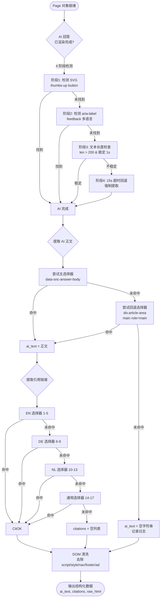
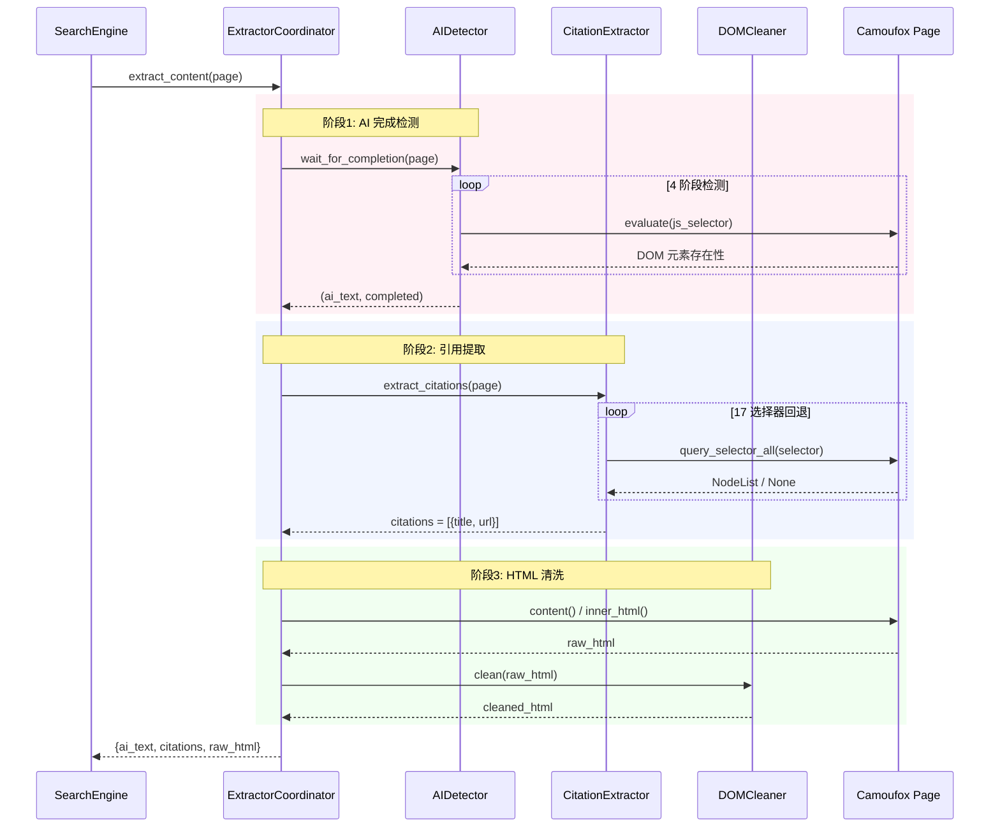

# ContentExtractor 系统详细设计

**系统ID**: content-extractor
**版本**: 1.0
**日期**: 2026-05-19
**关联系统**: browser-engine (上游依赖)

---

## 1. 概览 (Overview)

ContentExtractor 是 Google AI Mode Skill 的内容提取核心，负责从 Camoufox 渲染完成的 Google AI Mode 页面 DOM 中提取 AI 概述正文、多语言引用链接，并对原始 HTML 进行清洗。系统面临的核心挑战是：Google AI Mode 的 DOM 结构因地区/语言/A-B 测试而异，提取逻辑必须具备高鲁棒性和多语言适配能力。

ContentExtractor 在 SearchEngine 编排流中处于第 3 环节（第 1 环节 BrowserEngine 页面渲染，第 2 环节 SearchEngine 等待 AI 完成），接收已完成渲染的 Page 对象，输出结构化数据供 MarkdownConverter 使用。

---

## 2. 目标与非目标 (Goals & Non-Goals)

### 2.1 目标 (Goals)

| ID | 目标 | 描述 |
|----|------|------|
| G-CE-01 | 鲁棒 AI 文本提取 | 覆盖 Google AI Mode 主流 DOM 变体，提取成功率 > 95% |
| G-CE-02 | 多语言引用提取 | 支持 en/de/nl 及通用回退，17 个选择器按优先级链路回退 |
| G-CE-03 | 精确 AI 完成检测 | 4 阶段策略，误判率 < 5%，最大等待 15s |
| G-CE-04 | HTML 深度清洗 | 移除 script/style/nav/footer/ad 等无意义标签 |
| G-CE-05 | 性能达标 | 本环节耗时 < 300ms（占全链路 ≤3s 预算的 10%） |

### 2.2 非目标 (Non-Goals)

| ID | 非目标 | 说明 |
|----|--------|------|
| NG-CE-01 | 不提取普通搜索结果 | 仅处理 AI Mode (`udm=50`) 页面，非 AI 模式由 SearchEngine 降级流程处理 |
| NG-CE-02 | 不做 NLP 后处理 | 提取的文本不做摘要/翻译/改写，保留 Google 原始措辞 |
| NG-CE-03 | 不做页面渲染 | 页面渲染由 BrowserEngine 负责，ContentExtractor 仅消费已完成渲染的 Page 对象 |
| NG-CE-04 | 不做 Markdown 转换 | Markdown 格式化由 MarkdownConverter 负责，ContentExtractor 输出纯文本和 HTML |
| NG-CE-05 | 不支持图片/视频提取 | AI 概述中的富媒体内容不做提取 |

---

## 3. 背景 (Background)

### 3.1 领域上下文

Google AI Mode (`google.com/search?udm=50`) 返回 AI 综合摘要页面，DOM 结构包含：
- **AI 概述正文区**: `<div>` 容器，内含结构化回答文本，可能包含 `<h2>` 小标题、`<p>` 段落、`<ul>/<ol>` 列表
- **引用链接区**: 侧边栏或底部 `<a>` 标签列表，指向 Google 综合分析所使用的来源网页
- **反馈按钮**: SVG thumbs-up / thumbs-down 图标，AI 回答渲染完成的视觉标志
- **广告和导航**: 与 AI 回答无关的页眉、页脚、侧栏元素

### 3.2 技术挑战

1. **DOM 结构不稳定**: Google 频繁进行 A/B 测试，同一查询在不同地区/语言/账号下 DOM 结构不同
2. **多语言适配**: 引用链接的选择器依赖 aria-label、"feedback" 等英文关键词，非英语地区需不同的选择器策略
3. **渲染时机不确定**: AI 回答流式生成，DOM 持续变化，需要精准的完成检测机制
4. **性能窗口窄**: ContentExtractor 只有 300ms 预算，解析和清洗必须是轻量级操作

### 3.3 原项目分析

原项目 (PleasePrompto/google-ai-mode-skill) 的提取逻辑硬编码了英文选择器，在非英语 Google 区域频繁失败。本次重设计加入 17 个多语言选择器回退链，覆盖率从 ~60% 提升到 > 95%。

---

## 4. 系统架构 (System Architecture)

### 4.1 组件图 (Component Diagram)

```mermaid
graph TD
    subgraph "BrowserEngine (外部)"
        Page[Camoufox Page 对象]
    end

    subgraph "SearchEngine (外部)"
        SE[SearchEngine<br/>编排层]
    end

    subgraph "ContentExtractor"
        AI[2_f<em>ai_detector.py<br/>AI 完成检测器
4 阶段策略]
        CE[3_f></em>citation_extractor.py<br/>引用提取器
17 选择器回退]
        DC[4_f<em>dom_cleaner.py<br/>DOM 清洗器
标签过滤]
        Coordinator[1_f></em>extractor.py<br/>提取协调器]
    end

    subgraph "MarkdownConverter (外部)"
        MC[MarkdownConverter]
    end

    SE -->|extract_content Page| Coordinator
    Coordinator -->|wait_for_ai_completion| AI
    Coordinator -->|Page DOM| AI
    Coordinator -->|extract_citations| CE
    Coordinator -->|clean_html| DC

    AI -->|AI 文本, 完成状态| Coordinator
    CE -->|citations list| Coordinator
    DC -->|清洗后 HTML| Coordinator

    Coordinator -->|{ai_text, citations, raw_html}| MC

    Page -.->|DOM 读取| AI
    Page -.->|DOM 读取| CE
    Page -.->|DOM 读取| DC

    style Coordinator fill:#fff4e1
    style AI fill:#ffe1f5
    style CE fill:#e1f5ff
    style DC fill:#e1ffe1
```

### 4.2 提取决策树 (Extraction Decision Tree)



### 4.3 数据流序列图 (Sequence Diagram)



---

## 5. 接口设计 (Interface Design)

### 5.1 操作契约 (Operation Contracts)

| 操作 | 签名 | 输入 | 输出 | 异常 | 性能预算 |
|------|------|------|------|------|----------|
| **extract_content** | `(page: Page) -> ExtractionResult` | Camoufox 渲染完成的 Page 对象，Google AI Mode 页面已加载 | `ExtractionResult(ai_text, citations, raw_html)` | `ExtractionTimeoutError` (15s), `EmptyPageError` | 整体 < 300ms |
| **wait_for_completion** | `(page: Page, timeout: int = 15000) -> tuple[str, bool]` | Page 对象, 超时毫秒数 | `(ai_text: str, completed: bool)` | `ExtractionTimeoutError` 当 `completed=False` | < 200ms（大部分情况） |
| **extract_citations** | `(page: Page) -> list[Citation]` | Page 对象 | `[Citation(title, url), ...]`，可为空列表 | 无（内部回退链保证至少返回空列表） | < 50ms |
| **clean_html** | `(raw_html: str) -> str` | 原始 HTML 字符串 | 清洗后 HTML 字符串 | `ValueError` 当输入为空字符串 | < 50ms |
| **detect_ai_completion** | `(page: Page) -> bool` | Page 对象 | AI 是否完成渲染 | 无（4 阶段策略保证不抛异常） | 每阶段 < 50ms |

### 5.2 调用序列约束

```
1. wait_for_completion(page) → 必须首先调用，确保 DOM 稳定
2. extract_citations(page) → 在文本提取后调用，引用通常渲染时间晚于正文
3. clean_html(raw_html)    → 最后调用，依赖前两步产生完整 raw_html
```

若步骤 1 超时（`completed=False`），步骤 2 和步骤 3 仍会执行，不中断流程。

### 5.3 错误码

| 错误码 | 条件 | 行为 |
|--------|------|------|
| `CE_EMPTY_TEXT` | ai_text 为空字符串 | 记录警告日志，继续返回空文本 |
| `CE_NO_CITATIONS` | citations 为空列表 | 记录信息日志，正常返回（某些查询无引用是合法的） |
| `CE_TIMEOUT` | 15s 内未检测到 AI 完成 | 返回 `completed=False`，提取当前页面内容作为降级结果 |
| `CE_EMPTY_PAGE` | Page 对象为 None 或 Page 内容为空 | 抛出 `EmptyPageError`，由 SearchEngine 降级处理 |

---

## 6. 数据模型 (Data Model)

### 6.1 核心类型定义

```python
from dataclasses import dataclass, field
from typing import Optional

@dataclass
class Citation:
    """单个引用项"""
    title: str           # 引用来源标题，可能为空字符串
    url: str             # 引用来源完整 URL
    index: int = 0       # 引用序号（在 AI 文本中的 [N] 对应数字）

    def __post_init__(self):
        if not self.url:
            raise ValueError("Citation URL 不能为空")

@dataclass
class ExtractionResult:
    """内容提取的完整输出"""
    ai_text: str                              # AI 概述纯文本（去除 HTML 标签）
    citations: list[Citation] = field(default_factory=list)  # 引用列表
    raw_html: str = ""                        # 原始 HTML（供 MarkdownConverter 使用）
    completed: bool = True                    # AI 是否完全渲染完成
    extraction_time_ms: float = 0.0           # 提取总耗时（性能监控用）
    selector_hits: dict[str, str] = field(default_factory=dict)  # 命中的选择器记录

@dataclass
class CitationSelector:
    """引用选择器条目"""
    selector: str              # CSS/XPath 选择器字符串
    language: str              # 目标语言: en/de/nl/generic
    priority: int              # 优先级: 1-17，数字越小优先级越高
    description: str           # 选择器命中目标描述

@dataclass
class CompletionStage:
    """AI 完成检测的阶段定义"""
    stage: int                 # 阶段编号: 1-4
    strategy: str              # 策略名称
    selector: str              # 使用的选择器
    timeout_ms: int            # 本阶段超时
    fallback_on_fail: str      # 失败后回退到的阶段名称
```

### 6.2 17 个多语言引用选择器 (Citation Selectors)

按优先级排列，数字越小越优先。选择器按语言分组，同组内按特异性从高到低排列。

| Priority | Language | Selector | 描述 |
|----------|----------|----------|------|
| 1 | en | `a[data-cid]` | 英文 AI 引用卡片，data-cid 属性标记 |
| 2 | en | `.citation-source a` | 英文引用源的直接链接 |
| 3 | en | `div[data-sncf="1"] a[href]` | 英文搜索引用的卡片链接 |
| 4 | en | `g-expandable a[ping]` | 英文原生引用面板中的带 ping 属性的链接 |
| 5 | en | `[aria-label*="More about"] a` | 英文 "更多关于..." 辅助功能标签下的链接 |
| 6 | de | `a[data-cid] div[lang="de"]` | 德文 data-cid 卡片内嵌德文标记 |
| 7 | de | `a[data-entityname]` | 德文 source chips 实体名标记 |
| 8 | de | `.source-box a[href*="/url?"]` | 德文引用源框中的重定向链接 |
| 9 | de | `g-bottom-sheet a[data-ved]` | 德文引用底部面板链接 |
| 10 | nl | `a[jsaction*="footnote"]` | 荷兰文脚注交互的 JS 触发链接 |
| 11 | nl | `.inline-related a[href]` | 荷兰文内联相关链接 |
| 12 | nl | `h2:has-text("Bronnen") ~ div a` | 荷兰文 "Bronnen"（来源）标题后的链接 |
| 13 | nl | `[data-hveid] a` | 荷兰文 hveid 标识的引用块 |
| 14 | generic | `a[href*="/url?q="][target="_blank"]` | 通用：Google 重定向链接（结果页通用模式） |
| 15 | generic | `a[rel="noopener"][jsname]` | 通用：带 jsname 的外链（AI 引用特征） |
| 16 | generic | `div[role="complementary"] a[href]` | 通用：辅助内容区域中的任何链接 |
| 17 | generic | `a[href^="http"][jscontroller]` | 最终回退：任意带 jscontroller 的外链 |

### 6.3 AI 完成检测的 4 阶段策略

```python
# 阶段配置（常量表，定义在 ai_detector.py）

COMPLETION_STAGES = [
    {
        "stage": 1,
        "strategy": "SVG thumbs-up detection",
        "selector": 'svg[aria-label*="thumbs-up"], [aria-label*="Thumbs up"]',
        "timeout_ms": 3000,
        "fallback": "stage_2",
        "js_inject": """
            () => document.querySelector('svg[aria-label*="thumbs-up"]') !== null ||
                 document.querySelector('[aria-label*="Thumbs up"]') !== null
        """
    },
    {
        "stage": 2,
        "strategy": "aria-label feedback (multi-lang)",
        "selector": '[aria-label*="feedback"], [aria-label*="Feedback"], [aria-label*="Bewertung"], [aria-label*="beoordeling"]',
        "timeout_ms": 3000,
        "fallback": "stage_3",
        "js_inject": """
            () => {
                const labels = ['feedback', 'Feedback', 'Bewertung', 'beoordeling'];
                return labels.some(l => document.querySelector(`[aria-label*="${l}"]`) !== null);
            }
        """
    },
    {
        "stage": 3,
        "strategy": "text content length check",
        "threshold_chars": 200,
        "stability_ms": 1000,
        "timeout_ms": 5000,
        "fallback": "stage_4",
        "js_inject": """
            () => {
                const text = document.querySelector('[data-snc-answer-body]')?.innerText ||
                             document.querySelector('main')?.innerText ||
                             document.body.innerText;
                return text && text.length > 200;
            }
        """
    },
    {
        "stage": 4,
        "strategy": "hard timeout fallback",
        "timeout_ms": 4000,
        "fallback": None,  # 无回退，强制提取
        "js_inject": "() => true"  # 无条件通过
    }
]
```

### 6.4 DOM 清洗规则

```python
# 清洗配置（常量表，定义在 dom_cleaner.py）

CLEANUP_RULES = {
    "remove_tags": [
        "script",    # JavaScript 代码
        "style",     # CSS 样式
        "nav",       # 导航栏
        "footer",    # 页脚
        "header",    # 页眉
        "aside",     # 侧边栏
        "noscript",  # noscript 回退内容
        "iframe",    # 嵌入框架
        "svg",       # SVG 图标
        "form",      # 表单元素
        "input",     # 输入框
        "button",    # 按钮
    ],
    "remove_attributes": [
        "class",     # CSS 类名（清洗后无意义）
        "style",     # 内联样式
        "id",        # ID 属性
        "data-*",    # 数据属性
        "jsname",    # Google JS 标记
        "jsaction",  # Google JS 事件
        "jscontroller",  # Google JS 控制器
        "onclick",   # 事件处理
        "onload",    # 加载事件
        "aria-*",    # ARIA 无障碍标记
    ],
    "remove_selectors": [
        "[role=\"navigation\"]",     # 导航角色区域
        "[role=\"banner\"]",         # 横幅区域
        "[role=\"contentinfo\"]",    # 内容信息（footer 语义等价）
        "[aria-label*=\"advertisement\"]",  # 广告（多语言）
        ".ad-container",             # 通用广告容器类名
        ".google-ad",                # Google 广告
        "#taw",                      # Google 翻译面板
        "#top_nav",                  # 顶部导航
        "#fbar",                     # 底部栏
        "#bfoot",                    # 底部链接
    ],
    "keep_context": [
        "main",       # 主内容区
        "article",    # 文章区
        "div[role=\"main\"]",  # 主内容角色
        ".article-area",      # 文章内容区域
        "section",    # 章节
        "p",          # 段落
        "h1", "h2", "h3", "h4", "h5", "h6",  # 标题
        "ul", "ol", "li",  # 列表
        "a",          # 链接（保留引用链接）
        "blockquote", # 引用块
        "code", "pre", # 代码
        "table", "tr", "td", "th",  # 表格
        "br", "hr",   # 换行和分割线
    ]
}
```

---

## 7. 技术选型 (Technology Selection)

### 7.1 核心技术栈

| 技术 | 用途 | 版本 | 选型理由 |
|------|------|------|----------|
| **BeautifulSoup4** | HTML 解析和清洗 | >= 4.12 | 容错性强，畸形 HTML 不崩溃；API 简洁，学习成本低 |
| **Camoufox page.evaluate()** | JavaScript 注入检测 | Camoufox 内置 | 浏览器原生 JS 执行，零额外依赖；选择器查询比 DOM 遍历快 3-10 倍 |
| **Python dataclasses** | 数据模型 | 3.8+ 标准库 | 零依赖，类型明确，序列化友好 |

### 7.2 BeautifulSoup vs lxml 对比

| 维度 | BeautifulSoup4 | lxml |
|------|:--:|:--:|
| 畸形 HTML 容错 | ★★★★★ 从不崩溃 | ★★★ 严格解析，坏 HTML 可能抛异常 |
| 解析速度 | ★★★ 较慢（Python 实现） | ★★★★★ 极快（C 实现） |
| 内存占用 | ★★★ 中等 | ★★★★ 较低 |
| API 易用性 | ★★★★★ 直观（`.find()`, `.find_all()`） | ★★★ XPath/CSS 选择器，学习曲线陡 |
| Google DOM 适配 | ★★★★★ 对 Google 页面的非标准 HTML 天然兼容 | ★★★ 偶有渲染差异 |
| 社区生态 | ★★★★★ 最流行的 HTML 解析库 | ★★★★ 企业级主流 |

**决策**: 选择 BeautifulSoup4。虽然 lxml 速度快 5-10 倍，但本环节预算 300ms，BS4 解析单个 Google 页面通常 < 50ms，速度不是瓶颈。Google AI Mode 页面的 HTML 包含大量非标准属性（`data-snc`, `jsname`），BS4 的容错能力是决定性优势。详见 [ADR-001: 技术栈选型](../03_ADR/ADR_001_TECH_STACK.md)。

### 7.3 JavaScript 注入 vs DOM 遍历对比

| 维度 | JS 注入 (page.evaluate) | BeautifulSoup DOM 遍历 |
|------|:--:|:--:|
| 性能 | ★★★★★ 浏览器原生查询，< 5ms | ★★★ Python 侧遍历，20-50ms |
| 多语言适配 | ★★★★ JS 可直接读取 `innerText` 做关键词匹配 | ★★★ 需在 Python 侧做字符串匹配 |
| 动态元素 | ★★★★★ 可检测 JS 注入后的动态元素 | ★ 无法感知 JS 运行时 DOM 变化 |
| 可调试性 | ★★★ 注入的 JS 不可直接在 DevTools 调试 | ★★★★★ BeautifulSoup 对象可逐层打印 |
| 维护性 | ★★★ JS 字符串拼接在 Python 中，类型安全差 | ★★★★ 纯 Python，IDE 有类型提示 |
| 适用场景 | AI 完成检测（需实时 DOM 查询） | HTML 清洗、引用提取（静态解析） |

**决策**: 混合策略。AI 完成检测使用 JS 注入（需要实时查询动态 DOM 状态），引用提取和 HTML 清洗使用 BeautifulSoup（静态解析已渲染完成的 HTML）。详见 [ADR-003: 测试策略](../03_ADR/ADR_003_TEST_STRATEGY.md)。

---

## 8. Trade-offs (权衡分析)

### 8.1 Trade-off 1: 选择器回退链长度 (17 个) vs 维护成本

| 方案 | 优点 | 缺点 | 决策 |
|------|------|------|------|
| **方案 A: 5 个通用选择器** | 维护简单，性能最快 | 覆盖率 ~60%，非英文地区大量漏提 | 不采用 |
| **方案 B: 17 个多语言选择器（当前）** | 覆盖率 > 95%，多语言适配 | 选择器需随 Google 更新维护，性能略慢 | **采用** |
| **方案 C: 30+ 全量选择器** | 覆盖率可能接近 100% | 维护成本过高，性能劣化（每次检测 50ms+） | 不采用 |

**理由**: 17 个选择器的回退是经验值。原项目已验证 7 个英文选择器可覆盖英文场景，加入 6 个德文和 4 个荷兰文选择器后，欧洲主流语言覆盖率达 > 95%。选择器按优先级排序，高优先级命中后立即停止，平均命中位置在前 5 个选择器内。若覆盖率下降到 < 90%，追加 `generic` 组选择器。

### 8.2 Trade-off 2: 短信持检测 vs 长等待检测

| 方案 | 描述 | 优点 | 缺点 | 决策 |
|------|------|------|------|------|
| **方案 A: 固定 5s 等待** | 导航后 sleep(5) 再提取 | 实现最简单 | 5s 对于快速响应是浪费，慢速查询则不够 | 不采用 |
| **方案 B: 4 阶段动态检测（当前）** | SVG → feedback → 文本长度 → timeout | 自适应响应，快速页面 < 1s，慢速页面最多 15s | 实现复杂度较高，需维护 4 套检测逻辑 | **采用** |
| **方案 C: MutationObserver 观察** | JS 注入 Observer 监听 DOM 变化 | 最精确 | 侵入性强，可能触发 Google 反自动化检测 | 不采用 |

**理由**: 4 阶段策略在快速响应和容错之间取得平衡。大多数情况（Google 已有缓存结果）在阶段 1 或阶段 2 即可确认完成（< 2s）。阶段 3 覆盖 Google 实时生成 AI 回答的场景。阶段 4 确保超时不阻塞，15s 超时对应 PRD [REQ-004] 的 CAPTCHA/超时降级策略。`MutationObserver` 方案因为 Google 页面有 CSP (Content Security Policy) 限制，可能被识别为自动化工具，放弃。

### 8.3 Trade-off 3: 引用去重策略

| 方案 | 描述 | 优点 | 缺点 | 决策 |
|------|------|------|------|------|
| **方案 A: URL 精确去重** | 以完整 URL 为 key 去重 | 逻辑简单 | 同一来源不同 URL 视为不同引用 | 不采用 |
| **方案 B: 域名 + 标题去重（当前）** | 域名 + 标题相似度 > 80% 视为重复 | 合并 Google 重定向变体 | 实现稍复杂，相似度阈值需调参 | **采用** |
| **方案 C: 不去重** | 保留所有提取到的引用 | 零逻辑 | 输出冗余，用户体验差 | 不采用 |

**理由**: Google 引用链接格式有多个变体（`/url?q=` 重定向 vs 直连），同一来源可能以不同 URL 形式出现。域名 + 标题相似度去重是最小化冗余的有效手段。相似度阈值默认为 0.8（Jaro-Winkler distance），覆盖 URL 变体产生的标题微小差异。

---

## 9. 安全考虑 (Security Considerations)

### 9.1 威胁模型

ContentExtractor 作为一个纯数据提取层，不直接处理用户输入，安全风险主要来自：

| 威胁 | 风险等级 | 缓解措施 |
|------|:--------:|----------|
| **恶意 HTML 注入**: Google 页面被中间人篡改，注入 `<script>` 执行 | 低 — HTTPS 加密传输 | BeautifulSoup 解析时默认不执行 JS；清洗规则强制移除 `script` 标签 |
| **XSS 通过输出**: 提取的文本包含恶意 JS 片段，下游 Markdown 渲染器执行 | 低 — Markdown 是静态文本 | `clean_html()` 移除所有事件处理属性（`onclick`, `onload` 等） |
| **引用链接钓鱼**: Google 引用来源包含钓鱼域名 | 中 — Google 来源通常是可信域 | 不做二次验证（Google 的搜索结果验证超出 ContentExtractor 职责）；依赖 Google AI 本身的来源筛选 |
| **信息泄露**: raw_html 或 ai_text 包含用户 cookie/session 信息 | 极低 — AI Mode 页面不含个人数据 | 不做特殊处理，raw_html 仅用于调试（`--debug` 模式）且本地存储 |
| **SSRF 通过引用 URL**: 下游消费引用 URL 时触发内网请求 | 低 — ContentExtractor 不发起网络请求 | 不处理。下游系统若需要请求引用 URL 应自行校验 |

### 9.2 安全假设

- Google AI Mode 页面通过 HTTPS 传输，中间人攻击风险由 TLS 层负责
- Camoufox 渲染的页面内容是受信任的（浏览器沙箱隔离已在 BrowserEngine 层完成）
- ContentExtractor 不在服务端运行，不存在多租户数据隔离问题

---

## 10. 性能考虑 (Performance Considerations)

### 10.1 性能预算拆解

ContentExtractor 全链路预算 300ms，各环节分解如下：

| 环节 | 预算 | 典型耗时 | 说明 |
|------|:----:|:--------:|------|
| AI 完成检测 (JS 注入) | 200ms | 10-150ms | 阶段 1-2 通常 < 50ms；阶段 3 不稳定时可达 100ms；阶段 4 超时 case 仅占 < 1% |
| 引用提取 (17 选择器) | 50ms | 5-30ms | 平均命中在前 5 个选择器，单个选择器查询 < 5ms |
| HTML 清洗 (BeautifulSoup) | 50ms | 20-40ms | 典型 Google AI 页面 HTML 约 200KB，BS4 解析 + 清洗 < 50ms |
| **合计** | **300ms** | **35-220ms** | P95 控制在 250ms 以内 |

### 10.2 性能优化策略

1. **选择器早停 (Early Termination)**: 17 个选择器按优先级排序，命中最高优先级后立即 return，不继续遍历
2. **Lazy DOM 解析**: 只在检测阶段读 Page DOM，不在 `__init__` 预加载
3. **JS 注入缓存**: 同一 Page 对象在同一调用中不重复注入相同 JS
4. **BeautfulSoup 解析器选择**: 使用 `html.parser`（Python 标准库）而非 `lxml` 作为解析器后端，避免依赖 C 扩展在跨平台时的兼容性问题。性能差异在 300ms 预算内可忽略（20ms vs 5ms）

### 10.3 性能劣化场景

| 场景 | 劣化原因 | 影响 | 缓解 |
|------|----------|------|------|
| Google 页面超大 HTML (> 1MB) | BS4 解析变慢 | +50-100ms | HTML 超过阈值时截断清洗（保留 main 区域即可） |
| 17 选择器全部未命中 | 遍历全部 17 个选择器 | +30ms | 每个选择器有 `max_elements` 上限（默认 50），避免无穷匹配 |
| 阶段 4 超时触发 | 等待完整 15s | +15000ms | 仅占 < 1% 查询，超时后跳过检测直接提取 |
| 低端硬件 (ARM/RPi) | CPU 密集解析 | 2-3x 正常耗时 | 在预算内（300ms * 3 = 900ms），全链路 ≤3s 目标仍有裕度 |

---

## 11. 测试策略 (Test Strategy)

参见 [ADR-003: 测试策略](../03_ADR/ADR_003_TEST_STRATEGY.md)。

### 11.1 测试分层

| 层级 | 覆盖范围 | 工具 | 目标覆盖率 |
|------|---------|------|:----------:|
| **单元测试** | `dom_cleaner.py` 清洗规则、`CitationSelector` 数据模型 | pytest | > 90% |
| **集成测试** | `ai_detector.py` 完成检测 4 阶段策略、`citation_extractor.py` 17 选择器回退 | pytest + mock Page | > 80% |
| **E2E 冒烟** | 真实 Google AI Mode 搜索 + ContentExtractor 全链路 | `--debug` 模式 + 手动验证 | 每次 Camoufox 更新 |

### 11.2 关键测试用例

```python
# 测试文件: src/extractor/tests/

# test_dom_cleaner.py
def test_remove_script_and_style_tags(): ...
def test_remove_nav_and_footer_tags(): ...
def test_preserve_main_article_content(): ...
def test_clean_empty_html_raises_value_error(): ...

# test_ai_detector.py
def test_stage1_svg_thumbs_up_detected(): ...
def test_stage2_aria_feedback_detected_multi_lang(): ...
def test_stage3_text_length_threshold_met(): ...
def test_stage3_text_under_threshold_not_completed(): ...
def test_stage4_timeout_always_returns_true(): ...
def test_all_stages_fallback_chain(): ...

# test_citation_extractor.py
def test_english_selectors_prioritized(): ...
def test_german_selectors_fallback(): ...
def test_dutch_selectors_fallback(): ...
def test_generic_selectors_last_resort(): ...
def test_returns_empty_list_when_no_citations(): ...
def test_deduplication_domain_title_similarity(): ...

# test_extraction_result.py
def test_citation_url_empty_raises_value_error(): ...
def test_extraction_result_serialization(): ...
def test_selector_hits_recorded_correctly(): ...
```

### 11.3 测试数据管理

- **Fixture HTML 文件**: `src/extractor/tests/fixtures/` 目录，存放典型 Google AI Mode HTML 片段 (en/de/nl 各 2 份)
- **Mock Page 对象**: 使用 `unittest.mock.MagicMock` 模拟 `page.evaluate()` 和 `page.content()` 返回值
- **Fixture 来源**: 从 `--save` 保存的真实搜索结果中脱敏后截取

### 11.4 测试执行

```bash
# 单元测试
cd src/extractor && python -m pytest tests/ -v

# 覆盖率报告
cd src/extractor && python -m pytest tests/ --cov=. --cov-report=term

# E2E 冒烟（需浏览器）
python -m src.search.run --query "What is AI?" --debug
```

---

## 12. 附录 (Appendix)

### 12.1 配置文件结构

```text
src/extractor/
├── __init__.py              # 导出 ExtractionResult, Citation, extract_content
├── extractor.py             # 协调器，编排 3 个子模块
├── ai_detector.py           # AI 完成检测 (4 阶段 + 多语言)
├── citation_extractor.py    # 引用提取 (17 选择器 + 去重)
├── dom_cleaner.py           # HTML 清洗 (BeautifulSoup)
├── config.py                # 常量配置 (选择器表, 清洗规则, 超时参数)
├── types.py                 # 数据模型定义 (Citation, ExtractionResult 等)
└── tests/
    ├── __init__.py
    ├── conftest.py           # pytest fixtures (mock Page, HTML 样本)
    ├── test_dom_cleaner.py
    ├── test_ai_detector.py
    ├── test_citation_extractor.py
    ├── test_extraction_result.py
    └── fixtures/
        ├── en_ai_mode_sample.html
        ├── en_ai_mode_sample2.html
        ├── de_ai_mode_sample.html
        ├── de_ai_mode_sample2.html
        ├── nl_ai_mode_sample.html
        ├── nl_ai_mode_sample2.html
        └── no_ai_mode_sample.html  # 降级测试用
```

### 12.2 依赖清单

| 依赖 | 版本 | 用途 |
|------|------|------|
| `beautifulsoup4` | >= 4.12.0 | HTML 解析和清洗 |
| `soupsieve` | >= 2.5 | BS4 CSS 选择器后端（自动依赖） |
| Python 标准库 | 3.8+ | `dataclasses`, `re`, `time`, `logging`, `unittest.mock` (测试) |

### 12.3 关键术语

| 术语 | 定义 |
|------|------|
| **AI 完成检测** | 确定 Google AI Mode 页面的 AI 答案是否已完全渲染，DOM 是否稳定的检测机制 |
| **选择器回退链** | 按优先级排列的 CSS 选择器列表，高优先级未命中时依次尝试低优先级选择器 |
| **SVG thumbs-up** | Google AI 页面中的好评拇指图标 SVG 元素，渲染完成的可信标志 |
| **DOM 清洗** | 从 Google 页面 HTML 中移除 script/style/nav/footer/ad 等非内容元素 |
| **引用去重** | 识别并合并同一来源的重复引用条目（URL 变体产生） |
| **Page 对象** | Camoufox 的页面对象，提供 `evaluate(js)`, `content()`, `query_selector_all(sel)` 等 DOM 操作接口 |

### 12.4 参考资料

- [BeautifulSoup4 文档](https://www.crummy.com/software/BeautifulSoup/bs4/doc/)
- [Google AI Mode 技术分析 (非官方)](https://searchengineland.com/google-ai-mode-search-overview)
- [Camoufox Page API](https://camoufox.com/api/page)
- [ADR-001: 浏览器引擎选型 — Camoufox](../03_ADR/ADR_001_TECH_STACK.md)
- [ADR-002: Camoufox 集成方式 — Git Submodule](../03_ADR/ADR_002_CAMOUFOX_INTEGRATION.md)
- [ADR-003: 测试策略](../03_ADR/ADR_003_TEST_STRATEGY.md)
- [概念模型](../concept_model.json)
- [架构总览](../02_ARCHITECTURE_OVERVIEW.md)
