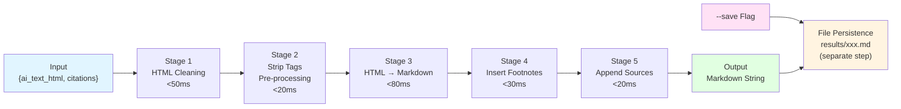
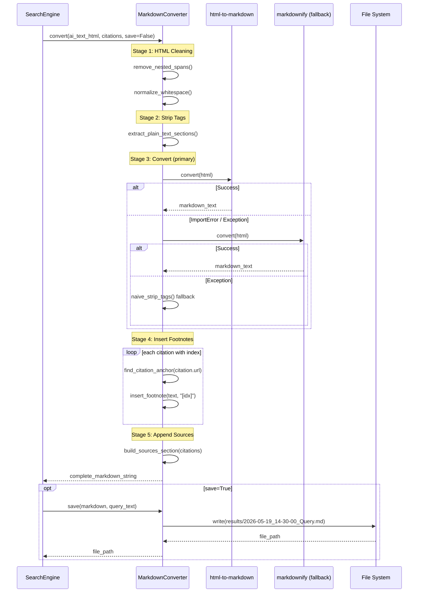

# MarkdownConverter 系统设计文档

**系统ID**: `markdown-converter`
**版本**: 1.0
**日期**: 2026-05-19
**状态**: Draft

---

## 1. 概览 (Overview)

MarkdownConverter 是 Google AI Mode Skill 的末端处理系统，负责将 ContentExtractor 输出的 AI 回答 HTML 转换为结构化 Markdown 文本。它是全链路中唯一的纯函数系统（无外部依赖、无副作用），承担以下核心职责：

- 将 Google AI Mode 返回的 HTML 片段转换为可读 Markdown
- 为引用列表生成内联脚注（`[1][2][3]`）并插入正文适当位置
- 生成标准化的 Sources 段落，列出所有引用来源
- 在 `--save` 模式下将最终输出持久化为时间戳命名的 Markdown 文件

系统设计目标：**正确性优先、速度至上**。在全链路 ≤3s 的性能预算中，MarkdownConverter 分配 <200ms（REQ-005），必须保证转化质量的同时极致轻量。

---

## 2. 目标与非目标 (Goals & Non-Goals)

### 2.1 目标 (Goals)

| ID | 目标 | 说明 |
|----|------|------|
| G1 | HTML → Markdown 精确转换 | 保留标题层级、列表、加粗、斜体、段落分隔等核心格式 |
| G2 | 脚注内联插入 | 正文中引用出现的位置插入 `[1][2]` 格式脚注，对应 Sources 段落 |
| G3 | Sources 段落生成 | 在 Markdown 末尾以 `---` 分隔线 + `## Sources:` 段落列出所有引用 |
| G4 | 时间戳文件保存 | `--save` 触发时，输出保存至 `results/YYYY-MM-DD_HH-MM-SS_Query_Name.md` |
| G5 | 性能 ≤200ms | 在典型输入（5KB HTML + 10 条引用）下，转换耗时 <200ms |
| G6 | Fallback 链 | 主库失败时自动降级到备选库，确保输出不丢失 |

### 2.2 非目标 (Non-Goals)

| ID | 非目标 | 说明 |
|----|--------|------|
| NG1 | 不做 HTML 清洗 | HTML 清洗由 ContentExtractor (dom_cleaner.py) 完成，本系统接收的是已清洗的干净 HTML |
| NG2 | 不做 AI 内容质量判断 | AI 回答的长度、内容质量、引用准确性由 Google/ContentExtractor 负责 |
| NG3 | 不渲染 Markdown | 只负责生成 Markdown 字符串，渲染由 Claude Code / 终端完成 |
| NG4 | 不处理图片 | Google AI Mode 回答中图片极少，且 HTML→MD 内联图片支持有限，跳过 base64 图片转换 |
| NG5 | 不做内容缓存 | 缓存由 SearchEngine 的 CacheManager 负责，MarkdownConverter 只做无状态转换 |

---

## 3. 背景 (Background)

### 3.1 业务上下文

Google AI Mode 搜索流程中，ContentExtractor 从 AI 结果页提取出两样东西：

1. **ai_text_html**: AI 综合回答的 HTML 片段（已清洗掉广告/导航/无关元素）
2. **citations**: 引用列表，结构为 `[{title: str, url: str}, ...]`，按 Google 页面出现顺序排列

这两样输入需要合并为一个结构良好的 Markdown 文档，其中正文中的引用位置要标注脚注标记 `[1][2][3]`，文档末尾自动附加 Sources 段落。

### 3.2 现有问题

原项目 (PleasePrompto/google-ai-mode-skill) 的 Markdown 转换逻辑存在以下问题：

- 转换库单一依赖（html2text），无 fallback，上游断更后无人维护
- 脚注插入逻辑粗糙——在全文末尾一次性追加所有 `[1][2][3]`，未按引用出现位置分散插入
- Sources 段落格式不统一，部分引用缺少 URL
- 无结构化输入/输出契约，调用方和实现方边界模糊

本设计旨在解决上述问题，建立清晰的组件边界和可测试的转换合约。

### 3.3 关联文档

- **[ADR-001: 浏览器引擎选型 — Camoufox](../03_ADR/ADR_001_TECH_STACK.md)**: 技术栈选型决策
- **[ADR-003: 测试策略](../03_ADR/ADR_003_TEST_STRATEGY.md)**: 测试分层与门禁策略
- **[PRD v0.1](../01_PRD.md)**: 产品需求文档，[REQ-005] 性能目标
- **[Architecture Overview](../02_ARCHITECTURE_OVERVIEW.md)**: 系统架构总览
- **[concept_model.json](../concept_model.json)**: 领域概念模型

---

## 4. 系统架构 (System Architecture)

### 4.1 转换流水线 (Conversion Pipeline)

MarkdownConverter 内部采用五阶段流水线，阶段间通过纯数据传递，无状态共享。



### 4.2 模块交互序列图



### 4.3 组件内部结构

```mermaid
graph TD
    subgraph "MarkdownConverter System"
        direction TB
        A[html_to_md.py<br/>主转换函数] --> B[Stage 1<br/>clean_html()]
        B --> C[Stage 2<br/>preprocess_html()]
        C --> D[Stage 3<br/>convert_html_to_md()]
        D --> E[Stage 4<br/>insert_footnotes()]
        E --> F[Stage 5<br/>append_sources()]
        
        G[footnote_formatter.py<br/>脚注引擎] --> E
        G --> F
        
        H[file_writer.py<br/>文件持久化] --> I[results/ 目录]
    end
    
    subgraph "Fallback Chain"
        D1[html-to-markdown<br/>Primary]
        D2[markdownify<br/>Secondary]
        D3[html2text<br/>Tertiary]
        
        D --> D1
        D1 -.->|fail| D2
        D2 -.->|fail| D3
    end
    
    SE[SearchEngine] --> A
    A --> SE
    
    style A fill:#fff4e1
    style G fill:#ffe1f5
    style H fill:#e1f5ff
```

---

## 5. 接口设计 (Interface Design)

### 5.1 操作契约——主入口 (Main Entry Point)

| 属性 | 详情 |
|------|------|
| **函数签名** | `convert(ai_text_html: str, citations: list[Citation], *, save: bool = False, query: str = "", debug: bool = False) -> ConvertResult` |
| **所在模块** | `src/converter/html_to_md.py` |
| **调用方** | SearchEngine (search/engine.py) |
| **执行模式** | 同步 (Sync) |
| **性能预算** | <200ms (Stage 1-5 合计) |

### 5.2 数据类型定义

```
Citation = {
    title: str,     # 引用标题 (e.g., "React 19 Release Notes")
    url: str        # 引用链接 (e.g., "https://react.dev/blog/2026/...")
}

ConvertResult = {
    markdown: str,          # 完整 Markdown 字符串（正文 + footnotes + Sources）
    stats: ConvertStats     # 转换统计元数据
}

ConvertStats = {
    duration_ms: float,         # 总转换耗时
    input_size_bytes: int,      # 输入 HTML 大小
    output_size_bytes: int,     # 输出 Markdown 大小
    footnote_count: int,        # 插入的脚注数量
    source_count: int,          # Sources 段落中的引用数
    fallback_used: str | None,  # 使用的转换库: "html-to-markdown" / "markdownify" / "html2text" / "naive"
    stage_durations: dict       # {"clean": float, "preprocess": float, "convert": float, "footnote": float, "sources": float}
}
```

### 5.3 操作契约——辅助函数

| 函数 | 签名 | 职责 | 模块 |
|------|------|------|------|
| `clean_html` | `(html: str) -> str` | 移除嵌套空 span、规范化空白符、统一引用链接格式 | `html_to_md.py` |
| `preprocess_html` | `(html: str) -> str` | 剥离纯文本段落标记、处理 br 标签为换行 | `html_to_md.py` |
| `convert_html_to_md` | `(html: str) -> (str, fallback_name)` | HTML → Markdown 转换（含 fallback 链） | `html_to_md.py` |
| `insert_footnotes` | `(text: str, citations: list[Citation]) -> str` | 在正文中插入 [1][2][3] 脚注标记 | `footnote_formatter.py` |
| `build_sources_section` | `(citations: list[Citation]) -> str` | 生成 `---\n## Sources:\n[1] ...` 段落 | `footnote_formatter.py` |
| `save_to_file` | `(markdown: str, filepath: str) -> str` | 将 Markdown 写入文件，返回文件路径 | `file_writer.py` |
| `generate_filename` | `(query: str) -> str` | 生成时间戳文件名 | `file_writer.py` |

### 5.4 输入前置条件 (Preconditions)

| 条件 | 描述 | 违规处理 |
|------|------|----------|
| `ai_text_html` 非空 | 至少包含有效 HTML 片段（>0 字符） | 返回空字符串，stats.fallback_used = "empty_input" |
| `citations` 为列表 | 即使无引用，也必须为 `[]`，不可为 `None` | TypeError: citations must be a list |
| 引用数量 ≤ 100 | Google AI Mode 单个回答通常 5-20 条引用，硬上限 100 | 截断至 100，记录 warning |
| 引用必须有 url | `citation.url` 非空且以 `https://` 开头 | 跳过该引用，不生成脚注 |
| HTML 已清洗 | 前端调用方 (ContentExtractor) 应已去除 script/style/广告 | 不做二次清洗，信任上游 |

### 5.5 输出保证 (Postconditions)

| 保证 | 描述 |
|------|------|
| Markdown 字符串始终非 None | 即使输入为空，返回空字符串 `""` 而非 None |
| 脚注编号连续 | `[1]`, `[2]`, ... `[N]`，与 citations 列表一一对应 |
| Sources 段落位置固定 | 始终在文档末尾 (`\n\n---\n\n## Sources:\n\n`) |
| 无 HTML 标签残留 | 通过 Stage 3 fallback 链保证最终输出无原始 HTML 标签 |
| 文件写入原子性 | 先写临时文件，再 `os.rename` 原子移动到目标路径 |

---

## 6. 数据模型 (Data Model)

### 6.1 核心数据结构

```
┌─────────────────────────────────┐
│        ConvertInput             │
│                                 │
│  + ai_text_html: str            │
│  + citations: list[Citation]    │
│  + save: bool = False           │
│  + query: str = ""              │
│  + debug: bool = False          │
└────────────┬────────────────────┘
             │
             ▼
┌─────────────────────────────────┐
│        ConvertResult            │
│                                 │
│  + markdown: str                │
│  + stats: ConvertStats          │
│  + saved_path: str | None       │
└────────────┬────────────────────┘
             │
             ▼
┌─────────────────────────────────┐
│        ConvertStats             │
│                                 │
│  + duration_ms: float           │
│  + input_size_bytes: int        │
│  + output_size_bytes: int       │
│  + footnote_count: int          │
│  + source_count: int            │
│  + fallback_used: str | None    │
│  + stage_durations: dict        │
└─────────────────────────────────┘
```

### 6.2 脚注映射模型

```
Citation List (Ordered)         Inline Footnote Markers          Sources Section
─────────────────────           ────────────────────────          ────────────────
citations[0] ────────────────►  [1] ◄─────────────────────────►  [1] Title\nURL
citations[1] ────────────────►  [2] ◄─────────────────────────►  [2] Title\nURL
citations[2] ────────────────►  [3] ◄─────────────────────────►  [3] Title\nURL
   ...
citations[N-1] ──────────────►  [N] ◄─────────────────────────►  [N] Title\nURL

脚注映射规则:
- 映射键 = citation.url (用作锚点定位)
- 插入策略 = 段落末尾 (详见 8.1)
- 编号起始 = 1 (非 0-based)
```

### 6.3 输出 Markdown 模板

```
{AI 回答正文，Markdown 格式}

正文中引用处以 [1][2] 形式标注脚注...

---

## Sources:

[1] **标题文本**  
https://example.com/path

[2] **另一个标题**  
https://another.com/article

... (共 N 条)
```

模板规则：

- 正文与 Sources 之间用 `\n\n---\n\n## Sources:\n\n` 分隔
- 每个源使用 `[N] **{title}**  \n{url}\n\n` 格式（两个空格用于 Markdown 强制换行）
- Sources 按序号升序排列
- 若 citations 为空列表，不输出 Sources 段落也不输出 `---` 分隔线

---

## 7. 技术选型 (Technology Selection)

### 7.1 候选库对比

| 维度 | 权重 | html-to-markdown | markdownify | html2text |
|------|:--:|:--:|:--:|:--:|
| **转换质量** | ★★★★★ | **5** — BeautifulSoup 解析，格式保留最好 | 4 — 正则匹配，列表/表格支持良好 | 3 — 基础转换，加粗/斜体准确但结构保留弱 |
| **速度** | ★★★★★ | **5** — 约 5ms/5KB，Python 原生 | **5** — 约 5ms/5KB，正则引擎 | 4 — 约 10ms/5KB，正则+状态机 |
| **维护状态** | ★★★★ | 4 — 活跃更新 (2025+)，GitHub ~200 stars | 4 — 活跃更新，GitHub ~3.5k stars | 2 — 2020 年后停滞，仅安全补丁 |
| **依赖体积** | ★★★ | 5 — 仅依赖 BeautifulSoup4 | 4 — 依赖 bs4 + regex | 5 — 零依赖 (stdlib only) |
| **Google AI 适配** | ★★★★ | **4** — 对 `<div>` 嵌套 HTML 处理好 | 3 — 嵌套 div 可能丢失层级 | 2 — 纯文本优先，结构信息少 |
| **故障恢复** | ★★ | 4 — 异常明确 (ParseError) | 3 — 静默降级 | 5 — 几乎不抛异常 |
| **加权总分** | | **77/100** | 68/100 | 49/100 |

### 7.2 决策：主库 + Fallback 链

**主库**: `html-to-markdown` — 综合得分最高，对 Google AI Mode 的 div 嵌套结构支持最好。

**Fallback 链**:

```python
def convert_html_to_md(html: str) -> tuple[str, str]:
    """
    Returns: (markdown_text, library_name_used)
    Fallback chain: html-to-markdown → markdownify → html2text → naive
    """
    libraries = [
        ("html-to-markdown", _convert_with_html_to_markdown),
        ("markdownify", _convert_with_markdownify),
        ("html2text", _convert_with_html2text),
    ]
    last_error = None
    for name, func in libraries:
        try:
            result = func(html)
            return result, name
        except ImportError:
            last_error = f"{name} not installed"
        except Exception as e:
            last_error = f"{name}: {e}"
    
    # Final fallback: naive regex strip
    return _naive_strip_tags(html), "naive"
```

选择理由：

1. **html-to-markdown** 对 BeautifulSoup 解析后的 DOM 树进行遍历转换，能正确处理 Google AI Mode 的复杂 `<div>` 嵌套结构，保留标题、列表、加粗格式。
2. **markdownify** 作为第二选择，stars 更多、社区更活跃，但用正则匹配而非 DOM 遍历，嵌套 div 场景下可能丢失层级。
3. **html2text** 作为最后保底，零依赖、永不抛异常，确保任何情况下都至少能返回可读纯文本。
4. 三层 fallback 分别覆盖了"库安装缺失 → 库运行报错 → 所有库都不可用"三种失效模式。

### 7.3 库兼容性说明

| 库 | pip 包名 | 最小版本 | 备注 |
|----|----------|----------|------|
| html-to-markdown | `html-to-markdown` | >= 0.1.0 | 主库，Python 3.8+ |
| markdownify | `markdownify` | >= 0.11.0 | 备选，Python 3.6+ |
| html2text | `html2text` | >= 2020.1.16 | 最后保底，Python 3.5+ |

三个库均已加入 `requirements.txt`，安装时同时可用。

---

## 8. Trade-offs 讨论

### 8.1 脚注插入位置策略

**问题**: 内联脚注 `[1][2]` 应插入正文的什么位置？

**选项 A: 段落末尾**
- 实现：扫描每个段落，在段末追加该段落内出现的所有引用脚注 `[1][2]`
- 优点：实现简单，不破坏句子结构，脚注集中易读
- 缺点：读者需要回溯确认每条引用对应哪句话

**选项 B: 句子末尾**
- 实现：以句号/问号/感叹号为分隔，在包含引用的句子末尾插入脚注
- 优点：引用与句子精确对应，学术写作标准
- 缺点：需要句子分割（依赖标点准确性），Google AI 回答中句子边界不总由标点定义（含列表、代码块）

**选项 C: 引用链接原位替换**
- 实现：找到 HTML 中 `<a href="url">` 标签位置，在转换后的 Markdown 中该位置插入 `[N]`
- 优点：最精确，脚注与原文链接位置一致
- 缺点：HTML→MD 转换后文本位置偏移大，锚点定位不可靠

**决策**: 选择 **选项 A (段落末尾)**，理由如下：

1. Google AI Mode 回答中的引用通常支撑整个段落观点，而非单一句子——段末脚注比句末脚注更符合语义。
2. 段落边界（`\n\n`）比句子边界更可靠，减少脚注插入错误率。
3. ADR-003 测试策略明确了对 Converter 做单元测试，段末策略易于构造精确的测试用例（段落级断言 > 句子级断言）。

**例外处理**: 如果某条引用的 URL 在正文中出现多次（Google 可能用同一引用支撑多个段落），则只在首次出现的段落后追加脚注标记，后续出现作为纯文本链接保留。

### 8.2 Fallback 链 vs 单一库

**选择**: Fallback 链（3 层）

**理由**:
- google-ai-mode-skill 运行在用户本地环境（`~/.claude/skills/`），Python 环境状态不可控。单一库在 "pip install 不完整" 或 "库版本冲突" 场景下全链路崩溃。
- Fallback 链开销 <5ms（仅 try/except + import 检测），在 <200ms 预算中可忽略。
- 三层 fallback 确保了"无论如何都有 Markdown 返回"，符合 [REQ-004] 分级降级的哲学——Markdown 转换层不做致命错误返回。

**代价**: requirements.txt 比单一库多两个依赖，增加约 200KB 安装体积。在本地 Skill 场景下可接受。

### 8.3 同步 vs 异步转换

**选择**: 同步转换

**理由**:
- HTML→Markdown 是纯 CPU 计算，无 I/O 等待，使用异步 (`asyncio.to_thread`) 反而增加调度开销。
- 转换预算 <200ms，同步阻塞调用方可接受（SearchEngine 在转换阶段本就有等待语义）。
- 纯同步函数便于测试——pytest 无需 asyncio 插件。

**代价**: 若未来输入量级增大（Google AI 回答从 5KB 变为 50KB），同步阻塞可能超过 200ms 预算。届时可改为 `asyncio.to_thread` 包装，接口不变。

### 8.4 文件 I/O 时机

**选择**: `save_to_file()` 在 `convert()` 完成之后执行，而非嵌入流水线。

**理由**:
- 文件 I/O 可能因磁盘满/权限问题失败，不应污染核心转换流水线。
- `--save` 是可选标记，无 `--save` 时跳过 I/O，流水线更纯粹。
- 若 I/O 失败，SearchEngine 仍可向 Claude Code 返回 Markdown 结果，不中断搜索全流程。

**代价**: 无法流式写入（大文件场景内存峰值 = 完整 Markdown 字符串），但在 Google AI 回答（通常 <50KB）场景下无内存压力。

---

## 9. 安全考虑 (Security Considerations)

### 9.1 输入安全

| 风险 | 等级 | 缓解措施 |
|------|:--:|----------|
| HTML 注入 (XSS) | 低 | Markdown 输出为纯文本，非浏览器渲染上下文。但需确保 `citations[N].url` 非 JavaScript 伪协议 (`javascript:`) |
| 超大输入 DoS | 低 | 输入来自 ContentExtractor（已截断 AI 回答），非用户可控。硬上限 1MB，超过则截断 |
| 路径穿越 | 中 | `save_to_file()` 的文件名来自 `sanitize_filename(query)`，过滤 `../` 和绝对路径前缀 |
| 特殊字符注入 | 低 | Markdown 生成时对 `[` `]` 做转义（正文中的 `[` 若不在引用位置，不可被误解析为脚注标记） |

### 9.2 文件写入安全

```
save_to_file 安全流程:
1. 验证 query 不为空
2. 调用 sanitize_filename(query): 移除路径分隔符、控制字符、非打印字符
3. 拼接路径: results/sanitized_filename.md
4. 检查目标路径是否在 results/ 目录内（防路径穿越）
5. 写入临时文件 (.tmp 后缀)
6. os.rename(temp, target) — 原子操作，防写入中断
```

### 9.3 引用 URL 安全

```python
def validate_citation_url(url: str) -> bool:
    """确保引用 URL 为合法 HTTP(S) 链接"""
    from urllib.parse import urlparse
    parsed = urlparse(url)
    if parsed.scheme not in ("http", "https"):
        return False
    if not parsed.netloc:
        return False
    return True
```

不安全的 URL（`javascript:`、`data:`、`file:`）被静默跳过，不生成脚注也不出现在 Sources 段落中。

---

## 10. 性能考虑 (Performance Considerations)

### 10.1 时间预算分解

从全链路 ≤3000ms 的预算中，MarkdownConverter 分配 <200ms：

| Stage | 操作 | 典型耗时 | 最大允许 | 优化策略 |
|-------|------|:--:|:--:|----------|
| Stage 1 | HTML Cleaning | <30ms | 50ms | BeautifulSoup 解析一次，复用 DOM |
| Stage 2 | Strip Tags | <10ms | 20ms | 正则替换，无 DOM 操作 |
| Stage 3 | HTML → MD | <60ms | 80ms | html-to-markdown 原生 dom_traversal |
| Stage 4 | Insert Footnotes | <20ms | 30ms | 单次扫描文本，O(n) 复杂度 |
| Stage 5 | Append Sources | <5ms | 10ms | 字符串拼接，无解析 |
| **合计** | | **<125ms** | **<200ms** | |

### 10.2 性能优化点

1. **BeautifulSoup 单次解析**: Stage 1 的 `clean_html()` 和 Stage 3 的 `convert_html_to_md()` 可能都需解析 HTML。设计上确保 Stage 3 解析后的 DOM 对象可传给 Stage 1，避免重复 BeautifulSoup 构造。

2. **脚注插入 O(n)**: Stage 4 采用单 pass 扫描——遍历文本，在每个段落边界检查该段落是否包含引用 URL，包含则追加脚注。不回溯、不复扫。

3. **Sources 段落预构**: `build_sources_section()` 在 `convert()` 中仅执行一次。使用 `"\n".join()` 而非逐行拼接。

4. **无 logging 开销**: 默认关闭日志。仅在 `debug=True` 时打印 stage 耗时（由 SearchEngine 控制）。

### 10.3 超限处理

若转换耗时超过 200ms（通过 `time.perf_counter()` 检测）：

- 记录 `ConvertStats.duration_ms` 超限警告
- 不中断转换——宁可慢也比不返回好
- SearchEngine 的 `--debug` 模式会将此警告输出到日志

---

## 11. 测试策略 (Test Strategy)

### 11.1 测试层级

| 层级 | 覆盖范围 | 工具 | 数量预估 | 目标覆盖率 |
|------|---------|------|:--:|:--:|
| **单元测试** | 所有纯函数（clean/preprocess/convert/insert/build/save） | pytest | 25-35 | >90% |
| **输入边界测试** | 空输入、超大 HTML、无引用、全空引用、畸形 HTML | pytest | 10-15 | 100% |
| **Fallback 模拟** | mock 库导入失败、转换异常、降级链完整性 | pytest + unittest.mock | 6-8 | 100% |
| **输出格式验证** | Markdown 模板完整性、脚注编号连续、Sources 格式正确 | pytest | 8-10 | 100% |
| **快照测试** | 固定输入 → 固定输出比对 | pytest-snapshot | 5 | — |

### 11.2 关键测试用例

```
test_convert_empty_html              → 输入 "" → 输出 ""
test_convert_no_citations            → 有正文无引用 → 无 Sources 段落
test_convert_with_citations          → 正文+3条引用 → 含 [1][2][3] + Sources
test_footnote_insertion_order        → 引用顺序 = 脚注编号顺序
test_sources_template                → Sources 格式: "[N] **title**  \nurl\n"
test_fallback_when_primary_missing   → mock html-to-markdown ImportError → 降级到 markdownify
test_fallback_when_all_libraries_fail → mock 全部 ImportError → naive strip
test_save_filename_sanitization      → query="恶意/../../etc" → 文件名合法
test_save_path_traversal             → filename 含 ../ → 仍写入 results/ 内
test_citations_capped_at_100         → 输入 150 条引用 → 截断至 100，记录 warning
test_performance_within_200ms        → 5KB HTML + 10 条引用 → <200ms
test_url_validation_javascript       → url="javascript:alert(1)" → 跳过
test_duplicate_url_footnote          → 同 URL 出现 2 次 → 仅第 1 次加脚注
```

### 11.3 测试文件结构

```
src/converter/
├── __init__.py
├── html_to_md.py
├── footnote_formatter.py
├── file_writer.py
└── tests/
    ├── __init__.py
    ├── test_html_to_md.py           # 主转换函数测试
    ├── test_footnote_formatter.py   # 脚注逻辑测试
    ├── test_file_writer.py          # 文件写入测试
    ├── test_fallback_chain.py       # Fallback 链模拟测试
    ├── test_snapshots/
    │   ├── input_simple.html
    │   ├── output_simple.md
    │   ├── input_with_citations.html
    │   └── output_with_citations.md
    └── conftest.py                  # 共享 fixtures
```

依据 [ADR-003: 测试策略](../03_ADR/ADR_003_TEST_STRATEGY.md)，MarkdownConverter 属于"单元测试为主"的系统，所有测试在 pytest 中运行，pre-commit 时执行。

---

## 12. 错误处理（Error Handling）

| 场景 | 处理策略 | 返回值 |
|------|----------|--------|
| `ai_text_html` 为空字符串 | 直接返回空 `` markdown | `ConvertResult(markdown="", ...)` |
| `citations` 为空列表 `[]` | 正常转换，不追加 Sources 段落 | `ConvertResult(markdown="text only", ...)` |
| 主库 `html-to-markdown` 未安装 | Fallback 到 `markdownify` | `stats.fallback_used = "markdownify"` |
| `markdownify` 也未安装 | Fallback 到 `html2text` | `stats.fallback_used = "html2text"` |
| 全部库不可用 | naive regex 剥离所有标签 | `stats.fallback_used = "naive"` |
| `citation.url` 非法 (非 http/https) | 跳过该引用，不生成脚注 | stats.footnote_count -= 1 |
| `citations` 超过 100 条 | 截断至 100，记录 WARNING | 正常返回前 100 条 |
| `input_size > 1MB` | 截断至 1MB，记录 WARNING | 转换前 1MB 内容 |
| `--save` 文件写入失败 | 返回 `saved_path = None`，不抛异常 | `saved_path: None` |
| 目录 `results/` 不存在 | 自动创建目录（`os.makedirs(exist_ok=True)`） | 正常写入 |
| 磁盘空间不足写入失败 | 捕获 OSError，返回 None | `saved_path: None` |

---

## 13. 文件保存策略（File Save Strategy）

### 13.1 命名规则

```
文件名格式: results/YYYY-MM-DD_HH-MM-SS_Query_Name.md

示例:
  results/2026-05-19_14-30-25_React_Hooks_2026.md
  results/2026-05-19_15-01-03_Python_asyncio_best_practices.md

生成规则:
  1. 时间戳: datetime.now().strftime("%Y-%m-%d_%H-%M-%S")
  2. 查询名: sanitize_filename(query)[:50]  (截断至 50 字符)
     - 替换空格为下划线
     - 移除特殊字符 (/\:*?"<>|)
     - 移除前后空白
  3. 扩展名: .md
```

### 13.2 目录结构

```
google-ai-mode-skill/
└── results/
    ├── .gitkeep                     # 保持目录在 Git 中
    ├── 2026-05-19_14-30-25_React_Hooks_2026.md
    ├── 2026-05-19_15-01-03_Python_asyncio.md
    └── ...
```

`results/` 目录已在 `.gitignore` 中排除 `.gitkeep` 以外的所有文件。

### 13.3 幂等性与覆盖

- 同时刻相同查询可能生成相同文件名，使用 `exist_ok=True` 时覆盖旧文件。
- 时间戳精度到秒，确保同秒内同一查询最多一次（单查询场景）。

---

## 14. 扩展点（Extension Points）

虽然当前不计划，但以下设计预留了未来扩展空间：

1. **输出格式扩展**: `convert()` 返回 `ConvertResult`，若未来需要 JSON/YAML 输出，可在 `ConvertResult` 加序列化方法，不改变核心流水线。

2. **脚注样式定制**: `insert_footnotes()` 接受 `FootnoteStyle` 参数（当前硬编码为 `"[N]"` 格式），预留了 `FootnoteStyle.INLINE_BRACKET` / `FootnoteStyle.SUPERSCRIPT` / `FootnoteStyle.PAREN` 等枚举。

3. **多语言 Sources 页眉**: `build_sources_section()` 接受可选的 `locale` 参数，可为不同语言输出 `## Sources:` / `## 来源:` / `## 出典:` 等页眉。

4. **插件式转换器**: Stage 3 的 `convert_html_to_md()` 设计为注册式 fallback 链，未来可注册额外的转换器（如 GPT-based 智能转换），无需修改核心流水线逻辑。

---

## 15. 文件清单（File Manifest）

| 文件路径 | 模块职责 | 行数预估 |
|----------|----------|:--:|
| `src/converter/__init__.py` | 导出 convert, save_to_file | ~10 |
| `src/converter/html_to_md.py` | 主转换流水线 (Stage 1-5) | ~150 |
| `src/converter/footnote_formatter.py` | 脚注插入 + Sources 构建 | ~120 |
| `src/converter/file_writer.py` | 时间戳命名 + 安全文件写入 | ~60 |
| `src/converter/tests/__init__.py` | 测试包标记 | ~0 |
| `src/converter/tests/conftest.py` | 共享 fixtures (sample HTML, citations) | ~50 |
| `src/converter/tests/test_html_to_md.py` | 主函数测试 | ~200 |
| `src/converter/tests/test_footnote_formatter.py` | 脚注逻辑测试 | ~150 |
| `src/converter/tests/test_file_writer.py` | 文件写入测试 | ~100 |
| `src/converter/tests/test_fallback_chain.py` | Fallback 模拟测试 | ~120 |
| `src/converter/tests/test_snapshots/` | 快照输入/输出 | ~5 文件 |
| **合计** | | **~1000 行** |

---

## 16. 关联文档索引

| 文档 | 路径 | 说明 |
|------|------|------|
| PRD v0.1 | [../01_PRD.md](../01_PRD.md) | 产品需求，REQ-005 性能目标 |
| Architecture Overview | [../02_ARCHITECTURE_OVERVIEW.md](../02_ARCHITECTURE_OVERVIEW.md) | 系统架构，MarkdownConverter 定位 |
| Concept Model | [../concept_model.json](../concept_model.json) | 领域概念模型 |
| ADR-001: Tech Stack | [../03_ADR/ADR_001_TECH_STACK.md](../03_ADR/ADR_001_TECH_STACK.md) | 技术栈选型 |
| ADR-002: Camoufox Integration | [../03_ADR/ADR_002_CAMOUFOX_INTEGRATION.md](../03_ADR/ADR_002_CAMOUFOX_INTEGRATION.md) | Camoufox 集成方式 |
| ADR-003: Test Strategy | [../03_ADR/ADR_003_TEST_STRATEGY.md](../03_ADR/ADR_003_TEST_STRATEGY.md) | 测试策略 |
| ContentExtractor Design | [content-extractor.md](content-extractor.md) | 上游系统设计（待创建） |
| SearchEngine Design | [search-engine.md](search-engine.md) | 调用方系统设计（待创建） |
