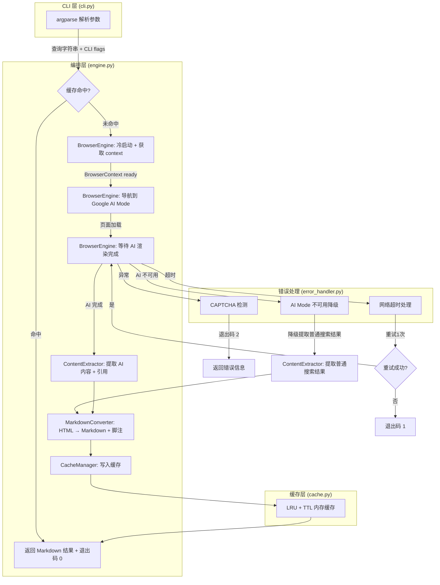
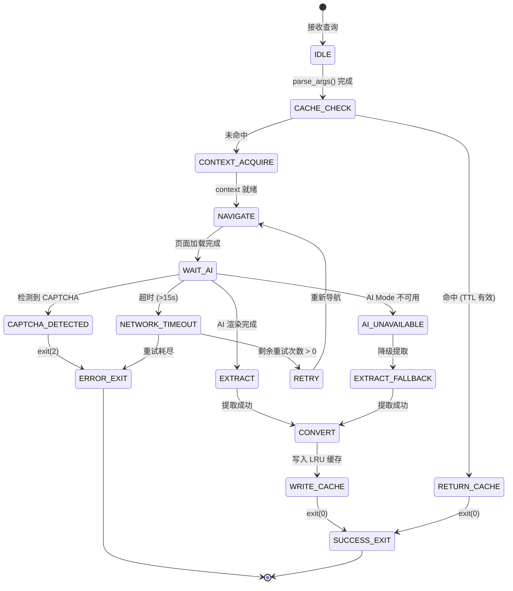
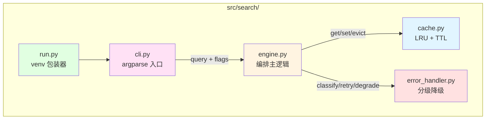
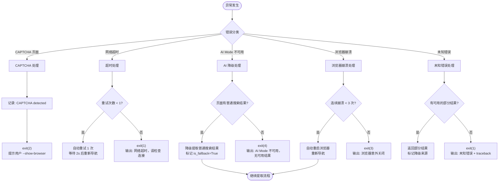
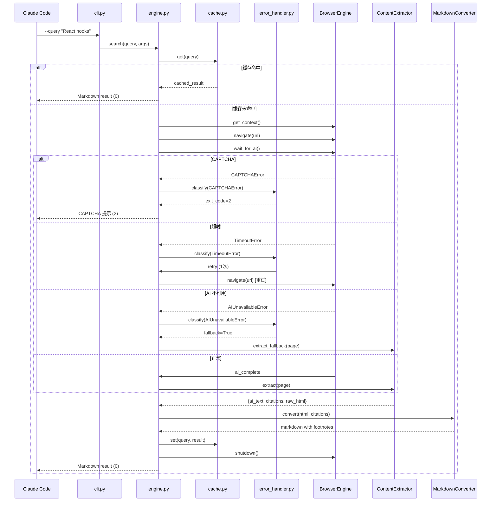

# 系统设计: SearchEngine (search-engine)

**系统ID**: `search-engine`
**版本**: 1.0
**日期**: 2026-05-19
**状态**: Draft

---

## 1. 概览 (Overview)

SearchEngine 是 Google AI Mode Skill 的**中心编排系统**。它负责接收 Claude Code 的搜索请求，协调 BrowserEngine、ContentExtractor、MarkdownConverter 三个子系统，完成从查询字符串到 Markdown 结果的完整搜索链路。此外，SearchEngine 承担 CLI 入口职责，通过 argparse 解析用户参数，并内建 LRU 内存缓存与分级错误降级机制。

**在整体架构中的位置**: SearchEngine 是整个系统的"大脑"，所有子系统通过它单向连接，子系统之间无直接依赖（参见 [Architecture Overview](../02_ARCHITECTURE_OVERVIEW.md)）。

---

## 2. 目标与非目标 (Goals & Non-Goals)

### 2.1 目标

| ID | 目标 | 关联需求 |
|----|------|---------|
| G1 | 搜索全流程编排，从 CLI 参数解析到 Markdown 输出，P95 <= 8s (冷启动) | [REQ-005] |
| G2 | 内存 LRU 缓存，重复查询 < 100ms 返回 | [REQ-003] |
| G3 | 分级错误降级，CAPTCHA/超时/AI不可用各有对应处理策略 | [REQ-004] |
| G4 | 标准化 CLI 接口，支持 --query/--save/--debug/--show-browser 四个参数 | [REQ-005] |
| G5 | 退出码语义清晰，区分 0(成功)/1(通用错误)/2(CAPTCHA)/3(浏览器关闭)/4(区域限制)/130(用户中断) | [REQ-004] |

### 2.2 非目标

| ID | 非目标 | 说明 |
|----|--------|------|
| NG1 | 不做 MCP Server 模式 | 仅作为 Claude Code Skill 内调用 |
| NG2 | 不做并发多查询 | 单次搜索单查询，无 asyncio 并发编排 |
| NG3 | 不做分布式缓存 | LRU 缓存仅在进程内存中，不持久化到磁盘 |
| NG4 | 不做查询语义理解/NLP | 查询优化仅做字符串层面的关键词改写（年份追加、语言指定），不做语义分析 |

---

## 3. 背景与约束 (Background & Constraints)

### 3.1 背景

原项目 (PleasePrompto/google-ai-mode-skill) 的搜索流程散落在多个脚本中，缺乏统一的编排层。缓存、错误处理、CLI 解析等功能耦合在浏览器操作代码中，难以独立测试和维护。本次重构将 SearchEngine 独立为系统，职责明确为"编排+缓存+降级+CLI"。

### 3.2 技术约束

- **Python**: >= 3.8（与原项目兼容）
- **标准库优先**: LRU 缓存使用 `collections.OrderedDict`，CLI 使用 `argparse`，不引入额外依赖
- **同步调用**: 全部系统间调用为同步（asyncio 仅在 BrowserEngine 内部使用），SearchEngine 不直接使用 asyncio
- **内存预算**: 缓存最大 50 条，预估总内存 < 10MB
- **部署位置**: `src/search/`，与仓库根相对路径

### 3.3 依赖系统

| 依赖系统 | 调用接口 | 调用阶段 |
|---------|---------|---------|
| browser-engine | `get_context()`, `navigate(url)`, `wait_for_ai()` | 导航阶段 |
| content-extractor | `extract(page)` | 提取阶段 |
| markdown-converter | `convert(html, citations)` | 转换阶段 |

---

## 4. 系统架构 (System Architecture)

### 4.1 搜索全流程编排（泳道图）



### 4.2 搜索流程状态机



### 4.3 内部模块结构



**模块职责**:

| 模块 | 文件 | 职责 |
|------|------|------|
| CLI 入口 | `cli.py` | argparse 参数解析、退出码返回 |
| 编排引擎 | `engine.py` | 搜索全流程编排、子系统间协调 |
| 缓存管理 | `cache.py` | LRU + TTL 内存缓存，OrderedDict 实现 |
| 错误处理 | `error_handler.py` | CAPTCHA 检测、超时重试、降级策略 |
| venv 包装 | `run.py` | 兼容旧接口，确保在虚拟环境中执行 |

---

## 5. 接口设计 (Interface Design)

### 5.1 CLI 参数规范

| 参数 | 短参数 | 类型 | 必填 | 默认值 | 说明 |
|------|--------|------|:--:|-------|------|
| `--query` | `-q` | `str` | 是 | 无 | 搜索查询字符串 |
| `--save` | 无 | `flag` | 否 | `False` | 保存结果到 `results/` 目录 |
| `--debug` | 无 | `flag` | 否 | `False` | 打印每步耗时（性能调试） |
| `--show-browser` | 无 | `flag` | 否 | `False` | 显示浏览器窗口（用于 CAPTCHA 手动解决） |

**调用示例**:

```bash
# 基本搜索
python src/search/cli.py --query "React hooks 2026"

# 带调试 + 保存
python src/search/cli.py --query "React hooks 2026" --debug --save

# 显示浏览器窗口（调试 CAPTCHA）
python src/search/cli.py --query "React hooks 2026" --show-browser
```

### 5.2 退出码定义

| 退出码 | 符号常量 | 含义 | 触发条件 | 用户后续操作 |
|:------:|---------|------|---------|------------|
| 0 | `EXIT_SUCCESS` | 搜索成功 | Markdown 结果正常输出 | 继续使用 |
| 1 | `EXIT_ERROR` | 通用错误 | 网络超时重试耗尽、提取失败等 | 检查日志，重试 |
| 2 | `EXIT_CAPTCHA` | CAPTCHA 触发 | Google 页面检测到 CAPTCHA | `--show-browser` 手动解决后重试 |
| 3 | `EXIT_BROWSER_CLOSED` | 浏览器意外关闭 | 浏览器进程崩溃或被 kill | 检查浏览器状态，重启搜索 |
| 4 | `EXIT_REGION_LIMITED` | 区域限制 | AI Mode 在该区域不可用，降级失败 | 检查网络区域设置 |
| 130 | `EXIT_USER_INTERRUPT` | 用户中断 | SIGINT (Ctrl+C) 或 SIGTERM | 用户主动中断，无需处理 |

### 5.3 子系统间接口契约

#### 5.3.1 对 BrowserEngine 的操作契约

| 操作 | 输入 | 预期输出 | 时间预算 | 异常类型 |
|------|------|---------|:------:|---------|
| `get_context()` | 无 | BrowserContext 对象 | <4000ms (冷启动) | `BrowserStartError` |
| `navigate(url)` | Google AI Mode URL | 页面加载完成 | <1000ms | `NavigationTimeoutError` |
| `wait_for_ai()` | Page 对象 | AI 完成标志 | <1500ms | `AIModeUnavailableError`, `CAPTCHADetectedError` |

#### 5.3.2 对 ContentExtractor 的操作契约

| 操作 | 输入 | 预期输出 | 时间预算 | 异常类型 |
|------|------|---------|:------:|---------|
| `extract(page)` | Page 对象 (Camoufox) | `{ai_text: str, citations: [{title, url}], raw_html: str}` | <300ms | `ExtractionError` |
| `extract_fallback(page)` | Page 对象 (普通搜索结果) | `{search_results: [{title, url, snippet}]}` | <300ms | `ExtractionError` |

#### 5.3.3 对 MarkdownConverter 的操作契约

| 操作 | 输入 | 预期输出 | 时间预算 | 异常类型 |
|------|------|---------|:------:|---------|
| `convert(html, citations)` | HTML 字符串 + 引用列表 | Markdown 字符串 (含 `[1][2][3]` 脚注) | <200ms | `ConversionError` |

### 5.4 CacheManager 接口

```python
class CacheManager:
    """LRU + TTL 内存缓存管理器"""

    def get(self, query: str) -> Optional[SearchResult]:
        """
        查询缓存。
        输入: 原始查询字符串 (标准化处理前)
        输出: 命中返回 SearchResult，未命中返回 None
        性能: < 1ms (OrderedDict 查找)
        """

    def set(self, query: str, result: SearchResult) -> None:
        """
        写入缓存。
        输入: 查询字符串 + 搜索结果
        行为:
          - 若缓存已满 (50 条)，淘汰最近最少使用的条目 (LRU)
          - 写入时附带当前 timestamp 作为 TTL 基准
          - 若内存不足，自动缩容至 max_size 的一半
        性能: < 1ms
        """

    def stats(self) -> dict:
        """
        返回缓存统计信息。
        输出: {hits: int, misses: int, size: int, max_size: int}
        """
```

---

## 6. 数据模型 (Data Model)

### 6.1 核心值对象

#### SearchResult (搜索结果)

| 字段 | 类型 | 必填 | 说明 |
|------|------|:--:|------|
| `query` | `str` | 是 | 标准化后的查询字符串 (缓存 key) |
| `ai_text` | `str` | 是 | AI 概述正文 (纯文本或简单 HTML) |
| `citations` | `List[Citation]` | 是 | 引用列表，索引 1-based |
| `markdown` | `str` | 是 | 最终 Markdown 输出 (含脚注) |
| `is_fallback` | `bool` | 是 | 是否为降级结果 (AI 不可用时为 True) |
| `execution_time_ms` | `int` | 是 | 端到端执行时间 (毫秒) |
| `error_log` | `List[str]` | 否 | 错误/警告日志 (--debug 时输出) |

#### Citation (引用项)

| 字段 | 类型 | 必填 | 说明 |
|------|------|:--:|------|
| `index` | `int` | 是 | 脚注序号 (1-based) |
| `title` | `str` | 是 | 来源标题 |
| `url` | `str` | 是 | 来源 URL |

#### CacheEntry (缓存条目)

| 字段 | 类型 | 必填 | 说明 |
|------|------|:--:|------|
| `query_hash` | `str` | 是 | 查询字符串的标准化哈希 (sha256 前 16 位) |
| `result` | `SearchResult` | 是 | 缓存的搜索结果 |
| `ttl_timestamp` | `float` | 是 | 写入时间戳 (epoch) |
| `ttl_seconds` | `int` | 是 | TTL 时长，默认 300 (5分钟) |

### 6.2 缓存 Key 设计

```
cache_key = sha256(normalize(query))[:16]

normalize(query):
  1. strip() 去首尾空白
  2. lower() 统一小写
  3. 移除多余空格（连续空格改为单个空格）
```

**设计理由**: 使用 sha256 hash 而非原始查询字符串作为 key，确保缓存 key 长度固定 (16 字符)，避免长查询导致 key 比较开销。标准化处理确保"React hooks 2026"和"react hooks 2026  "命中同一缓存。

### 6.3 LRU + TTL 数据结构

```python
from collections import OrderedDict
from dataclasses import dataclass, field
from typing import Dict, Optional
import time

@dataclass
class CacheEntry:
    result: SearchResult
    timestamp: float = field(default_factory=time.time)
    ttl: int = 300  # 5 minutes

class LRUCache:
    def __init__(self, max_size: int = 50):
        self._store: OrderedDict[str, CacheEntry] = OrderedDict()
        self.max_size = max_size

    def get(self, key: str) -> Optional[SearchResult]:
        entry = self._store.get(key)
        if entry is None:
            return None
        # TTL 过期检查
        if time.time() - entry.timestamp > entry.ttl:
            self._store.pop(key)
            return None
        # LRU: 移至末尾（最近使用）
        self._store.move_to_end(key)
        return entry.result

    def set(self, key: str, result: SearchResult) -> None:
        if key in self._store:
            self._store.move_to_end(key)
        else:
            # 满则淘汰最旧条目
            if len(self._store) >= self.max_size:
                self._store.popitem(last=False)  # FIFO = 最少使用
        self._store[key] = CacheEntry(result=result)
```

---

## 7. 错误处理设计 (Error Handling Design)

### 7.1 分级降级决策树



### 7.2 异常类型定义

```python
class SearchError(Exception):
    """搜索异常基类"""
    exit_code: int = 1

class CAPTCHAError(SearchError):
    """CAPTCHA 检测异常"""
    exit_code = 2

class NetworkTimeoutError(SearchError):
    """网络超时异常"""
    exit_code = 1

class AIUnavailableError(SearchError):
    """AI Mode 不可用异常"""
    exit_code = 4

class BrowserClosedError(SearchError):
    """浏览器意外关闭异常"""
    exit_code = 3
```

### 7.3 兜底策略

连续 3 次任意类型失败后，系统放弃并返回聚合错误摘要，不进入无限重试循环。

---

## 8. 技术选型 (Technology Choices)

参见 [ADR-001: 浏览器引擎选型 — Camoufox](../03_ADR/ADR_001_TECH_STACK.md) 中 SearchEngine 相关的技术栈决策。

| 组件 | 技术 | 选型理由 |
|------|------|---------|
| CLI 解析 | `argparse` (标准库) | Python 3.8+ 内置，无外部依赖，满足 4 个参数的需求 |
| LRU 缓存 | `collections.OrderedDict` (标准库) | 标准库实现，支持 FIFO 淘汰 (`popitem(last=False)`)，50 条规模不需要专业缓存库 |
| 查询 hash | `hashlib.sha256` (标准库) | 标准库，碰撞概率极低，key 长度固定 |
| 时间戳 | `time.time()` (标准库) | 秒级足够 (TTL 5 分钟)，不需要 `time.monotonic()` |
| 异步编排 | 不引入 `asyncio` | SearchEngine 为同步编排器，asyncio 仅在 BrowserEngine 内部使用 |

**关键权衡**: 使用标准库 `OrderedDict` 而非 `functools.lru_cache` 或 `cachetools`。`functools.lru_cache` 基于函数装饰器，不适合需要 TTL 过期和手动统计的场景。`cachetools` 提供 `TTLCache` 但需要额外 pip 依赖，且功能过剩。50 行手写 LRU + TTL 投入产出比最高。

---

## 9. 性能设计 (Performance Design)

### 9.1 性能预算分解

总预算: P95 <= 8000ms (冷启动)

| 环节 | 时间预算 | 测量方式 | 负责模块 | 备注 |
|------|:------:|---------|---------|------|
| 缓存检查 | <1ms | `time.time()` 差值 | cache.py | OrderedDict 查找 O(1) |
| 浏览器 context 获取 (冷启动) | <4000ms | `get_context()` 前后耗时 | BrowserEngine | 含 Firefox 冷启动 |
| 页面导航 | <1000ms | `navigate()` 前后耗时 | BrowserEngine | 含 HTTP 请求 + 首屏渲染 |
| AI 等待 | <1500ms | `wait_for_ai()` 自测 | BrowserEngine | 自适应超时 (5s→15s) |
| 内容提取 | <300ms | `extract()` 前后耗时 | ContentExtractor | DOM 遍历 + 选择器匹配 |
| Markdown 转换 | <200ms | `convert()` 前后耗时 | MarkdownConverter | HTML 解析 + 格式化 |
| 缓存写入 | <1ms | `set()` 前后耗时 | cache.py | 内存写入 O(1) |
| **总计** | **<= 8000ms** | 端到端计时 | SearchEngine | --debug 输出各环节耗时 |

**冷启动说明**: 每次搜索均为冷启动，BrowserEngine 预算含 Firefox 启动 (Camoufox.launch) + Profile 加载。

### 9.2 性能优化策略

1. **浏览器按需生命周期**: 每次搜索冷启动，搜索完成后自动关闭，无残留进程 (参见 [REQ-002])
2. **LRU 缓存**: 5 分钟内重复查询命中率 > 30%，命中后总耗时 < 100ms
3. **自适应 AI 等待**: 从原方案的固定 15s 超时改为自适应 5s→15s (多数情况 2-3s 内 AI 渲染完成)
4. **查询优化**: 追加 `&hl=en` 和 `&gl=us` 参数，减少 Google 重定向延迟

### 9.3 性能监控

`--debug` 模式输出格式:

```
[SearchEngine] 2026-05-19 10:30:15.123 | cache_check: 0ms (miss)
[SearchEngine] 2026-05-19 10:30:15.456 | context_acquire: 2340ms (cold start)
[SearchEngine] 2026-05-19 10:30:16.234 | navigate: 778ms
[SearchEngine] 2026-05-19 10:30:17.890 | wait_ai: 1456ms
[SearchEngine] 2026-05-19 10:30:18.145 | extract: 255ms
[SearchEngine] 2026-05-19 10:30:18.312 | convert: 167ms
[SearchEngine] 2026-05-19 10:30:18.313 | total: 6543ms (OK: within 8000ms budget)
```

---

## 10. 安全考虑 (Security Considerations)

| 风险 | 等级 | 缓解措施 |
|------|:--:|---------|
| 缓存 key hash 碰撞 (sha256 前 16 位) | 低 | 16 hex 字符 = 64 bit 空间，50 条缓存碰撞概率 ~10^-15，可忽略。若未来缓存规模增长到千级，扩展为 32 位 |
| CLI 注入攻击 (查询字符串传入 shell) | 低 | 使用 `subprocess` 的 `list` 参数形式而非 `shell=True`；查询字符串仅用于 HTTP URL 编码，不拼接 shell 命令 |
| 缓存内存泄漏 (大结果堆积) | 中 | LRU 自动淘汰 + 条目大小监控；若单条 > 500KB 记录 warning；内存不足时自动缩容至 max_size/2 |
| 敏感查询缓存残留 | 低 | 缓存仅在进程内存中，进程退出即释放。不序列化到磁盘。用户可通过重启清除 |

---

## 11. Trade-offs (权衡与取舍)

### Trade-off 1: 标准库 LRU vs 专用缓存库

**选择**: `collections.OrderedDict` 手写 LRU + TTL
**代价**: 不享受专用库的线程安全、序列化、监控仪表盘等高级功能
**收益**: 零外部依赖，50 行代码完全可控，调试透明
**风险缓解**: 50 条 max_size 远低于 `OrderedDict` 性能拐点 (通常 > 1000 条才需优化)

### Trade-off 2: 查询 hash 标准化 vs 原始查询字符串

**选择**: `sha256(normalize(query))[:16]` 作为缓存 key
**代价**: 标准化丢失了大小写和空格差异对应的语义细微差别
**收益**: key 固定长度、查询统一匹配、避免 URL 编码差异导致的缓存未命中
**风险缓解**: 标准化仅做 `strip/lower/去多余空格`，不改变词序或语义。极少数"大写专有名词"场景 (如 "RUST" vs "Rust") 可能误命中，但 Google 搜索本身对大写不敏感

### Trade-off 3: 同步编排 vs 异步编排

**选择**: SearchEngine 全部为同步调用
**代价**: 等待 AI 渲染时线程阻塞 (占 ~1.5s 中的 CPU 利用率极低)
**收益**: 代码简单、调试直观、异常栈完整、不需要 asyncio 事件循环管理
**风险缓解**: 单查询场景下 asyncio 无性能收益（没有并发等待），引入 asyncio 只会增加复杂度

### Trade-off 4: 缓存仅内存不持久化

**选择**: LRU 缓存仅在进程内存中
**代价**: 进程重启后缓存全部丢失，首次搜索无缓存加速
**收益**: 无磁盘 I/O 开销、无序列化/反序列化、无 `sqlite` 或 `json` 文件管理复杂度
**风险缓解**: 冷启动策略下每次搜索为新进程，缓存仅在进程内存中。5 分钟 TTL 窗口内若同一 Claude Code 会话发起多次搜索，LRU 缓存可命中

---

## 12. 测试策略 (Test Strategy)

参见 [ADR-003: 测试策略](../03_ADR/ADR_003_TEST_STRATEGY.md) 中对 SearchEngine 层级的覆盖策略。

### 12.1 单元测试 (pytest)

| 测试对象 | 测试内容 | 覆盖率目标 |
|---------|---------|:------:|
| `cache.py` | LRU 淘汰、TTL 过期 (mock time)、key 标准化、满容量行为、空缓存 | 100% |
| `error_handler.py` | 异常分类、重试计数、CAPTCHA 检测规则、降级逻辑 | 100% |
| `cli.py` | 参数解析 (必填/可选/默认值)、退出码映射、--debug flag | 90% |

### 12.2 集成测试 (pytest + mock Page)

| 测试场景 | mock 对象 | 验证内容 |
|---------|----------|---------|
| 正常搜索流程 | mock BrowserEngine (返回模拟 Page) | 编排顺序正确、各子系统间数据传递正确 |
| 缓存命中跳过编排 | mock CacheManager | 命中后不调用 BrowserEngine/ContentExtractor |
| AI 不可用降级 | mock Page (无 AI 元素) | 降级路径被触发，结果标记 is_fallback=True |
| 超时重试 | mock navigate 首次抛异常 | 自动重试 1 次，第二次成功 |

### 12.3 E2E 冒烟测试 (手动)

| 场景 | 验证方法 |
|------|---------|
| 真实 Google 搜索 | `--query "test" --debug` 验证输出格式正确 |
| 缓存命中 | 连续两次相同查询，第二次 < 100ms |
| CAPTCHA 场景 | `--show-browser` 手动验证退出码 2 + 错误信息 |

---

## 13. 风险与缓解 (Risks & Mitigations)

| 风险 | 严重度 | 可能性 | 缓解措施 |
|------|:--:|:--:|---------|
| SearchEngine 单点故障导致全链路不可用 | 高 | 低 | 分级降级确保部分场景下有可用输出；`error_handler.py` 避免未处理异常 |
| Google 页面 DOM 大改导致提取失败 | 中 | 中 | ContentExtractor 的 17 选择器回退链；AI 不可用时降级到普通搜索 |
| 缓存 key 标准化导致误命中 | 低 | 低 | 见 Trade-off 2 分析 |
| 性能预算超标 (Google 响应变慢) | 中 | 中 | `--debug` 输出环节耗时诊断；性能警告不中断搜索 |

---

## 14. 版本兼容性 (Version Compatibility)

| 版本 | 变更说明 |
|------|---------|
| v1.0 | 初始版本。标准库 LRU 缓存、argparse CLI、分级降级、同步编排 |

---

## 15. 附录 (Appendix)

### 15.1 文件清单

| 文件 | 行数估计 | 说明 |
|------|:------:|------|
| `src/search/__init__.py` | ~5 | 模块初始化 |
| `src/search/cli.py` | ~60 | argparse 参数解析 + main 入口 |
| `src/search/engine.py` | ~120 | 搜索编排主逻辑 |
| `src/search/cache.py` | ~50 | LRU + TTL 缓存实现 |
| `src/search/error_handler.py` | ~80 | 分级降级异常类 + 处理函数 |
| `src/search/run.py` | ~30 | venv 包装器 (兼容旧接口) |

### 15.2 与其他系统的交互序列



### 15.3 参考文档

- [01_PRD.md](../01_PRD.md) — 产品需求，定义 [REQ-003] 缓存、[REQ-004] 降级、[REQ-005] 性能
- [02_ARCHITECTURE_OVERVIEW.md](../02_ARCHITECTURE_OVERVIEW.md) — 系统架构总览，4 系统依赖关系
- [ADR-001: 浏览器引擎选型 — Camoufox](../03_ADR/ADR_001_TECH_STACK.md) — SearchEngine 通过 BrowserEngine 间接使用 Camoufox
- [ADR-003: 测试策略](../03_ADR/ADR_003_TEST_STRATEGY.md) — SearchEngine 测试分层覆盖
- [concept_model.json](../concept_model.json) — 领域概念模型 (SearchEngine 为"聚合根")
