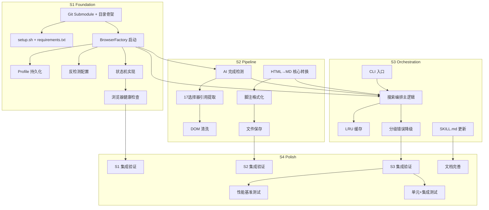

# 任务清单 (Task List)

**项目**: Google AI Mode Skill — Camoufox 迁移
**版本**: v1
**创建日期**: 2026-05-19
**状态**: Active

---

## Sprint 路线图

| Sprint | 代号 | 核心任务 | 退出标准 | 预估 |
|--------|------|---------|---------|:--:|
| S1 | Foundation | 项目骨架 + BrowserEngine 实现 | Camoufox 启动成功，导航 Google 正常 | 6-8h |
| S2 | Pipeline | ContentExtractor + MarkdownConverter | AI 内容提取→Markdown 转换全链路可用 | 6-8h |
| S3 | Orchestration | SearchEngine 编排 + 集成联调 | 端到端搜索成功，CLI 参数正常 | 8-10h |
| S4 | Polish | 性能验证 + 测试 + 文档 | P95 ≤ 3s，SKILL.md 更新 | 4-6h |

---

## 依赖图总览

---

## System 1: 项目骨架 (Project Scaffold)

### Phase 1: Foundation

- [x] **T1.1.1** [REQ-006]: 添加 Camoufox Git Submodule + 项目目录骨架
  - **描述**: 添加 Camoufox 为 Git Submodule，创建 src/ 子目录结构，配置 PYTHONPATH
  - **输入**:
    - ADR-002: Git Submodule 集成决策
    - 02_ARCHITECTURE_OVERVIEW.md §6 物理代码结构
  - **输出**: `.gitmodules`, `libs/camoufox/`, `src/browser/`, `src/search/`, `src/extractor/`, `src/converter/` 目录 + `__init__.py`
  - **验收标准**:
    - [ ] `git submodule add https://github.com/daijro/camoufox.git libs/camoufox` 成功
    - [ ] `src/{browser,search,extractor,converter}/` 目录创建，各自含 `__init__.py`
    - [ ] `python -c "import sys; sys.path.insert(0, 'libs/camoufox')"` 不报错
  - **验证类型**: 编译检查
  - **验证说明**: `ls libs/camoufox/` 有源码, `python -c "import camoufox"` 成功
  - **估时**: 1h
  - **依赖**: 无
  - **优先级**: P0

- [x] **T1.1.2** [基础]: 编写 setup.sh 和 requirements.txt
  - **描述**: 编写首次安装脚本（submodule init + pip install -e + venv），定义 Python 依赖
  - **输入**:
    - ADR-002: `pip install -e libs/camoufox`
    - 原项目 `scripts/setup_environment.py` 参考
  - **输出**: `setup.sh`, `requirements.txt`
  - **验收标准**:
    - [ ] `bash setup.sh` 在新 clone 的仓库中一次性完成安装
    - [ ] `requirements.txt` 包含: camoufox, beautifulsoup4, html-to-markdown, pytest
    - [ ] setup.sh 包含 `git submodule update --init` 和 `pip install -e libs/camoufox`
  - **验证类型**: 手动验证
  - **验证说明**: 执行 `bash setup.sh` 后 `.venv/` 存在, `python -c "import camoufox"` 成功
  - **估时**: 1h
  - **依赖**: T1.1.1
  - **优先级**: P0

---

## System 2: BrowserEngine (browser-engine)

### Phase 1: Foundation — 启动与配置

- [ ] **T2.1.1** [REQ-001]: 实现 BrowserFactory 启动 Camoufox
  - **描述**: 用 Camoufox 的 launch_persistent_context 替代原 Patchright 启动逻辑，成功启动 Firefox 并导航到 google.com
  - **输入**:
    - 04_SYSTEM_DESIGN/browser-engine.md §4 组件架构、§6 接口设计
    - 原项目 `scripts/browser_utils.py` (BrowserFactory 参考)
  - **输出**: `src/browser/browser_factory.py`（含 `get_context()`, `navigate(url)` 方法）
  - **验收标准**:
    - [ ] `get_context()` 返回 Camoufox BrowserContext，`browser.browser_type.name == "firefox"`
    - [ ] `navigate("https://www.google.com")` 页面成功加载，title 含 "Google"
    - [ ] 异常: Camoufox 未安装时抛清晰错误 `Camoufox not found. Run: git submodule update --init`
  - **验证类型**: 集成测试
  - **验证说明**: 脚本启动 Firefox → 导航 Google → 截图验证
  - **估时**: 3h
  - **依赖**: T1.1.2
  - **优先级**: P0

### Phase 2: Core — Profile 与反检测

- [ ] **T2.2.1** [REQ-007]: 实现 Profile 持久化
  - **描述**: Profile 目录管理（创建/加载/损坏恢复），路径 `~/.cache/google-ai-mode-skill/firefox_profile/`，兼容旧 Chrome Profile 路径提示
  - **输入**:
    - 04_SYSTEM_DESIGN/browser-engine.md §7 数据模型、§14 错误处理矩阵
    - PRD [REQ-007] 验收标准
  - **输出**: `src/browser/profile_manager.py`
  - **验收标准**:
    - [ ] 首次运行自动创建 Profile 目录于 `~/.cache/google-ai-mode-skill/firefox_profile/`
    - [ ] 已有 Profile 时直接复用（cookies/session 保持）
    - [ ] 异常: Profile 损坏时备份为 `.corrupted_{timestamp}` 并新建
    - [ ] 异常: 检测到旧 Chrome Profile 路径时打印迁移警告
  - **验证类型**: 集成测试
  - **验证说明**: 运行 2 次搜索 → 检查 Profile 目录存在 → 删除 Preferences → 再次运行验证自动恢复
  - **估时**: 2h
  - **依赖**: T2.1.1
  - **优先级**: P1

- [ ] **T2.2.2** [REQ-001]: 实现反检测配置
  - **描述**: 配置 11 项反检测项（UA 伪装、locale="en-US"、extra_http_headers、disable-automation flags），5 项显式配置 + 6 项 Camoufox 内置
  - **输入**:
    - 04_SYSTEM_DESIGN/browser-engine.md §8 反检测配置详解
  - **输出**: `src/browser/stealth.py`
  - **验收标准**:
    - [ ] UA 设为最新 Chrome/Firefox hybrid 格式
    - [ ] locale 设为 "en-US"，extra_http_headers 含 `Accept-Language: en-US,en`
    - [ ] `--enable-automation` 等自动化标记已禁用
    - [ ] 导航 Google 不触发 CAPTCHA（首次除外）
  - **验证类型**: 手动验证
  - **验证说明**: 启动浏览器 → 访问 `https://bot.sannysoft.com/` → 验证自动化标记为 false
  - **估时**: 2h
  - **依赖**: T2.1.1
  - **优先级**: P0

### Phase 3: Integration — 状态机与健康检查

- [ ] **T2.3.1** [REQ-002]: 实现浏览器预热常驻状态机
  - **描述**: COLD → WARMING → READY → STALE → DEAD 五状态机，含状态转换逻辑和心跳检测
  - **输入**:
    - 04_SYSTEM_DESIGN/browser-engine.md §5 状态机设计（状态图 + 转换决策表）
    - PRD [REQ-002] 验收标准
  - **输出**: `src/browser/context_manager.py`
  - **验收标准**:
    - [ ] 首次调用 `get_context()` 走 COLD→WARMING→READY，冷启动成功
    - [ ] 后续 `get_context()` 返回已 READY 的 context（不重启进程），导航 < 500ms
    - [ ] 闲置 > 5 分钟后 context → STALE，下次调用时自动 `health_check()` → 重新 WARMING
    - [ ] 异常: 浏览器进程被 kill 后自动检测并重启（DEAD → WARMING → READY）
  - **验证类型**: 集成测试
  - **验证说明**: 启动 → 搜索 → `sleep 360` → 再次搜索验证状态转换
  - **估时**: 3h
  - **依赖**: T2.1.1, T2.2.1
  - **优先级**: P0

- [ ] **T2.3.2** [REQ-002]: 实现浏览器健康检查与优雅关闭
  - **描述**: health_check() 检测浏览器进程/browser context 有效性；shutdown() 优雅关闭（清缓存→kill 进程→标记 DEAD）
  - **输入**:
    - 04_SYSTEM_DESIGN/browser-engine.md §6.1 接口契约（shutdown, health_check）、§15 可观测性
  - **输出**: `src/browser/context_manager.py` 中 `health_check()` 和 `shutdown()` 方法
  - **验收标准**:
    - [ ] `health_check()` 返回 `{status: COLD|READY|STALE|DEAD, pid, uptime_seconds}`
    - [ ] `shutdown()` 关闭浏览器进程，清理临时文件，设置状态为 DEAD
    - [ ] 异常: 进程已被 OS kill → health_check 返回 status=DEAD 而非抛异常
  - **验证类型**: 集成测试
  - **验证说明**: 启动 → health_check 返回 READY → shutdown → health_check 返回 DEAD
  - **估时**: 1.5h
  - **依赖**: T2.3.1
  - **优先级**: P1

---

## System 3: ContentExtractor (content-extractor)

### Phase 1: Core — AI 检测与内容提取

- [ ] **T3.1.1** [REQ-005]: 实现 AI 完成检测 4 阶段策略
  - **描述**: 4 阶段检测（SVG→aria-label→文本长度→超时回退），每个阶段注入 JS 查询 DOM
  - **输入**:
    - 04_SYSTEM_DESIGN/content-extractor.md §4 提取决策树、§6.3 4阶段配置常量
  - **输出**: `src/extractor/ai_detector.py`
  - **验收标准**:
    - [ ] 阶段1: 检测 SVG thumbs-up button，命中即返回 `completed=True`
    - [ ] 阶段2: 检测 aria-label 含 "feedback"/"Feedback"/"Bewertung"，多语言覆盖
    - [ ] 阶段3: 文本长度 > 200 且 1s 内稳定
    - [ ] 阶段4: 15s 硬超时，返回 `completed=False` 但不中断流程
  - **验证类型**: 单元测试 + 手动验证
  - **验证说明**: pytest mock Page + 真实 Google 搜索验证阶段1命中率
  - **估时**: 2.5h
  - **依赖**: T2.1.1
  - **优先级**: P0

- [ ] **T3.1.2** [REQ-005]: 实现 17 选择器引用提取 + 去重
  - **描述**: 17 个多语言选择器回退链（en 5 → de 4 → nl 4 → generic 4），域名+标题相似度去重
  - **输入**:
    - 04_SYSTEM_DESIGN/content-extractor.md §6.2 17选择器列表、§8.3 去重策略
  - **输出**: `src/extractor/citation_extractor.py`
  - **验收标准**:
    - [ ] 英文搜索命中前 5 个选择器之一，返回 citations 列表
    - [ ] 英文选择器未命中时回退到 de/nl/generic 组
    - [ ] 全部未命中返回空列表（不抛异常）
    - [ ] 去重: 同一来源不同 URL 变体合并为 1 条
  - **验证类型**: 单元测试 + 手动验证
  - **验证说明**: mock HTML fixtures (en/de/nl) 验证选择器命中率
  - **估时**: 2.5h
  - **依赖**: T2.1.1
  - **优先级**: P0

- [x] **T3.1.3** [REQ-005]: 实现 DOM 清洗
  - **描述**: 用 BeautifulSoup4 移除 script/style/nav/footer/ad 标签和无关属性，保留 main/article/p/列表
  - **输入**:
    - 04_SYSTEM_DESIGN/content-extractor.md §6.4 DOM清洗规则
  - **输出**: `src/extractor/dom_cleaner.py`
  - **验收标准**:
    - [ ] 移除 script, style, nav, footer, header, aside, noscript, iframe, svg, form, input, button
    - [ ] 移除所有事件处理属性 (onclick, onload) 和 Google 特定属性 (jsname, jscontroller)
    - [ ] 保留 main, article, p, h1-h6, ul/ol/li, a, blockquote, code/pre, table
    - [ ] 异常: 空 HTML 输入返回空字符串
  - **验证类型**: 单元测试
  - **验证说明**: pytest 输入 mock HTML → 验证输出中无 script 标签、无 style 标签
  - **估时**: 1.5h
  - **依赖**: 无
  - **优先级**: P1

- [ ] **T3.1.4** [REQ-005]: 实现提取协调器
  - **描述**: 编排 AI 检测 → 引用提取 → DOM 清洗三个阶段，输出 ExtractionResult
  - **输入**:
    - 04_SYSTEM_DESIGN/content-extractor.md §4 组件图、§5 接口设计
  - **输出**: `src/extractor/extractor.py`
  - **验收标准**:
    - [ ] `extract_content(page)` 依次调用 `wait_for_completion` → `extract_citations` → `clean_html`
    - [ ] 返回 `ExtractionResult(ai_text, citations, raw_html, completed, extraction_time_ms)`
    - [ ] AI 检测超时时仍继续提取（不中断流程）
  - **验证类型**: 单元测试
  - **验证说明**: pytest mock Page 对象 → 验证 ExtractionResult 字段完整
  - **估时**: 1.5h
  - **依赖**: T3.1.1, T3.1.2, T3.1.3
  - **优先级**: P0

---

## System 4: MarkdownConverter (markdown-converter)

### Phase 1: Core — 转换与格式化

- [x] **T4.1.1** [REQ-005]: 实现 HTML→Markdown 三库 Fallback 转换
  - **描述**: 主库 html-to-markdown，失败回退 markdownify，再失败回退 html2text，三层 Fallback 链
  - **输入**:
    - 04_SYSTEM_DESIGN/markdown-converter.md §7 技术选型（三库对比）
  - **输出**: `src/converter/html_to_md.py`
  - **验收标准**:
    - [ ] 主库可用时使用 html-to-markdown 转换
    - [ ] 主库 ImportError 时自动回退 markdownify
    - [ ] markdownify 也失败时回退 html2text
    - [ ] 全部不可用时使用朴素正则 strip 作为最终保底
    - [ ] 转换耗时 < 200ms（Google AI 页面典型 HTML ~200KB）
  - **验证类型**: 单元测试
  - **验证说明**: pytest mock 各库不可用场景验证 Fallback 链
  - **估时**: 2h
  - **依赖**: 无
  - **优先级**: P0

- [x] **T4.1.2** [REQ-005]: 实现脚注格式化 + Sources 段落
  - **描述**: 引用 [1][2] 插入段落末尾，生成 `## Sources:` 段落列出 URL 和标题
  - **输入**:
    - 04_SYSTEM_DESIGN/markdown-converter.md §6 数据模型（脚注映射）、§8.1 脚注策略
  - **输出**: `src/converter/footnote_formatter.py`
  - **验收标准**:
    - [ ] Citation 序号按 AI 文本中出现顺序分配
    - [ ] 脚注 [1][2] 插入段落末尾（非句末）
    - [ ] `## Sources:` 段落格式 `[N] Title\nURL\n`
    - [ ] 无引用时省略 Sources 段落
  - **验证类型**: 单元测试
  - **验证说明**: pytest 输入 mock citations + ai_text → 验证输出 Markdown 格式
  - **估时**: 1.5h
  - **依赖**: 无
  - **优先级**: P1

- [x] **T4.1.3** [REQ-005]: 实现文件保存策略
  - **描述**: `--save` 标记触发，保存到 `results/` 目录，时间戳命名 `YYYY-MM-DD_HH-MM-SS_Query_Name.md`
  - **输入**:
    - 04_SYSTEM_DESIGN/markdown-converter.md §13 文件保存策略
  - **输出**: `src/converter/file_saver.py`
  - **验收标准**:
    - [ ] `save_result(markdown, query)` 写入 `results/2026-05-19_14-30-00_Query_Name.md`
    - [ ] 文件名非法字符替换为 `_`（如 `?`, `/`, `:`）
    - [ ] 目录 `results/` 不存在时自动创建
    - [ ] 幂等: 同一时间戳+查询名覆盖写入
  - **验证类型**: 单元测试
  - **验证说明**: pytest tmp_path 验证文件创建和内容
  - **估时**: 1h
  - **依赖**: 无
  - **优先级**: P1

---

## System 5: SearchEngine (search-engine)

### Phase 1: Foundation — CLI

- [ ] **T5.1.1** [REQ-005]: 实现 CLI 入口 + venv 包装器
  - **描述**: argparse CLI 解析（--query 必填, --save, --debug, --show-browser 可选），venv 包装器兼容原 run.py 接口
  - **输入**:
    - 04_SYSTEM_DESIGN/search-engine.md §5 CLI 设计（参数表、退出码）
  - **输出**: `src/search/cli.py`, `src/search/run.py`
  - **验收标准**:
    - [ ] `python src/search/run.py --query "test"` 执行搜索
    - [ ] `--save` 标记时结果保存到 `results/`
    - [ ] `--debug` 标记时输出每环节耗时日志
    - [ ] `--show-browser` 标记时 headless=False
    - [ ] 退出码: 0(成功), 1(通用错误), 2(CAPTCHA), 3(浏览器关闭), 4(区域限制), 130(中断)
  - **验证类型**: 集成测试
  - **验证说明**: 执行各参数组合验证参数解析和退出码
  - **估时**: 2h
  - **依赖**: T2.1.1
  - **优先级**: P0

### Phase 2: Core — 编排与缓存

- [ ] **T5.2.1** [REQ-005]: 实现搜索编排主逻辑
  - **描述**: 编排 BrowserEngine → ContentExtractor → MarkdownConverter 全流程，含性能计时
  - **输入**:
    - 04_SYSTEM_DESIGN/search-engine.md §4 泳道图、§8 性能设计（预算分解）
  - **输出**: `src/search/engine.py`
  - **验收标准**:
    - [ ] `search(query)` 依次调用 BrowserEngine → ContentExtractor → MarkdownConverter
    - [ ] `--debug` 模式打印每环节耗时（browser_start, navigate, ai_wait, extract, convert, total）
    - [ ] 返回完整 Markdown（含脚注 + Sources）
    - [ ] P95 总耗时 ≤ 3000ms（预热后，≥10次采样）
  - **验证类型**: 集成测试
  - **验证说明**: 执行 `--debug` 搜索 → 检查控制台输出包含各环节耗时, 总时间 ≤ 3s
  - **估时**: 3h
  - **依赖**: T2.3.1, T3.1.4, T4.1.1, T4.1.2, T5.1.1
  - **优先级**: P0

- [ ] **T5.2.2** [REQ-003]: 实现 LRU + TTL 缓存
  - **描述**: OrderedDict 实现 LRU 缓存，max 50 条，TTL 5 分钟，查询 hash 作为 key
  - **输入**:
    - 04_SYSTEM_DESIGN/search-engine.md §6 数据模型（CacheEntry）、§8 Trade-off
  - **输出**: `src/search/cache.py`
  - **验收标准**:
    - [ ] 相同查询 5 分钟内直接返回缓存，耗时 < 100ms
    - [ ] 超过 50 条时淘汰最少使用的条目（LRU）
    - [ ] TTL 过期条目重新搜索
    - [ ] 查询大小写不同视为相同 key（normalized hash）
  - **验证类型**: 单元测试
  - **验证说明**: pytest 插入 51 条 → 验证第 1 条被淘汰; time.sleep(301) → 验证过期
  - **估时**: 2h
  - **依赖**: T5.2.1
  - **优先级**: P1

- [ ] **T5.2.3** [REQ-004]: 实现分级错误降级
  - **描述**: CAPTCHA 检测 → 退出码2 + 提示; 超时 → 自动重试1次; AI Mode 不可用 → 普通搜索降级; 连续3次失败 → 放弃
  - **输入**:
    - 04_SYSTEM_DESIGN/search-engine.md §7 错误处理（决策树）
    - PRD [REQ-004] 验收标准
  - **输出**: `src/search/error_handler.py`
  - **验收标准**:
    - [ ] CAPTCHA 检测: URL 含 `/sorry/index` 或文本含 "captcha" → 退出码 2
    - [ ] 网络超时 (15s): 自动重试 1 次 → 仍失败返回 "网络超时，请检查连接"
    - [ ] AI Mode 不可用: 无 AI overview 元素 → 尝试提取普通搜索结果，标记 `[ASSUMPTION: 非 AI 结果]`
    - [ ] 连续 3 次失败 → 返回聚合错误摘要，不无限重试
  - **验证类型**: 单元测试 + 手动验证
  - **验证说明**: pytest mock Page 返回 CAPTCHA/空页面/超时场景; 真实搜索触发降级验证
  - **估时**: 2h
  - **依赖**: T5.2.1
  - **优先级**: P1

### Phase 3: 文档

- [ ] **T5.3.1** [REQ-005]: 更新 SKILL.md
  - **描述**: 更新 SKILL.md 反映 Camoufox 引擎、新 CLI 参数、性能特性
  - **输入**:
    - PRD §1 执行摘要
    - 原项目 SKILL.md 内容
  - **输出**: 根目录更新后的 `SKILL.md`
  - **验收标准**:
    - [ ] 描述中提到 Camoufox (Firefox) 替代 Patchright (Chrome)
    - [ ] 更新 "How It Works" 节包含预热常驻和 LRU 缓存说明
    - [ ] 更新 CLI 参数表（--query/--save/--debug/--show-browser）
    - [ ] 更新 Troubleshooting 节（Camoufox 初始化失败、Profile 损坏）
  - **验证类型**: 手动验证
  - **验证说明**: 审阅 SKILL.md 内容准确性
  - **估时**: 1.5h
  - **依赖**: T5.2.3
  - **优先级**: P1

---

## System 6: 集成验证与测试 (Integration & Testing)

### Phase 1: Sprint 验证

- [ ] **INT-S1** [MILESTONE]: S1 集成验证 — BrowserEngine 就绪
  - **描述**: 验证 S1 退出标准：Camoufox 启动 + 导航 Google + Profile 持久化 + 反检测配置
  - **输入**: S1 所有任务产出
  - **输出**: 集成验证报告（通过/失败 + 问题清单）
  - **验收标准**:
    - Given 项目骨架 + BrowserEngine 代码已实现
    - When 执行以下检查: (1) `get_context()` 启动 Firefox (2) `navigate("https://www.google.com")` 成功 (3) 第二次调用复用 context (4) Profile 目录存在
    - Then 全部通过 → S1 完成
  - **验证类型**: 冒烟测试
  - **验证说明**: 执行脚本 → 检查进程列表含 Firefox, Profile 目录创建, 截图无 CAPTCHA
  - **估时**: 1.5h
  - **依赖**: T2.3.2
  - **优先级**: P0

- [ ] **INT-S2** [MILESTONE]: S2 集成验证 — 提取管线就绪
  - **描述**: 验证 S2 退出标准：AI 检测 → 引用提取 → DOM 清洗 → Markdown 转换全链路可用
  - **输入**: S2 所有任务产出
  - **输出**: 集成验证报告
  - **验收标准**:
    - Given ContentExtractor + MarkdownConverter 代码已实现
    - When 提供真实 Google AI Mode 页面 HTML fixture
    - Then AI 完成检测返回 True, citations 列表非空, Markdown 输出含 [1][2] 脚注 + Sources 段落
  - **验证类型**: 集成测试
  - **验证说明**: pytest 用 fixture HTML + mock Page → 验证 ExtractionResult → Markdown 全链路
  - **估时**: 1.5h
  - **依赖**: T3.1.4, T4.1.2
  - **优先级**: P0

- [ ] **INT-S3** [MILESTONE]: S3 集成验证 — 端到端搜索就绪
  - **描述**: 验证 S3 退出标准：CLI → 编排 → 搜索 → Markdown 输出完整链路
  - **输入**: S3 所有任务产出
  - **输出**: 集成验证报告
  - **验收标准**:
    - Given 所有系统已实现并集成
    - When `python src/search/run.py --query "React hooks 2026" --save --debug` 执行 3 次
    - Then 3 次均返回 Markdown 含引用; 第 2/3 次总耗时 ≤ 3s; 缓存命中时 < 100ms
  - **验证类型**: E2E测试
  - **验证说明**: 真实 Google 搜索 3 次 → 检查输出结果 + 性能日志
  - **估时**: 2h
  - **依赖**: T5.2.3
  - **优先级**: P0

### Phase 2: 性能与质量

- [ ] **T6.2.1** [REQ-005]: 性能基准测试
  - **描述**: 10 次不同查询统计 P95 延迟，验证 ≤ 3s（预热后）和 ≤ 8s（首次冷启动）
  - **输入**: INT-S3 验收完成的搜索管线
  - **输出**: `results/benchmark_{date}.md` 性能报告
  - **验收标准**:
    - [ ] 10 次查询 P95 ≤ 3000ms（预热后）
    - [ ] 首次冷启动 ≤ 8000ms
    - [ ] 缓存命中 < 100ms
    - [ ] 报告包含每环节时间分布（navigate/ai_wait/extract/convert）
  - **验证类型**: E2E测试
  - **验证说明**: 执行 10 次不同查询 → `--debug` 日志 → 统计 P50/P95/MAX
  - **估时**: 1.5h
  - **依赖**: INT-S3
  - **优先级**: P0

- [ ] **T6.2.2** [ADR-003]: 编写单元测试 + 集成测试
  - **描述**: 为核心模块编写 pytest 用例，目标覆盖率 > 60%
  - **输入**: ADR-003 测试策略、各系统设计文档的测试章节
  - **输出**: `src/*/tests/` 目录下测试文件，`requirements.txt` 含 pytest
  - **验收标准**:
    - [ ] MarkdownConverter: 单元测试 > 90% 覆盖率（纯函数）
    - [ ] ContentExtractor: 集成测试 > 80% 覆盖率（mock Page）
    - [ ] Cache: 单元测试覆盖 LRU 淘汰/TTL 过期/缩容
    - [ ] ErrorHandler: 单元测试覆盖 CAPTCHA/超时/AI不可用/3次失败
    - [ ] 所有测试 `python -m pytest src/` 通过
  - **验证类型**: 单元测试 + 集成测试
  - **验证说明**: `python -m pytest src/ -v --cov` 输出覆盖率报告
  - **估时**: 3h
  - **依赖**: INT-S3
  - **优先级**: P1

- [ ] **T6.2.3** [基础]: 文档完善与 README 更新
  - **描述**: 更新 README.md（Camoufox 安装说明、性能数据、架构链接）、更新 .gitignore
  - **输入**: SKILL.md 更新内容、性能基准测试结果
  - **输出**: 更新后的 `README.md`, `.gitignore`
  - **验收标准**:
    - [ ] README 含 Camoufox submodule clone 说明 (`git clone --recurse-submodules`)
    - [ ] README 含性能基准数据
    - [ ] .gitignore 含 `.venv/`, `__pycache__/`, `.cache/`, `results/`, `logs/`
  - **验证类型**: 手动验证
  - **验证说明**: 审阅 README 内容完整性和准确性
  - **估时**: 1h
  - **依赖**: T5.3.1, T6.2.1
  - **优先级**: P2

---

## 任务统计

| 指标 | 值 |
|------|-----|
| 总任务数 | 23 |
| P0 任务 | 12 |
| P1 任务 | 9 |
| P2 任务 | 2 |
| Sprint 数 | 4 |
| 总预估工时 | 约 40 小时 |
| 可并行任务 | T2.2.1/T2.2.2, T3.1.3/T4.1.1/T4.1.2/T4.1.3 |

---

## User Story 覆盖矩阵

| US | 需求 | 覆盖任务 |
|----|------|---------|
| US-001 | [REQ-001] Camoufox 引擎替换 | T2.1.1, T2.2.2 |
| US-002 | [REQ-002] 浏览器预热常驻 | T2.3.1, T2.3.2 |
| US-003 | [REQ-003] LRU 缓存 | T5.2.2 |
| US-004 | [REQ-004] 分级错误降级 | T5.2.3 |
| US-005 | [REQ-005] 全链路性能达标 | T3.1.1, T3.1.2, T3.1.4, T4.1.1, T5.1.1, T5.2.1, T6.2.1 |
| US-006 | [REQ-006] Submodule 管理 | T1.1.1 |
| US-007 | [REQ-007] 登录状态持久化 | T2.2.1 |

---

## 下一步行动

1. **立即执行**: T1.1.1 添加 Camoufox Submodule
2. **按 Sprint 顺序**: S1 → S2 → S3 → S4
3. **并行机会**: S2 中 T3.1.3, T4.1.1, T4.1.2, T4.1.3 无相互依赖可并行
4. **关键路径**: T1.1.1 → T2.1.1 → T2.3.1 → T5.2.1 → INT-S3 → T6.2.1
