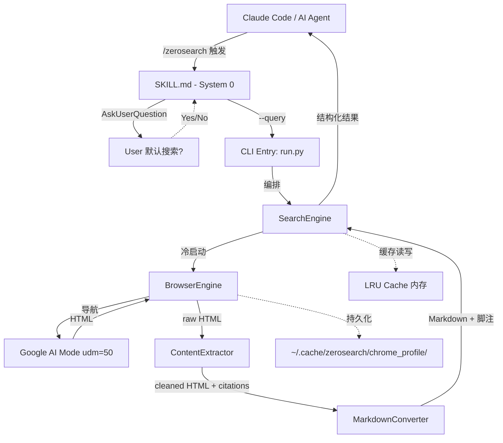
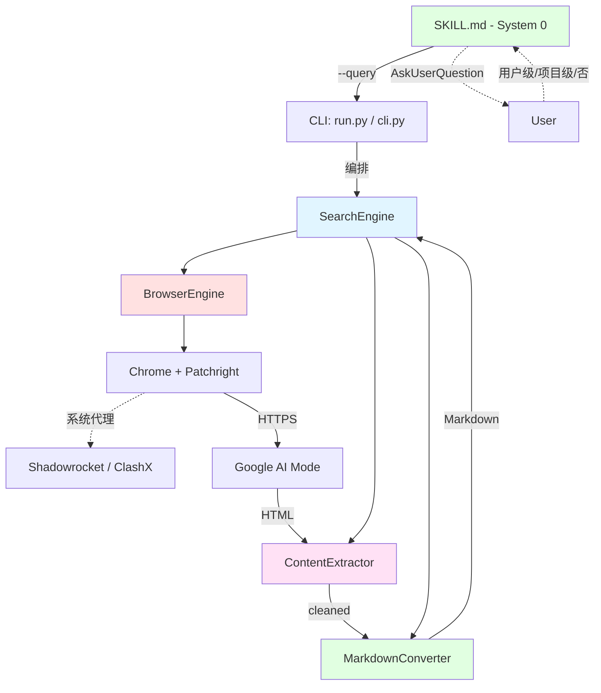

# 系统架构总览 (Architecture Overview)

**项目**: ZeroSearch v0.2
**版本**: 0.2
**日期**: 2026-05-20

---

## 1. 系统上下文 (System Context)

### 1.1 C4 Level 1 - 系统上下文图



### 1.2 关键用户

| 角色 | 交互方式 |
|------|---------|
| **Claude Code (AI Agent)** | 通过 `/zerosearch` 技能触发，接收 Markdown + 脚注 |
| **开发者** | CLI: `python src/search/run.py --query "..."` |

### 1.3 外部系统

| 外部系统 | 协议 | 用途 |
|---------|------|------|
| **Google AI Mode** | HTTPS (udm=50) | AI 合成搜索概述 |
| **系统代理** (Shadowrocket/ClashX) | SOCKS/HTTP 127.0.0.1 | Chromium 自动继承 |
| **Patchright** (pip) | Python API | 反检测浏览器自动化 |

---

## 2. 系统清单 (System Inventory)

### System 0: SKILL.md — 技能入口与交互层

**系统ID**: `skill-entry`

**职责**:
- 接收 Claude Code `/zerosearch` 触发，解析查询参数
- 首次运行调用 `AskUserQuestion`："是否将 ZeroSearch 设为默认搜索工具？"
  - Yes → 在 CLAUDE.md 中注册搜索策略
  - No → 跳过注册
- 将查询转发给 Python CLI

**AskUserQuestion 交互协议**:

| 字段 | 值 |
|------|-----|
| **Header** | "默认搜索" |
| **Yes** | 写入 CLAUDE.md 搜索策略，AI 优先使用 ZeroSearch |
| **No** | 不修改配置，手动通过 /zerosearch 触发 |

**边界**:
- **输入**: `/zerosearch <query>`
- **输出**: `python src/search/run.py --query "..." [--save] [--debug]`
- **依赖**: `AskUserQuestion` (Claude Code 工具)

**关联需求**: [REQ-009]

**文件**: `SKILL.md`

---

### System 1: BrowserEngine — 浏览器引擎

**系统ID**: `browser-engine`

**职责**:
- 使用 Patchright 冷启动真 Chrome（channel="chrome"）
- 持久化 Profile 管理（cookie/session 保留，CAPTCHA 记忆）
- 页面导航（Google AI Mode `udm=50`）
- 反检测配置（BROWSER_ARGS、语言强制英文）
- 人类行为模拟（可选延迟）

**v0.2 变更**:
- Camoufox (Firefox) → Patchright (Chromium)
- `detect_system_proxy()` 移除（Chromium 自动继承系统代理）
- 新增 `channel="chrome"` + Profile 文件写入（Local State / Preferences）
- 新增人类行为模拟工具（StealthUtils）
- Profile 目录: `~/.cache/zerosearch/chrome_profile/` — 独立 Chrome Profile
  - 与用户日常 Chrome 隔离，避免 Profile 锁定冲突
  - Chrome 禁止在默认 Profile 目录上开启 DevTools 远程调试

**边界**:
- **输入**: `BrowserFactory.get_context(profile_path)` 调用
- **输出**: Playwright Page 对象（已导航到 Google AI Mode）
- **依赖**: Patchright (pip)、系统 Chrome、`profile_config.json`

**关联需求**: [REQ-002], [REQ-004], [REQ-006], [REQ-007], [REQ-008]

**源码**: `src/browser/`

---

### System 2: SearchEngine — 搜索引擎

**系统ID**: `search-engine`

**职责**:
- CLI 参数解析（argparse）
- 全流程编排（BrowserEngine → ContentExtractor → MarkdownConverter）
- LRU 内存缓存（50 条，TTL 5 分）
- 分级错误降级（CAPTCHA/超时/AI 不可用）
- 文件保存（results/ 目录）
- venv 包装器（run.py）

**v0.2 变更**: 基本不变，仅适配 Patchright BrowserEngine API

**边界**:
- **输入**: CLI args (`--query`, `--save`, `--debug`, `--profile <path>`, `--fresh-profile`, `--reconfigure`)
- **输出**: Markdown 字符串 + 退出码
- **依赖**: BrowserEngine, ContentExtractor, MarkdownConverter

**CLI Flags 完整列表**:

| Flag | 来源 | 用途 |
|------|------|------|
| `--query`, `-q` | REQ-001 | 搜索查询字符串 |
| `--save` | REQ-001 | 保存结果到 results/ |
| `--debug` | REQ-001 | 每阶段耗时日志 |
| `--profile <path>` | REQ-008 | 指定 Chrome Profile 路径（由 System 0 传入） |
| `--fresh-profile` | REQ-008 | 使用独立空白 Profile（忽略 profile_config.json） |
| `--reconfigure` | REQ-008 | 重新触发 System 0 的 Profile 选择 |

**退出码**:
| 码 | 含义 |
|:--:|------|
| 0 | 成功 |
| 1 | 通用错误 |
| 2 | CAPTCHA 触发 |
| 3 | 浏览器关闭 |
| 4 | AI Mode 不可用 |
| 5 | Chrome Profile 锁定（需关闭 Chrome） |
| 130 | 用户中断 |

**关联需求**: [REQ-001], [REQ-008]

**源码**: `src/search/`

---

### System 3: ContentExtractor — 内容提取器

**系统ID**: `content-extractor`

**职责**:
- AI Overview 完成检测
- 引用提取（多语言 CSS 选择器 + JS 注入）
- DOM 清洗（去 Google UI 噪音：导航栏、页脚、搜索框等）
- 精简输出（只为 AI 消费，去冗余空白/样式）

**v0.2 变更**: 基本不变；AI 原生优化——进一步精简输出格式

**边界**:
- **输入**: Playwright Page 对象（Google AI Mode 结果页）
- **输出**: `ExtractionResult(ai_text, citations, raw_html)`
- **依赖**: 无

**关联需求**: [REQ-003]

**源码**: `src/extractor/`

---

### System 4: MarkdownConverter — Markdown 转换器

**系统ID**: `markdown-converter`

**职责**:
- HTML → Markdown（三库 fallback）
- 脚注格式化（[1], [2]... 插入段落末尾）
- Sources 段落生成
- 文件保存（时间戳命名）

**v0.2 变更**: 基本不变；AI 原生优化——输出更紧凑（减少空行、精简引用格式）

**边界**:
- **输入**: HTML 文本 + citations 列表
- **输出**: 格式化 Markdown 字符串
- **依赖**: 无

**关联需求**: [REQ-003]

**源码**: `src/converter/`

---

## 3. 系统边界矩阵

| 系统 | 输入 | 输出 | 依赖系统 | 被依赖系统 |
|------|------|------|---------|----------|
| SKILL.md (System 0) | `/zerosearch <query>` + `AskUserQuestion` | `python run.py --query "..." [--save] [--debug]` | AskUserQuestion | — |
| BrowserEngine | `get_context()` | Playwright Page | Patchright, Chrome | SearchEngine |
| SearchEngine | CLI args (--query, --save, --debug) | Markdown + 退出码 | Browser, Extractor, Converter | SKILL.md |
| ContentExtractor | Playwright Page | ExtractionResult | — | SearchEngine |
| MarkdownConverter | HTML + Citations | Markdown 字符串 | — | SearchEngine |

---

## 4. 系统依赖图



---

## 5. 项目物理结构

```text
ZeroSearch/
├── setup.sh                     # 一键安装 (pip install + patchright install chrome + CLAUDE.md 注册)
├── requirements.txt             # patchright>=1.55,<2, beautifulsoup4, etc.
├── SKILL.md                     # System 0: Claude Code 技能入口 + AskUserQuestion 交互
├── README.md
├── src/
│   ├── browser/                 # System 1: BrowserEngine
│   │   ├── browser_factory.py   #   Patchright launch + persistent context
│   │   ├── context_manager.py   #   状态机 COLD→READY→DEAD
│   │   ├── stealth.py           #   BROWSER_ARGS + 语言强制 + StealthUtils
│   │   └── profile_manager.py   #   Chrome Profile 持久化
│   ├── search/                  # System 2: SearchEngine
│   │   ├── cli.py               #   argparse CLI 入口
│   │   ├── run.py               #   venv 包装器
│   │   ├── engine.py            #   全流程编排
│   │   ├── cache.py             #   LRU + TTL 缓存
│   │   └── error_handler.py     #   分级错误降级
│   ├── extractor/               # System 3: ContentExtractor
│   │   ├── extractor.py         #   提取协调器
│   │   ├── ai_detector.py       #   AI Overview 完成检测
│   │   ├── citation_extractor.py #  引用提取 (CSS + JS)
│   │   └── dom_cleaner.py       #   DOM 清洗
│   └── converter/               # System 4: MarkdownConverter
│       ├── html_to_md.py        #   HTML→MD 三库 fallback
│       ├── footnote_formatter.py # 脚注格式化
│       └── file_saver.py        #   文件保存
├── tests/
│   ├── test_cache.py
│   ├── test_dom_cleaner.py
│   └── test_footnote.py
├── results/                     # 搜索结果保存
└── .anws/v2/                   # 架构文档
```

---

## 6. 拆分原则与理由

### 为什么是 5 个系统

| 维度 | 分析 |
|------|------|
| **职责分离** | 技能入口 / 浏览器管理 / 搜索编排 / 内容提取 / 格式转换 — 五者职责独立 |
| **运行层分离** | SKILL.md 运行在 Claude Code 层，其余 4 系统运行在 Python CLI 层 |
| **变化频率** | BrowserEngine 是唯一大变系统（换底层），SKILL.md 随 UX 需求变化 |
| **测试独立性** | 每个系统可独立单元测试（ContentExtractor/MarkdownConverter 纯函数） |

### 为什么 SKILL.md 独立为 System 0

**SKILL.md 运行在 Claude Code 层**，不是 Python CLI 的一部分。它负责：
- 用户交互（AskUserQuestion："默认搜索工具？" → 用户级/项目级/否）
- 将查询参数转发给 Python CLI

将 SKILL.md 放在任意一个 Python 系统中都会模糊运行层边界。独立为 System 0 后，Python 系统不需要理解 AskUserQuestion——它们只接收 `--query` 参数。

**BrowserEngine 独立**: 底层引擎变更（Camoufox→Patchright）应该只影响这一个系统，不波及其他。

**SearchEngine 独立**: 纯 Python 编排逻辑，不依赖具体浏览器 API。

---

## 7. 下一步行动

- `/design-system browser-engine` — 详细设计 BrowserEngine（主要变更）
- 其余三系统保持 v0.1 设计，只需微调
- `/blueprint` — 生成任务清单
