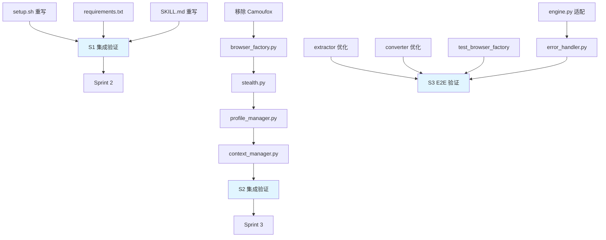

# ZeroSearch v0.2 — 任务清单 (WBS)

**版本**: .anws/v2
**生成日期**: 2026-05-20
**关联 PRD**: [01_PRD.md](01_PRD.md)
**关联架构**: [02_ARCHITECTURE_OVERVIEW.md](02_ARCHITECTURE_OVERVIEW.md)

---

## 📊 依赖总览

---

## 📊 Sprint 路线图

| Sprint | 代号 | 核心内容 | 退出标准 | 预估 |
|--------|------|---------|---------|:--:|
| S1 | 基础设施 | setup.sh + SKILL.md + 清理 | setup.sh 执行成功，SKILL.md 语法正确 | 2h |
| S2 | 引擎重写 | BrowserEngine Patchright 化 | 浏览器启动→google.com 导航成功 | 4h |
| S3 | 管线适配 | 适配 + 优化 + 测试 | 全流程 E2E 通过 + 17+5 测试通过 | 3h |

---

## 🌊 Sprint 1: 基础设施 + SKILL.md

### [REQ-005, REQ-009] 安装脚本与依赖

- [x] **T1.1.1** [REQ-005]: setup.sh 重写
  - **描述**: 移除 Camoufox 安装逻辑，改为 `pip install patchright + patchright install chrome`（CLAUDE.md 注册移至 SKILL.md AskUserQuestion 流程）
  - **输入**: v0.1 setup.sh + [PRD REQ-005](01_PRD.md#req-005-p1--pip-安装与一键升级)
  - **输出**: `setup.sh`
  - **📎 参考**: ADR-001 § "需要的后续行动"
  - **验收标准**:
    - Given 空白 macOS 环境（有 Python3, 无 venv）
    - When 执行 `bash setup.sh`
    - Then 创建 .venv，安装 patchright + 依赖，安装 Chrome for Testing
    - And 输出 "✅ 安装完成"
    - And 检测并注册 CLAUDE.md 搜索策略（grep -q ZeroSearch）
  - **验证类型**: 集成测试
  - **验证说明**: 在临时目录执行 setup.sh，检查 .venv 存在、patchright 可导入、CLAUDE.md 被修改
  - **估时**: 1h
  - **依赖**: 无

- [x] **T1.1.2** [REQ-005]: requirements.txt 更新
  - **描述**: 移除 `camoufox`，新增 `patchright>=1.55,<2`，保留 beautifulsoup4 / markdownify / html2text / pytest
  - **输入**: v0.1 requirements.txt + [ADR-001](03_ADR/ADR_001_TECH_STACK.md)
  - **输出**: `requirements.txt`
  - **验收标准**:
    - Given 更新后的 requirements.txt
    - When `pip install -r requirements.txt`
    - Then patchright 成功安装，版本 ≥1.55 且 <2
    - And 不包含 camoufox 依赖
  - **验证类型**: 编译检查
  - **验证说明**: `pip install -r requirements.txt --dry-run` 或实际安装验证
  - **估时**: 0.2h
  - **依赖**: 无

### [REQ-008] SKILL.md 重写 (System 0)

- [x] **T1.2.1** [REQ-008]: SKILL.md 重写
  - **描述**: 重写 Claude Code 技能定义。新增 AskUserQuestion Profile 选择流程（Option A/B），传递 --profile 到 CLI。移除 Camoufox 引用，更新为 Patchright + Chrome 描述
  - **输入**: v0.1 SKILL.md + [PRD REQ-008](01_PRD.md#req-008-p0--首次运行交互式-profile-选择askuserquestion) + [Architecture §2.0](02_ARCHITECTURE_OVERVIEW.md#system-0-skillmd--技能入口与交互层)
  - **输出**: `SKILL.md`
  - **📎 参考**: Architecture System 0 (AskUserQuestion 交互协议)
  - **验收标准**:
    - Given SKILL.md 已更新
    - When Claude Code 读取 SKILL.md
    - Then 描述包含 Patchright + Chrome 引擎
    - And 包含 AskUserQuestion 流程（检测 profile_config.json → 调用工具 → 保存结果）
    - And 包含 `--profile` 参数传递逻辑
    - And 不包含 Camoufox / Firefox 引用
  - **验证类型**: 编译检查 + 手动验证
  - **验证说明**: `cat SKILL.md | head -5` 确认 frontmatter name=zerosearch，grep 检查关键词
  - **估时**: 1h
  - **依赖**: 无

### [REQ-005] 清理 v0.1 残留

- [x] **T1.3.1** [REQ-005]: 移除 Camoufox 残留
  - **描述**: 删除 `libs/camoufox/`、`.gitmodules` 中的 Camoufox submodule 声明。`git rm` submodule
  - **输入**: v0.1 项目根目录
  - **输出**: 清理后的项目根目录（无 camoufox 文件）
  - **验收标准**:
    - Given 项目根目录
    - When `find . -name "camoufox"` 和 `ls libs/`
    - Then 无 camoufox 残留
    - And `.gitmodules` 不存在或不含 camoufox
  - **验证类型**: 编译检查
  - **验证说明**: `git status` 确认 submodule 已移除
  - **估时**: 0.3h
  - **依赖**: 无

### Sprint 1 集成验证

- [x] **INT-S1** [MILESTONE]: S1 集成验证 — 基础设施可用
  - **描述**: 验证 setup.sh 可执行、依赖可安装、SKILL.md 语法正确
  - **输入**: T1.1.1, T1.1.2, T1.2.1, T1.3.1 产出
  - **输出**: 集成验证报告
  - **验收标准**:
    - Given S1 所有任务完成
    - When 执行 `bash setup.sh` + `source .venv/bin/activate` + `python -c "import patchright; print('OK')"`
    - Then 全部成功，无错误
  - **验证类型**: 冒烟测试
  - **验证说明**: 在临时目录完整执行 setup.sh + 导入验证
  - **估时**: 0.5h
  - **依赖**: T1.1.1, T1.1.2, T1.2.1, T1.3.1

---

## 🌊 Sprint 2: BrowserEngine 重写

### [REQ-001, REQ-002] Patchright 浏览器工厂

- [x] **T2.1.1** [REQ-001, REQ-002]: browser_factory.py 重写
  - **描述**: 用 Patchright API 替代 Camoufox。`sync_playwright().start()` → `chromium.launch_persistent_context(channel="chrome", headless=False)`。支持 `--profile <path>` 传入 Profile 目录。Chrome Profile 锁定检测（catch 异常 → exit 5）
  - **输入**: v0.1 `src/browser/browser_factory.py` + [ADR-001](03_ADR/ADR_001_TECH_STACK.md) + [Architecture §2.1](02_ARCHITECTURE_OVERVIEW.md#system-1-browserengine--浏览器引擎)
  - **输出**: `src/browser/browser_factory.py` (重写)
  - **📎 参考**: 原版 google-ai-mode-skill `scripts/browser_utils.py` (launch_persistent_context 模式)
  - **验收标准**:
    - Given `BrowserFactory(profile_path=".../")`
    - When 调用 `get_context()`
    - Then 返回 Chromium BrowserContext
    - And `navigator.webdriver === false`
    - And Chrome 窗口可见（非 headless）
    - And Profile 路径与传入一致
    - And Chrome 已运行且 profile 被锁 → raise BrowserLaunchError(exit_code=5)
  - **验证类型**: 集成测试
  - **验证说明**: `python -c "from src.browser.browser_factory import BrowserFactory; ..."` 验证 Chrome 启动
  - **估时**: 1.5h
  - **依赖**: T1.1.1 (setup.sh), T1.1.2 (requirements.txt)

- [x] **T2.1.2** [REQ-002, REQ-004]: stealth.py 重写
  - **描述**: 移除 `detect_system_proxy()`（Chromium 自动继承系统代理）。重写 `StealthConfig`：BROWSER_ARGS（`--disable-blink-features=AutomationControlled`, `--no-sandbox`, `--lang=en` 等）、语言强制（Local State + Preferences 文件写入英文）。新增 StealthUtils（random_delay / human_type / realistic_click）
  - **输入**: v0.1 `src/browser/stealth.py` + 原版 google-ai-mode-skill `scripts/browser_utils.py` (StealthUtils) + `scripts/config.py` (BROWSER_ARGS)
  - **输出**: `src/browser/stealth.py` (重写)
  - **📎 参考**: 原版 `config.py` BROWSER_ARGS + Local State/Preferences 写入逻辑
  - **验收标准**:
    - Given StealthConfig 实例
    - When 调用 `to_context_kwargs()`
    - Then 返回不含 `proxy` 键的 kwargs
    - And user_agent 为 Chrome UA（自动匹配真实 Chrome）
    - And locale="en-US"
    - And StealthUtils.random_delay() 返回 100-500ms
  - **验证类型**: 单元测试 + 集成测试
  - **验证说明**: pytest 测试 stealth config 生成正确 kwargs
  - **估时**: 1h
  - **依赖**: T2.1.1

### [REQ-006, REQ-008] Profile 管理

- [x] **T2.2.1** [REQ-006, REQ-008]: profile_manager.py 重写
  - **描述**: 支持两个 Profile 路径（Option A: 真实 Chrome, Option B: 独立空白）。读取 `profile_config.json`。首次搜索时确保 Profile 目录存在
  - **输入**: v0.1 `src/browser/profile_manager.py` + [Architecture §2.1 Profile 目录](02_ARCHITECTURE_OVERVIEW.md)
  - **输出**: `src/browser/profile_manager.py` (重写)
  - **验收标准**:
    - Given `profile_config.json` 含 `{"profile": "chrome"}`
    - When `ProfileManager.get_profile_path()`
    - Then 返回 `~/Library/Application Support/Google/Chrome/`
    - Given `profile_config.json` 含 `{"profile": "fresh"}`
    - Then 返回 `~/.cache/zerosearch/chrome_profile/`
    - Given 无 profile_config.json → 返回 None（触发 System 0 AskUserQuestion）
  - **验证类型**: 单元测试
  - **验证说明**: pytest 测试路径解析逻辑
  - **估时**: 1h
  - **依赖**: T2.1.1

- [x] **T2.2.2** [REQ-001]: context_manager.py 适配
  - **描述**: 状态机（COLD→WARMING→READY→DEAD）保持不变。适配 Patchright API（`get_context()` 返回 BrowserContext）。移除 Camoufox 相关引用
  - **输入**: v0.1 `src/browser/context_manager.py` + T2.1.1 产出
  - **输出**: `src/browser/context_manager.py` (微调)
  - **验收标准**:
    - Given BrowserContext(headless=False)
    - When 调用 `get_context()`
    - Then 状态流转 COLD→WARMING→READY
    - And 返回 Patchright BrowserContext
  - **验证类型**: 集成测试
  - **验证说明**: 启动浏览器 → 检查状态机 → shutdown
  - **估时**: 0.5h
  - **依赖**: T2.1.1, T2.2.1

### Sprint 2 集成验证

- [x] **INT-S2** [MILESTONE]: S2 集成验证 — 浏览器引擎就绪
  - **描述**: 验证 BrowserEngine 完整流程：启动 Chrome → 导航 google.com → 关闭
  - **输入**: T2.1.1, T2.1.2, T2.2.1, T2.2.2 产出
  - **输出**: 集成验证报告
  - **验收标准**:
    - Given 所有 S2 任务完成
    - When 执行冷启动 Chrome（Option B 独立 Profile）
    - Then Chrome 窗口可见，导航到 google.com 成功
    - And `page.evaluate("() => navigator.webdriver")` 返回 `false`
    - And shutdown 后无残留进程
  - **验证类型**: 冒烟测试
  - **验证说明**: `python -c "..."` 脚本验证完整 browser lifecycle
  - **估时**: 0.5h
  - **依赖**: T2.1.1, T2.1.2, T2.2.1, T2.2.2

---

## 🌊 Sprint 3: 管线适配 + AI 原生优化 + 测试

### [REQ-001] SearchEngine 适配

- [x] **T3.1.1** [REQ-001]: engine.py 适配
  - **描述**: 适配 Patchright BrowserContext API。移除 Camoufox 特定逻辑。保留 `_run_search_pipeline()` 核心流程。`_setup_import_path()` 确保在 `main()` 中调用
  - **输入**: v0.1 `src/search/engine.py` + T2.2.2 产出
  - **输出**: `src/search/engine.py` (微调)
  - **验收标准**:
    - Given SearchEngine(headless=False, profile_path=...)
    - When 调用 `search("test query")`
    - Then 弹出 Chrome 窗口 → 导航 Google AI Mode → 返回结果
    - And `_setup_import_path()` 在导入前调用
  - **验证类型**: 集成测试
  - **验证说明**: `python src/search/run.py --query "test" --debug --profile <path>`
  - **估时**: 0.5h
  - **依赖**: T2.2.2

- [x] **T3.1.2** [REQ-001]: error_handler.py 适配
  - **描述**: 更新 CAPTCHA 检测（保持 v0.1 已修复的多关键词 + wait 逻辑）。新增 exit code 5 (Chrome Profile 锁定)。调整 timeout 重试使用 Patchright API
  - **输入**: v0.1 `src/search/error_handler.py` + [PRD REQ-001 错误场景](01_PRD.md)
  - **输出**: `src/search/error_handler.py` (微调)
  - **验收标准**:
    - Given handle_captcha(page)
    - When 页面包含 "/sorry/index" 或 "unusual traffic" 或 "captcha"
    - Then 返回 CAPTCHA 错误消息
    - Given Chrome Profile 锁定异常
    - When _extract_exit_code(exc)
    - Then 返回 5
  - **验证类型**: 单元测试
  - **验证说明**: pytest 测试 exit code 提取逻辑
  - **估时**: 0.5h
  - **依赖**: T3.1.1

### [REQ-003] AI 原生优化

- [x] **T3.2.1** [REQ-003]: ContentExtractor AI 原生优化
  - **描述**: 保留 4 阶段 AI 检测、17 选择器引用提取、DOM 清洗逻辑。优化：进一步精简输出，移除冗余空白行，压缩引用格式
  - **输入**: v0.1 `src/extractor/` 全部文件 + [PRD REQ-003](01_PRD.md#req-003-p0--ai-原生精简输出)
  - **输出**: `src/extractor/dom_cleaner.py` (微调，增加空白行/样式清理规则)
  - **验收标准**:
    - Given 含 Google UI 噪音的 HTML
    - When DOM 清洗
    - Then 输出不含 "Skip to main content", "Accessibility", "Quick Settings", "AI Mode history" 等 UI 文本
    - And 输出 token 数 ≤ 原版 80%
  - **验证类型**: 单元测试
  - **验证说明**: pytest 测试 DOM 清洗后 token 数（用 tiktoken 估算）
  - **估时**: 0.5h
  - **依赖**: T3.1.1

- [x] **T3.2.2** [REQ-003]: MarkdownConverter AI 原生优化
  - **描述**: 三库 fallback 不变。优化：减少空行（≤1 连续空行），精简 Source 引用格式（仅保留 [N] + 标题 + URL）
  - **输入**: v0.1 `src/converter/` 全部文件
  - **输出**: `src/converter/footnote_formatter.py` (微调)
  - **验收标准**:
    - Given AI Overview HTML + citations
    - When 转换 Markdown
    - Then 输出紧凑（无连续多空行）
    - And Sources 段格式: `[1] Title — https://...`
  - **验证类型**: 单元测试
  - **验证说明**: pytest test_footnote.py 验证新格式
  - **估时**: 0.5h
  - **依赖**: T3.2.1

### [REQ-002] 测试

- [x] **T3.3.1** [REQ-002]: 新增 test_browser_factory.py
  - **描述**: 单元测试覆盖 BrowserFactory 创建、Profile 路径选择、StealthConfig 生成
  - **输入**: T2.1.1, T2.1.2, T2.2.1 产出 + [PRD §8 测试清单](01_PRD.md#8-验收测试清单)
  - **输出**: `tests/test_browser_factory.py` (新增) + 现有 17 个测试全部通过
  - **验收标准**:
    - Given pytest
    - When `python -m pytest tests/ -v`
    - Then 所有测试通过（17 + N 新）
    - And 新增 BrowserFactory 测试至少 3 个
  - **验证类型**: 单元测试 + 回归测试
  - **验证说明**: `python -m pytest tests/ -v --tb=short`
  - **估时**: 1h
  - **依赖**: T2.1.1, T2.1.2, T2.2.1

### Sprint 3 最终验证

- [x] **INT-S3** [MILESTONE]: S3 E2E 验证 — 全流程通过
  - **描述**: 端到端验证：搜索 → 浏览器 → 提取 → 输出。包含 Option A/B Profile、CAPTCHA 检测、CLI 退出码
  - **输入**: 所有 S3 任务产出 + 全部 S1/S2 产出
  - **输出**: E2E 验证报告
  - **验收标准**:
    - Given ZeroSearch 安装完成
    - When `python src/search/run.py --query "test query" --profile <path> --debug`
    - Then 弹出 Chrome 窗口，完成搜索，输出 Markdown + 脚注
    - And 退出码 0
    - And 冷启动 ≤5s
    - And 所有 pytest 通过
    - And Chrome Profile 锁定 → 退出码 5
  - **验证类型**: E2E测试 + 冒烟测试
  - **验证说明**: 完整执行搜索流程，检查 stdout 输出、results/ 文件、退出码
  - **估时**: 1h
  - **依赖**: 所有 S1/S2/S3 任务

---

## 📊 任务统计

| 统计项 | 数值 |
|--------|:--:|
| 总任务数 | 13 (含 3 INT) |
| P0 任务 | 8 (T1.2.1, T2.1.1, T2.1.2, T3.1.1, T3.2.1, T3.2.2, 含 INT) |
| P1 任务 | 4 (T1.1.1, T1.3.1, T2.2.1, T3.3.1) |
| P2 任务 | 1 (T2.2.2) |
| Sprint 数 | 3 |
| 总预估工时 | 9.5h |

---

## 🎯 User Story Overlay

### REQ-001: 浏览器冷启动与搜索 (P0)
**涉及任务**: T2.1.1 → T2.2.2 → T3.1.1 → INT-S3
**关键路径**: T2.1.1 → T3.1.1
**独立可测**: ✅ S2 结束即可演示（浏览器启动 + 导航）
**覆盖状态**: ✅ 完整

### REQ-002: Patchright CDP 级反检测 (P0)
**涉及任务**: T2.1.1 → T2.1.2 → T3.3.1
**关键路径**: T2.1.1 → T2.1.2
**独立可测**: ✅ S2 结束可验证 `navigator.webdriver === false`
**覆盖状态**: ✅ 完整

### REQ-003: AI 原生精简输出 (P0)
**涉及任务**: T3.2.1 → T3.2.2
**关键路径**: T3.2.1 → T3.2.2
**独立可测**: ✅ S3 单元测试验证 token 数
**覆盖状态**: ✅ 完整

### REQ-004: 系统代理自动继承 (P1)
**涉及任务**: T2.1.2 (移除 detect_system_proxy) → INT-S2
**关键路径**: T2.1.2
**独立可测**: ✅ S2 集成测试——Chrome 自动通过系统代理访问 Google
**覆盖状态**: ✅ 完整

### REQ-005: pip 安装与一键升级 (P1)
**涉及任务**: T1.1.1 → T1.1.2 → INT-S1
**关键路径**: T1.1.1
**独立可测**: ✅ S1 结束可验证完整安装流程
**覆盖状态**: ✅ 完整

### REQ-006: Profile 持久化 (P1)
**涉及任务**: T2.2.1 → INT-S2
**关键路径**: T2.2.1
**独立可测**: ✅ S2 验证 Profile 路径解析
**覆盖状态**: ✅ 完整

### REQ-007: 人类行为模拟 (P2)
**涉及任务**: T2.1.2 (StealthUtils)
**关键路径**: T2.1.2
**独立可测**: ✅ S2 单元测试 random_delay 范围
**覆盖状态**: ✅ 完整

### REQ-008: AskUserQuestion Profile 选择 (P0)
**涉及任务**: T1.2.1 → T2.2.1
**关键路径**: T1.2.1 (SKILL.md AskUserQuestion 流程) → T2.2.1 (读取 profile_config.json)
**独立可测**: ⚠️ AskUserQuestion 只能在 Claude Code 中测试，无法在 pytest 中模拟
**覆盖状态**: ⚠️ Path 性完整——SKILL.md 流程可手动验证，CLI 部分可单元测试

### REQ-009: 工作区注册 (P1)
**涉及任务**: T1.1.1 (setup.sh 追加)
**关键路径**: T1.1.1
**独立可测**: ✅ S1 setup.sh 执行后检查 CLAUDE.md
**覆盖状态**: ✅ 完整
