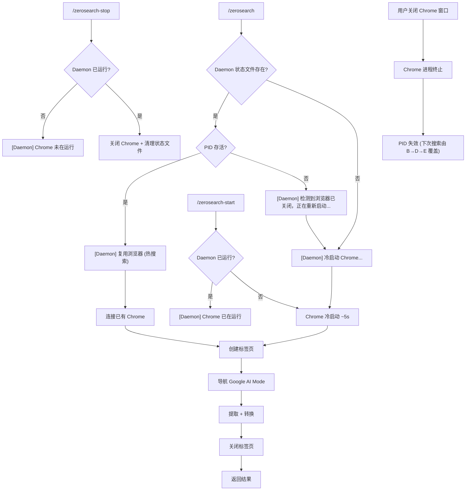

# ZeroSearch v0.3 — 产品需求文档 (PRD)

**功能名称**: Chrome Daemon（会话级浏览器常驻进程）
**文档状态**: 草稿 (Draft)
**创建日期**: 2026-05-21
**关联概念模型**: `.anws/v3/concept_model.json`

---

## 1. 执行摘要 (Executive Summary)

将 ZeroSearch 的 Chrome 浏览器从"每次冷启动"升级为"常驻进程"，首次搜索后 Chrome 保持存活直到用户手动停止或关闭窗口，后续搜索只创建新标签页，将重复搜索耗时从 ~5s 降至 <1s。

---

## 2. 背景与上下文 (Background & Context)

### 2.1 问题陈述 (Problem Statement)

- **当前痛点**: v0.2 每次搜索都冷启动 Chrome 浏览器（~5s），即使连续搜索同一主题也需要反复等待。搜索完成后关闭浏览器，下一次搜索又要重新启动。
- **影响范围**: 所有使用 `/zerosearch` 的 Claude Code 用户，每次搜索体验有 ~5s 延迟。
- **业务影响**: 连续搜索场景下（如追问、细化查询），用户需要反复等待浏览器启动，打断搜索思路流。

### 2.2 核心机会 (Opportunity)

- 首次搜索后的每一次后续搜索，耗时从 ~5s 降至 <1s（仅创建标签页 + 导航 + 提取 + 关闭标签页）
- 连续搜索 3 次即可节省 ~8s（5s+1s+1s vs 5s+5s+5s）
- 复用 Chrome Profile 的 cookie/session 状态，减少重复认证

---

## 3. 目标与范围 (Goals & Non-Goals)

### 3.1 目标 (Goals)

- **[G1]**: 会话内首次搜索冷启动 Chrome，耗时 ≤5s（与 v0.2 持平）
- **[G2]**: Daemon 运行时后续搜索耗时 <1s（仅标签页创建 + 导航 + 提取 + 关闭标签页）
- **[G3]**: Chrome 进程被意外关闭后，下次搜索自动冷启动重建（零人工干预）
- **[G4]**: 用户可通过 `/zerosearch-start` / `/zerosearch-stop` 手动控制 Daemon

### 3.2 非目标 (Non-Goals)

- **[NG1]**: 不做跨会话 Daemon 持久化（不实现系统级常驻服务，如 launchd daemon）
- **[NG2]**: 不做 Plugin 化升级（推迟到后续版本）
- **[NG3]**: 不做 Deep Research 多轮搜索（推迟到后续版本）
- **[NG4]**: 不做 Citation Crawler 引用爬取（推迟到后续版本）
- **[NG5]**: 不做 headless 模式（保持有头模式）
- **[NG6]**: 不做多 Chrome 实例并发搜索
- **[NG7]**: 不做自动空闲超时关闭（Chrome 仅在手动 stop 或关窗时停止）
- **[NG8]**: 不做会话结束自动检测和清理（Python 进程无法感知 Claude Code 会话生命周期）

---

## 4. 用户故事与需求清单 (User Stories)

### US-010: 首次搜索自动冷启动 Daemon [REQ-010] (优先级: P0)

- **故事描述**: 作为一个 AI Agent，我想要在会话内首次搜索时自动启动 Chrome Daemon，以便后续搜索可以复用该浏览器实例，无需重复等待冷启动。
- **用户价值**: 首次搜索体验与 v0.2 持平（~5s），但为后续热搜索铺路。
- **独立可测性**: 启动 Claude Code 新会话，执行 `/zerosearch test`，验证 Chrome 窗口出现且搜索完成后不关闭。
- **涉及系统**: BrowserEngine, SearchEngine, SKILL.md
- **验收标准 (Acceptance Criteria)**:
    - [ ] **Given** Claude Code 会话刚开始，Daemon 未运行，**When** 执行 `/zerosearch <query>`，**Then** Chrome 冷启动（~5s），搜索完成后 Chrome 窗口保持打开（不关闭浏览器进程），搜索标签页关闭。
    - [ ] **Given** Daemon 未运行，**When** 执行 `/zerosearch-start`，**Then** Chrome 冷启动并保持打开，不执行搜索。
    - [ ] **异常处理**: 当 Chrome 冷启动失败（Profile 锁定、Chrome 未安装等）时，返回 v0.2 已有退出码（exit code 1/5），不创建 Daemon 状态文件。
- **边界与极限情况**:
    - 冷启动过程中用户按 Ctrl+C → 终止启动，无残留 Chrome 进程
    - 首次安装 v0.3 但 Profile 不存在 → 自动创建 Profile 后启动

---

### US-011: 热搜索复用 Chrome 标签页 [REQ-011] (优先级: P0)

- **故事描述**: 作为一个 AI Agent，我想要在 Daemon 已运行时执行搜索，直接在已有 Chrome 中创建新标签页完成搜索，以便将搜索耗时从 ~5s 降至 <1s。
- **用户价值**: 连续搜索时几乎无等待，搜索体验从"每次等 5 秒"变为"秒出结果"。
- **独立可测性**: 先执行一次搜索启动 Daemon，再执行第二次搜索，测量第二次搜索耗时应 <1s，且 Chrome 窗口没有被重新创建。
- **涉及系统**: BrowserEngine, SearchEngine
- **验收标准 (Acceptance Criteria)**:
    - [ ] **Given** Daemon 已运行（Chrome 窗口可见），**When** 执行 `/zerosearch <query>`，**Then** 在已有 Chrome 实例中创建新标签页，导航到 Google AI Mode，提取结果后关闭该标签页，Chrome 窗口保持打开。
    - [ ] **Given** Daemon 已运行，**When** 执行搜索，**Then** 从 BrowserEngine 连接到已有 Chrome 到结果输出的总耗时 <1s。
    - [ ] **异常处理**: 当 Daemon 运行中但 Chrome 无响应（假死）时，强制关闭 Chrome 进程并降级为冷启动（exit code 1 + stderr 提示）。
- **边界与极限情况**:
    - 连续快速多次搜索 → 每次创建独立标签页，前一个标签页不影响后一个
    - Chrome 标签页数过多（>10）→ 不影响新标签页创建，历史标签页可手动关闭
    - LRU 缓存命中时 → 直接返回缓存结果，不创建标签页，耗时 <1ms（与 v0.2 一致）

---

### US-012: Daemon 存活检测与自动降级 [REQ-012] (优先级: P0)

- **故事描述**: 作为一个 AI Agent，我想要在每次搜索前自动检测 Chrome Daemon 是否存活，若已死亡则自动冷启动重建，以便无论发生什么都能正常完成搜索，无需人工干预。
- **用户价值**: 用户可随意关闭 Chrome 窗口，下次搜索自动恢复，无需理解 Daemon 状态。
- **独立可测性**: 启动 Daemon → 手动关闭 Chrome 窗口 → 执行搜索，验证自动冷启动重建并完成搜索。
- **涉及系统**: BrowserEngine, SearchEngine
- **验收标准 (Acceptance Criteria)**:
    - [ ] **Given** Daemon 曾运行但 Chrome 进程已被关闭（用户关窗/崩溃），**When** 执行 `/zerosearch <query>`，**Then** 自动检测到 Daemon 不存活，执行冷启动（~5s），正常完成搜索。
    - [ ] **Given** Daemon 状态文件存在但 Chrome 进程 PID 不存在，**When** 搜索前检测，**Then** 清理过期状态文件，触发冷启动。
    - [ ] **异常处理**: 当连续 3 次冷启动均失败时，返回 exit code 1，stderr 输出 `[ERROR] Chrome 无法启动，请检查 Chrome 安装和 Profile 状态`，不再重试。
- **边界与极限情况**:
    - Chrome 进程存在但 CDP 端口无响应 → 强制 kill 旧进程后重建
    - Daemon 状态文件损坏 → 忽略，直接冷启动并覆盖状态文件
    - 系统休眠唤醒后 → CDP 连接断开，检测到后自动重建

---

### US-013: 手动启停 Daemon [REQ-013] (优先级: P1)

- **故事描述**: 作为一个开发者，我想要通过命令手动启动或停止 Chrome Daemon，以便在不需要搜索时释放系统资源，或在搜索前提前预热 Daemon。
- **用户价值**: 提供明确的资源控制权，高级用户可按需管理 Chrome 进程。
- **独立可测性**: 执行 `/zerosearch-start` 验证 Chrome 窗口出现（不搜索）；执行 `/zerosearch-stop` 验证 Chrome 窗口关闭。
- **涉及系统**: SKILL.md, BrowserEngine
- **验收标准 (Acceptance Criteria)**:
    - [ ] **Given** Daemon 未运行，**When** 执行 `/zerosearch-start`，**Then** Chrome 冷启动并保持打开（不执行搜索）。
    - [ ] **Given** Daemon 正在运行，**When** 执行 `/zerosearch-stop`，**Then** Chrome 浏览器窗口关闭，Daemon 状态文件清理。
    - [ ] **Given** Daemon 未运行，**When** 执行 `/zerosearch-stop`，**Then** stderr 输出 `[Daemon] Chrome 未在运行`，退出码 0（幂等操作）。
    - [ ] **异常处理**: 当 `/zerosearch-stop` 执行时 Chrome 进程拒绝关闭（无响应）时，强制 kill 进程（SIGTERM → 3s → SIGKILL）。
- **边界与极限情况**:
    - `/zerosearch-start` 重复执行 → 幂等，检测到已运行则输出 `[Daemon] Chrome 已在运行`，退出码 0

---

### US-014: 关闭窗口即停止 Daemon [REQ-014] (优先级: P1)

- **故事描述**: 作为一个用户，我想要直接关闭可见的 Chrome 浏览器窗口来停止 Daemon，以便用最自然的方式管理浏览器进程，无需记住命令。
- **用户价值**: 符合直觉的操作方式——关窗即停止，无需学习命令。
- **独立可测性**: 启动 Daemon → 手动点击 Chrome 窗口关闭按钮 → 执行 `/zerosearch test`，验证自动冷启动重建并完成搜索。
- **涉及系统**: BrowserEngine, SearchEngine
- **验收标准 (Acceptance Criteria)**:
    - [ ] **Given** Daemon 正在运行，Chrome 窗口可见，**When** 用户点击窗口关闭按钮（或 Cmd+Q），**Then** Chrome 进程终止，Daemon 状态文件中的 PID 失效。
    - [ ] **Given** 用户已关闭 Chrome 窗口，**When** 下次搜索，**Then** 行为由 REQ-012 覆盖（存活检测 → 自动重建）。
    - [ ] **异常处理**: 无额外处理——关闭窗口是正常操作路径，不视为错误。
- **边界与极限情况**:
    - 用户通过 Activity Monitor / kill 命令关闭 → 与窗口关闭行为一致
    - Cmd+Q 退出所有 Chrome 窗口 → 行为一致

---

### US-015: Daemon 状态指示 [REQ-015] (优先级: P1)

- **故事描述**: 作为一个用户，我想要在每次搜索时从 stderr 输出中感知 Daemon 是冷启动还是热搜索，以便了解当前搜索的预期耗时。
- **用户价值**: 透明的状态反馈，用户理解"为什么这次快/慢"。
- **独立可测性**: 执行首次搜索（冷启动）和第二次搜索（热搜索），验证 stderr 输出正确区分。
- **涉及系统**: SearchEngine
- **验收标准 (Acceptance Criteria)**:
    - [ ] **Given** Daemon 未运行，首次搜索触发冷启动，**When** 搜索开始，**Then** stderr 输出 `[Daemon] 冷启动 Chrome...`。
    - [ ] **Given** Daemon 已运行，**When** 搜索开始，**Then** stderr 输出 `[Daemon] 复用浏览器 (热搜索)`。
    - [ ] **Given** Daemon 曾被关闭，触发自动重建，**When** 搜索开始，**Then** stderr 输出 `[Daemon] 检测到浏览器已关闭，正在重新启动...`。
- **边界与极限情况**:
    - 所有 stderr 输出使用 `[Daemon]` 前缀，与 v0.2 其他日志格式一致
    - `--debug` 模式下额外输出 Daemon PID、CDP 端口、标签页数等信息

---

### US-016: Daemon 状态文件管理 [REQ-016] (优先级: P2)

- **故事描述**: 作为一个系统，我需要通过本地状态文件追踪 Daemon 的 PID 和 CDP 端口，以便不同的 CLI 调用之间能发现并连接到已有 Chrome 实例。
- **用户价值**: 用户无感知——这是实现 Daemon 跨 CLI 调用复用的基础设施。
- **独立可测性**: 启动 Daemon → 检查状态文件内容（PID + CDP 端口）→ 第二次搜索验证连接已有实例而非创建新 Chrome。
- **涉及系统**: BrowserEngine
- **验收标准 (Acceptance Criteria)**:
    - [ ] **Given** Daemon 冷启动成功，**When** Chrome 就绪，**Then** 写入状态文件 `~/.cache/zerosearch/daemon.json`，包含 `{"pid": <int>, "cdp_port": <int>, "profile_path": "<str>", "started_at": "<ISO8601>"}`。
    - [ ] **Given** Daemon 正常停止，**When** Chrome 进程退出，**Then** 删除 `~/.cache/zerosearch/daemon.json`。
    - [ ] **异常处理**: 当状态文件存在但 PID 不存活时，标记为 stale 并在下次搜索时覆盖。
- **边界与极限情况**:
    - 状态文件写入失败（磁盘满/权限不足）→ Daemon 仍可运行（进程级），但跨 CLI 调用无法发现，每次退化为冷启动
    - 两个 Claude Code 会话同时运行 → 各自独立的 Daemon（不同 CDP 端口），通过不同的状态文件或端口区分 [ASSUMPTION: 单会话单 Daemon，多会话场景为边界情况不做特殊处理]

---

## 5. 关键用户流程 (Key User Flows)

---

## 6. 约束与限制 (Constraint Analysis)

### 6.1 技术约束 (Technical Constraints)

- **底层引擎**: Patchright (Chromium) ≥1.55,<2 — 与 v0.2 一致
- **Python**: ≥3.10 — 与 v0.2 一致
- **平台**: macOS — 与 v0.2 一致
- **CDP 连接**: 需通过 CDP 端口连接到已有 Chrome 实例 [ASSUMPTION: Patchright 的 `connect_over_cdp` 可连接到独立启动的 Chrome 实例]
- **状态文件**: `~/.cache/zerosearch/daemon.json` — 进程间通信的唯一桥梁
- **Profile 复用**: 冷启动和热连接必须使用相同的 Chrome Profile 路径

### 6.2 安全与合规 (Security & Compliance)

- **数据安全**: Daemon 状态文件仅包含 PID 和 CDP 端口号，不含查询内容或用户数据
- **进程隔离**: Chrome Daemon 使用独立 Profile，与用户日常 Chrome 隔离（与 v0.2 一致）

---

## 7. 与 v0.2 的关系

| v0.2 保留 | v0.2 变更 |
|-----------|----------|
| SKILL.md 交互逻辑 | BrowserEngine: 新增 Daemon 生命周期管理（status check / connect / launch） |
| ContentExtractor (全部) | SearchEngine: 编排层新增 Daemon 状态检测分支 |
| MarkdownConverter (全部) | BrowserEngine: 新增状态文件读写模块 |
| LRU 缓存逻辑 | SKILL.md: 新增 `/zerosearch-start` / `/zerosearch-stop` 触发词 |
| 错误降级框架 | BrowserEngine: 冷启动路径保留，热连接为新路径 |
| CLI 入口 (cli.py/run.py) | — (参数扩展 --start / --stop) |
| setup.sh / requirements.txt | — (无新依赖) |

---

## 8. 非功能需求

| 类别 | 需求 | 度量 |
|------|------|:--:|
| 性能 | 冷启动到导航完成 | ≤5s |
| 性能 | 热搜索（连接已有 Chrome → 结果返回） | <1s |
| 性能 | Daemon start 命令（启动 Chrome 不搜索） | ≤5s |
| 性能 | Daemon stop 命令（关闭 Chrome） | <3s（含 3s SIGTERM 超时） |
| 可靠性 | Chrome 被关闭后自动重建 | 下次搜索自动完成 |
| 可靠性 | 连续 3 次冷启动失败 | 终止并报错 |
| 可控性 | 手动启停 | `/zerosearch-start/stop` 命令 |
| 兼容性 | v0.2 搜索行为 | 向后兼容，不加参数行为不变（自动 Daemon） |
| Token 效率 | 搜索结果输出 | 与 v0.2 一致 |

---

## 9. 完成标准 (Definition of Done)

- [ ] 所有的验收标准 (AC) 全部测试通过
- [ ] 单元测试覆盖 Daemon 状态检测、状态文件读写、存活检测逻辑
- [ ] 集成测试覆盖：冷启动 → 热搜索 → 关窗 → 自动重建 → stop 命令
- [ ] v0.2 现有 29 个测试全部通过（无回归）
- [ ] 代码 Lint 及格式化审查均无警告
- [ ] README 更新 v0.3 安装和使用说明

---

## 10. 附录 (Appendix)

### 10.1 术语表 (Glossary)

- **Chrome Daemon**: 常驻 Chrome 进程，首次搜索冷启动后保持存活，后续搜索复用标签页。停止方式：`/zerosearch-stop` 命令或直接关闭 Chrome 窗口。不做自动超时关闭。
- **冷启动 (Cold Start)**: Daemon 未运行时的首次浏览器启动，完整创建 Chrome 进程 + 加载 Profile，耗时 ~5s。
- **热搜索 (Hot Search)**: Daemon 已运行时的后续搜索，通过 CDP 连接已有 Chrome，创建新标签页完成搜索，耗时 <1s。
- **状态文件 (Daemon State File)**: `~/.cache/zerosearch/daemon.json`，存储 Daemon PID 和 CDP 端口，供跨 CLI 调用发现已有 Chrome 实例。
- **CDP (Chrome DevTools Protocol)**: Chrome 远程调试协议，Patchright 通过 CDP 端口连接和控制 Chrome 浏览器。
- **存活检测 (Liveness Check)**: 每次搜索前检查 Daemon 状态文件和 Chrome 进程是否存活，决定走冷启动还是热搜索路径。

### 10.2 参考资料

- v0.2 PRD: `.anws/v2/01_PRD.md`
- v0.2 Architecture Overview: `.anws/v2/02_ARCHITECTURE_OVERVIEW.md`
- ADR-001 (v2): Patchright + Chrome 选型 — `.anws/v2/03_ADR/ADR_001_TECH_STACK.md`
- v0.3 概念模型: `.anws/v3/concept_model.json`
