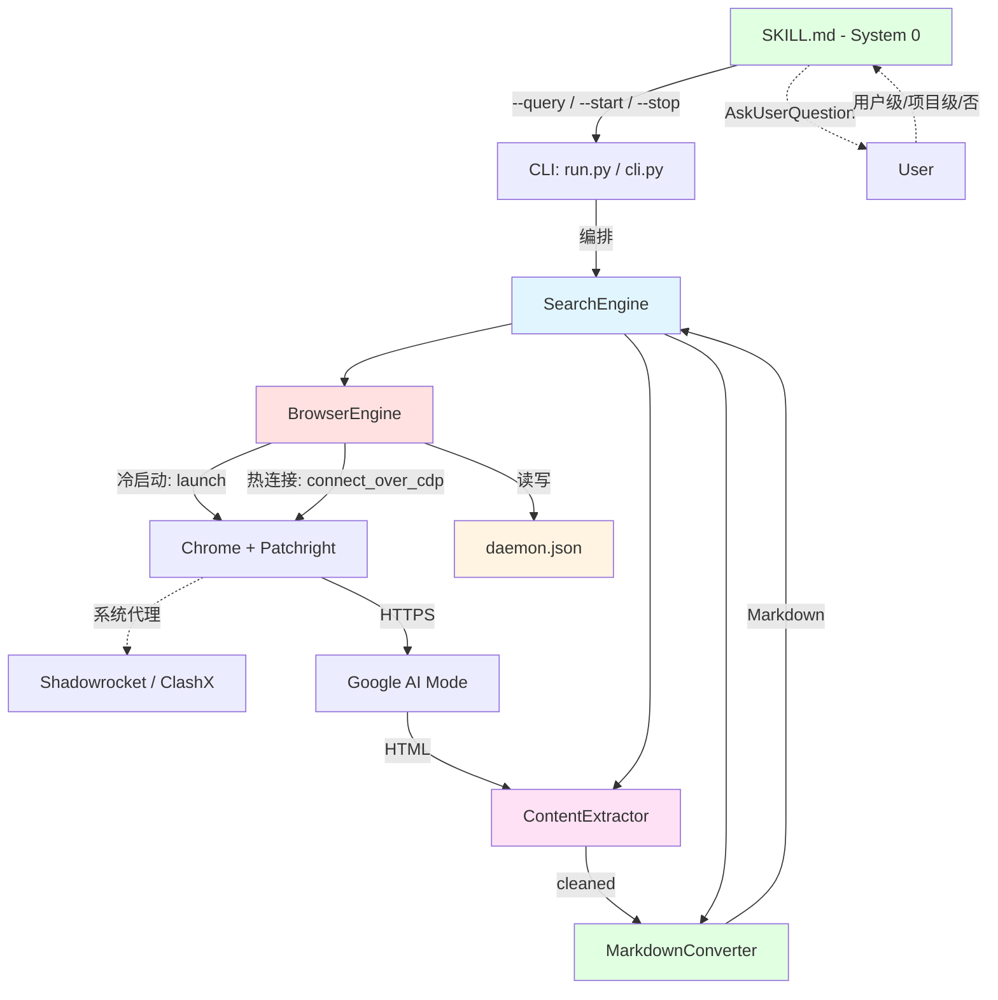

# 系统架构总览 (Architecture Overview)

**项目**: ZeroSearch v0.3
**版本**: 0.3
**日期**: 2026-05-21

---

## 1. 系统上下文 (System Context)

### 1.1 C4 Level 1 - 系统上下文图

```mermaid
graph TD
    AI[Claude Code / AI Agent] -->|"/zerosearch" 触发| SKILL[SKILL.md - System 0]
    SKILL -->|AskUserQuestion| User[User 默认搜索?]
    User -.->|用户级/项目级/否| SKILL

    SKILL -->|"/zerosearch-start"| CLI_START[CLI --start]
    SKILL -->|"/zerosearch-stop"| CLI_STOP[CLI --stop]
    SKILL -->|"--query"| CLI[CLI Entry: run.py]

    CLI -->|编排| SE[SearchEngine]
    SE -->|状态检测| DAEMON_STATE[daemon.json]

    SE -->|冷启动| BE_COLD[BrowserEngine - Cold Launch]
    SE -->|热连接| BE_HOT[BrowserEngine - Hot Connect]

    BE_COLD -->|守护进程 (Patchright launch)| Chrome[Chrome 进程 - 分离模式]
    BE_HOT -->|connect_over_cdp| Chrome
    Chrome -.->|写入状态| DAEMON_STATE

    Chrome -->|导航| Google[Google AI Mode udm=50]
    Google -->|HTML| Chrome
    Chrome -->|raw HTML| CE[ContentExtractor]
    CE -->|cleaned HTML + citations| MC[MarkdownConverter]
    MC -->|Markdown + 脚注| SE
    SE -->|结构化结果| AI

    SE -.->|缓存读写| Cache[LRU Cache 内存]
    Chrome -.->|持久化| Profile[~/.cache/zerosearch/chrome_profile/]

    User -->|关窗| Chrome
    CLI_STOP -->|SIGTERM| Chrome
```

### 1.2 关键用户

| 角色 | 交互方式 |
|------|---------|
| **Claude Code (AI Agent)** | 通过 `/zerosearch` 技能触发，接收 Markdown + 脚注 |
| **开发者** | CLI: `python src/search/run.py --query "..."`；手动启停 Daemon |

### 1.3 外部系统

| 外部系统 | 协议 | 用途 |
|---------|------|------|
| **Google AI Mode** | HTTPS (udm=50) | AI 合成搜索概述 |
| **系统代理** (Shadowrocket/ClashX) | SOCKS/HTTP 127.0.0.1 | Chromium 自动继承 |
| **Patchright** (pip) | Python API | 反检测浏览器自动化 |

---

## 2. 系统清单 (System Inventory)

### System 0: SKILL.md — 技能入口与交互层

**系统ID**: `skill-entry`

**职责**:
- 接收 Claude Code `/zerosearch` 触发，解析查询参数
- 首次运行调用 `AskUserQuestion`："是否将 ZeroSearch 设为默认搜索工具？"
  - 用户级 → 写入 `~/.claude/CLAUDE.md`
  - 项目级 → 写入当前工作区 `CLAUDE.md`
  - 不注册 → 跳过
- 将查询转发给 Python CLI
- 新增 `/zerosearch-start` → 调用 CLI `--start`（手动启动 Daemon）
- 新增 `/zerosearch-stop` → 调用 CLI `--stop`（手动停止 Daemon）

**v0.3 变更**: 新增 `/zerosearch-start` 和 `/zerosearch-stop` 两个触发词

**边界**:
- **输入**: `/zerosearch <query>` / `/zerosearch-start` / `/zerosearch-stop`
- **输出**: `python src/search/run.py --query "..." [--save] [--debug]` / `--start` / `--stop`
- **依赖**: `AskUserQuestion` (Claude Code 工具)

**关联需求**: [REQ-009], [REQ-013]

**文件**: `SKILL.md`

---

### System 1: BrowserEngine — 浏览器引擎 + Daemon 生命周期

**系统ID**: `browser-engine`

**职责**:
- **冷启动路径 (Cold Launch)**: `subprocess` 启动 `daemon_runner.py` 守护进程，内部使用 Patchright `launch_persistent_context()` 启动 Chrome → 完整的 CDP 级反检测补丁（Runtime.enable / Console.enable 等）。守护进程写入 `daemon.json` 后 sleep 保持 Chrome 存活
- **热连接路径 (Hot Connect)**: `connect_over_cdp("http://127.0.0.1:<port>")` 连接到已有 Chrome 实例。CDP 补丁已在 Chrome 进程内部生效（守护进程注入），无需重新注入。**冷启动也走此路径**（启动后立即 connect）
- **反检测**: Patchright `launch_persistent_context` 提供完整 CDP 协议级补丁 + Chrome flags（`--disable-blink-features=AutomationControlled`）；守护进程退出时 Chrome 随 driver 关闭
- **Daemon 状态文件管理 (新增)**: `~/.cache/zerosearch/daemon.json` 读写，存储 `{"pid": <int>, "cdp_port": <int>, "profile_path": "<str>", "started_at": "<ISO8601>"}`
- **存活检测 (Liveness Check)**: 每次搜索前检查 `daemon.json` → 进程 PID 存活 → CDP 端口响应。任一失败则触发冷启动
- **标签页生命周期**: 热搜索路径下 `new_page()` → 导航 → 提取 → `page.close()`，不调用 `browser.close()`
- **手动停止**: `cleanup()` → `browser.close()` + 删除 `daemon.json`
- Profile 持久化（cookie/session 保留，CAPTCHA 记忆）
- 反检测配置（BROWSER_ARGS、语言强制英文）

**v0.3 变更**:
- 新增热连接路径（`connect_over_cdp`）：首次搜索 ~5s，后续搜索 <1s
- 新增 `daemon_runner.py` 守护进程：Patchright `launch_persistent_context` + 信号处理 + 状态文件管理
- 新增 `daemon_state.py` 模块：状态文件读写 + 存活检测
- **冷启动改用守护进程**：subprocess 启动 Python 守护进程（而非直接启动 Chrome），守护进程内部使用 Patchright launch，获得完整 CDP 反检测
- 上下文管理器状态机扩展：COLD → HOT → DEAD
- 保留完整冷启动路径：与 v0.2 完全兼容

**边界**:
- **输入**: `get_browser()` 调用（内部自动判断冷启动/热连接）
- **输出**: Playwright Browser + Page 对象（已导航到 Google AI Mode）
- **依赖**: Patchright (pip)、系统 Chrome、`daemon.json`

**关联需求**: [REQ-002], [REQ-004], [REQ-006], [REQ-007], [REQ-008], [REQ-010], [REQ-011], [REQ-012], [REQ-016]

**源码**: `src/browser/`

---

### System 2: SearchEngine — 搜索引擎（编排层）

**系统ID**: `search-engine`

**职责**:
- CLI 参数解析（argparse）
- **Daemon 状态检测分支（新增）**: 搜索前调用 BrowserEngine 的存活检测，决定走冷启动或热连接路径
- 全流程编排（BrowserEngine → ContentExtractor → MarkdownConverter）
- LRU 内存缓存（50 条，TTL 5 分）
- 分级错误降级（CAPTCHA/超时/AI 不可用/CDP 连接失败）
- **状态指示（新增）**: stderr 输出区分冷启动 / 热搜索 / 自动重建
- 文件保存（results/ 目录）
- venv 包装器（run.py）

**v0.3 变更**: 编排层新增 Daemon 状态检测分支；新增 `--start` / `--stop` CLI 参数；新增状态指示 stderr 输出

**CLI Flags 完整列表**:

| Flag | 来源 | 用途 |
|------|------|------|
| `--query`, `-q` | REQ-001 | 搜索查询字符串 |
| `--save` | REQ-001 | 保存结果到 results/ |
| `--debug` | REQ-001 | 每阶段耗时日志 |
| `--start` | REQ-013 | 手动启动 Chrome Daemon（不搜索） |
| `--stop` | REQ-013 | 手动停止 Chrome Daemon |
| `--profile <path>` | REQ-008 | 指定 Chrome Profile 路径 |
| `--fresh-profile` | REQ-008 | 使用独立空白 Profile |
| `--reconfigure` | REQ-008 | 重新触发 System 0 的 Profile 选择 |

**退出码**:

| 码 | 含义 |
|:--:|------|
| 0 | 成功 |
| 1 | 通用错误 |
| 2 | CAPTCHA 触发 |
| 3 | 浏览器关闭 |
| 4 | AI Mode 不可用 |
| 5 | Chrome Profile 锁定 |
| 130 | 用户中断 |

**关联需求**: [REQ-001], [REQ-008], [REQ-011], [REQ-015]

**源码**: `src/search/`

---

### System 3: ContentExtractor — 内容提取器

**系统ID**: `content-extractor`

**职责**:
- AI Overview 完成检测
- 引用提取（多语言 CSS 选择器 + JS 注入）
- DOM 清洗（去 Google UI 噪音：导航栏、页脚、搜索框等）
- 精简输出（只为 AI 消费，去冗余空白/样式）

**v0.3 变更**: 完全不变

**边界**:
- **输入**: Playwright Page 对象（Google AI Mode 结果页）
- **输出**: `ExtractionResult(ai_text, citations, raw_html)`
- **依赖**: 无

**关联需求**: [REQ-003]

**源码**: `src/extractor/`

---

### System 4: MarkdownConverter — Markdown 转换器

**系统ID**: `markdown-converter`

**职责**:
- HTML → Markdown（三库 fallback）
- 脚注格式化（[1], [2]... 插入段落末尾）
- Sources 段落生成
- 文件保存（时间戳命名）

**v0.3 变更**: 完全不变

**边界**:
- **输入**: HTML 文本 + citations 列表
- **输出**: 格式化 Markdown 字符串
- **依赖**: 无

**关联需求**: [REQ-003]

**源码**: `src/converter/`

---

## 3. 系统边界矩阵

| 系统 | 输入 | 输出 | 依赖系统 | 被依赖系统 | 关联需求 |
|------|------|------|---------|----------|---------|
| SKILL.md (System 0) | `/zerosearch <query>` / `--start` / `--stop` | `python run.py --query "..." / --start / --stop` | AskUserQuestion | — | REQ-009, REQ-013 |
| BrowserEngine | `get_browser()` | Playwright Browser + Page | Patchright, Chrome, daemon.json | SearchEngine | REQ-002,004,006,007,008,010,011,012,016 |
| SearchEngine | CLI args | Markdown + 退出码 + stderr 状态 | Browser, Extractor, Converter | SKILL.md | REQ-001,008,011,015 |
| ContentExtractor | Playwright Page | ExtractionResult | — | SearchEngine | REQ-003 |
| MarkdownConverter | HTML + Citations | Markdown 字符串 | — | SearchEngine | REQ-003 |

---

## 4. 系统依赖图



**关键路径**:
- **冷启动路径**: SE → BE(Cold Launch) → Chrome 新进程 → daemon.json 写入
- **热搜索路径**: SE → BE(Hot Connect) → daemon.json 读取 → Chrome 已有进程 → new_page()

---

## 5. 关键技术决策

### 5.1 CDP 连接方案: connect_over_cdp（ADR-002）

热搜索通过 Patchright 的 `connect_over_cdp(endpoint)` 连接到已有 Chrome 实例。首次冷启动使用完整的 `launch()` 注入反检测补丁，后续连接不重置 CDP 域，补丁持续生效。

### 5.2 Chrome 进程分离 (Daemon-Worker 模式)

冷启动通过 `subprocess` 启动 `daemon_runner.py` 守护进程（`start_new_session=True`）。守护进程内部使用 Patchright `launch_persistent_context()` 启动 Chrome，完整注入 CDP 反检测补丁。守护进程通过 SIGTERM 信号优雅退出（`ctx.close()` + `p.stop()`）。Chrome 仅通过以下方式停止：
- 用户手动执行 `/zerosearch-stop`（向守护进程 PID 发送 SIGTERM）
- 用户直接关闭 Chrome 窗口（守护进程检测到后自动退出）

### 5.3 跨 CLI 状态共享

`~/.cache/zerosearch/daemon.json` 是唯一的跨 CLI 调用通信桥梁。不同 Python 进程通过此文件交换 Daemon PID 和 CDP 端口信息。

---

## 6. 项目物理结构

```text
ZeroSearch/
├── setup.sh                     # 一键安装 (pip install + patchright install chrome + CLAUDE.md 注册)
├── requirements.txt             # patchright>=1.55,<2, beautifulsoup4, etc.
├── SKILL.md                     # System 0: Claude Code 技能入口 + AskUserQuestion + start/stop 触发
├── README.md
├── src/
│   ├── browser/                 # System 1: BrowserEngine
│   │   ├── browser_factory.py   #   守护进程启动 + 热连接 connect_over_cdp
│   │   ├── daemon_runner.py     #   [新增] Patchright 守护进程 (launch_persistent_context)
│   │   ├── daemon_state.py      #   [新增] daemon.json 读写 + 存活检测
│   │   ├── context_manager.py   #   状态机 COLD→HOT→DEAD
│   │   ├── stealth.py           #   BROWSER_ARGS + 语言强制 + StealthUtils (不变)
│   │   └── profile_manager.py   #   Chrome Profile 持久化 (不变)
│   ├── search/                  # System 2: SearchEngine
│   │   ├── cli.py               #   argparse CLI 入口 + --start / --stop
│   │   ├── run.py               #   venv 包装器
│   │   ├── engine.py            #   全流程编排 + Daemon 状态检测分支
│   │   ├── cache.py             #   LRU + TTL 缓存 (不变)
│   │   └── error_handler.py     #   分级错误降级 (不变)
│   ├── extractor/               # System 3: ContentExtractor (完全不变)
│   │   ├── extractor.py
│   │   ├── ai_detector.py
│   │   ├── citation_extractor.py
│   │   └── dom_cleaner.py
│   └── converter/               # System 4: MarkdownConverter (完全不变)
│       ├── html_to_md.py
│       ├── footnote_formatter.py
│       └── file_saver.py
├── tests/
│   ├── test_cache.py
│   ├── test_dom_cleaner.py
│   ├── test_footnote.py
│   └── test_daemon_state.py     # [新增] Daemon 状态文件 + 存活检测测试
├── results/                     # 搜索结果保存
└── .anws/v3/                    # 架构文档 (当前版本)
```

---

## 7. 拆分原则与理由

### 为什么保持 5 个系统

| 维度 | 分析 |
|------|------|
| **职责分离** | 技能入口 / 浏览器管理+Daemon / 搜索编排 / 内容提取 / 格式转换 — 五者职责独立 |
| **运行层分离** | SKILL.md 运行在 Claude Code 层，其余 4 系统运行在 Python CLI 层 |
| **变化频率** | BrowserEngine 是 v0.3 唯一大变系统（新增 Daemon 生命周期），其余系统基本不变 |
| **测试独立性** | 每个系统可独立单元测试（daemon_state 纯文件 IO + PID 检测） |

### 为什么 Daemon 状态文件不独立为系统

`daemon.json` 是 BrowserEngine 的子模块而非独立系统：
- 它是 BrowserEngine 的内部实现细节（状态持久化），不是独立的业务能力
- 不存在独立的用户接触点或部署单元
- 它只被 BrowserEngine 读写，无独立依赖或被依赖

### 为什么 Chrome Daemon 在 BrowserEngine 内而非新系统

BrowserEngine 的职责已经从"一次搜索的浏览器管理"扩展到"跨搜索的浏览器生命周期管理"。这是同一职责的自然延伸，不是职责分裂。新增的 `daemon_state.py` 和热连接路径是对现有 `browser_factory.py` / `context_manager.py` 的增量修改，而非独立系统。

---

## 8. 下一步行动

- `/design-system browser-engine` — 详细设计 BrowserEngine v0.3（主要变更：冷启动+热连接双路径、daemon_state、存活检测）
- SearchEngine / SKILL.md 变更较小，可在 blueprint 阶段直接写入任务
- `/blueprint` — 生成 v0.3 任务清单 (`.anws/v3/05_TASKS.md`)
