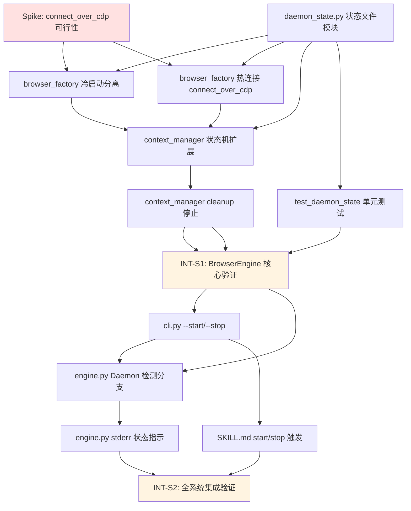

# ZeroSearch v0.3 — 任务清单 (WBS)

**版本**: .anws/v3
**创建日期**: 2026-05-21
**关联 PRD**: [01_PRD.md](01_PRD.md)
**关联架构**: [02_ARCHITECTURE_OVERVIEW.md](02_ARCHITECTURE_OVERVIEW.md)

---

## 依赖图总览

---

## 📊 Sprint 路线图

| Sprint | 代号 | 核心任务 | 退出标准 | 预估 |
|--------|------|---------|---------|:--:|
| **S1** | Daemon 核心 | daemon_state + 工厂双路径 + 状态机 | 冷启动分离模式可运行，热连接可创建标签页，单元测试通过 | 3-4d |
| **S2** | 系统集成 | CLI 适配 + 编排层 + SKILL.md + 回归 | 完整五路径可运行，45 tests 通过 | 2-3d |

---

## System 1: BrowserEngine — Daemon 生命周期

> **目标**: 实现 Chrome Daemon 核心——冷启动/热连接双路径、状态文件管理、存活检测、标签页生命周期。

---

### Phase 0: API 可行性 Spike

- [x] **T1.0.1** [基础] (P0): Spike — 验证 connect_over_cdp 跨进程可行性 ✅ 已完成
  - **描述**: 用最小脚本验证 Patchright 的 `connect_over_cdp` 能否从独立 Python 进程连接到已有 Chrome 实例，且反检测补丁持续生效。这是整个 v0.3 的基石假设——在投入 S1 全部工作前必须验证。
  - **输入**: [ADR-002 §权衡点](03_ADR/ADR_002_DAEMON_CDP.md) (assumption: connect_over_cdp 不重置 CDP 域)
  - **输出**: `spikes/test_cdp_reconnect.py`
    - 脚本 A: `launch(channel="chrome", headless=False, args=["--remote-debugging-port=9222"])` → 打印 ws_endpoint → sleep 30
    - 脚本 B: `connect_over_cdp("http://127.0.0.1:9222")` → `new_page()` → `evaluate("navigator.webdriver")` → 验证返回 `false`
    - 脚本 B: `page.goto("https://www.google.com")` → 验证页面正常加载
  - **验收标准**:
    - Given 脚本 A 启动 Chrome (Patchright), When 脚本 B 通过 connect_over_cdp 连接, Then 连接成功且 `navigator.webdriver === false`
    - Given connect_over_cdp 连接成功, When `browser.new_page()` → `page.goto("https://www.google.com")`, Then 页面正常加载无 CAPTCHA 拦截
    - 如果失败 → 记录失败原因，评估方案 B/C 的回退可行性
  - **验证类型**: 手动验证
  - **验证说明**: ✅ Spike 通过：subprocess Chrome → navigator.webdriver=false → connect_over_cdp 成功 → Google 无 CAPTCHA。结论：冷启动用 subprocess（非 Patchright launch），热连接用 connect_over_cdp。
  - **估时**: 2h (已完成)
  - **依赖**: 无

---

### Phase 1: Daemon 基础设施

- [x] **T1.1.1** [REQ-016] ✅ (P0): 实现 daemon_state.py — 状态文件读写模块
  - **描述**: 创建 `src/browser/daemon_state.py`，提供 Daemon 状态文件的原子读写和存活检测。状态文件为 `~/.cache/zerosearch/daemon.json`，包含 `pid`、`cdp_port`、`profile_path`、`started_at`。
  - **输入**: [Architecture §2 System 1](02_ARCHITECTURE_OVERVIEW.md) + [PRD REQ-016](01_PRD.md#us-016-daemon-状态文件管理-req-016-优先级-p2) + [ADR-002 §决策](03_ADR/ADR_002_DAEMON_CDP.md)
  - **输出**: `src/browser/daemon_state.py`
    - `write_state(pid, cdp_port, profile_path)` — 原子写入（临时文件 + rename）
    - `read_state()` → `DaemonState` | `None`
    - `is_pid_alive(pid)` → `bool`（`os.kill(pid, 0)`）
    - `is_cdp_responsive(port)` → `bool`（HTTP GET `http://127.0.0.1:<port>/json/version` 超时 2s）
    - `cleanup_stale()` — 删除过期状态文件
    - `DaemonState` dataclass (pid, cdp_port, profile_path, started_at)
    - 状态文件路径: `~/.cache/zerosearch/daemon.json`
  - **📎 参考**: ADR-002 §"跨 CLI 状态共享"、§"daemon.json 竞态"
  - **验收标准**:
    - Given 状态文件不存在, When 调用 `read_state()`, Then 返回 `None`
    - Given Daemon 已启动 (pid=12345, port=9222), When 调用 `write_state(12345, 9222, ...)`, Then `daemon.json` 包含正确 JSON
    - Given `daemon.json` 存在且 PID 存活, When 调用 `is_pid_alive()`, Then 返回 `True`
    - Given `daemon.json` 存在但 PID 已死亡, When 调用 `is_pid_alive()`, Then 返回 `False`
    - Given CDP 端口可响应, When 调用 `is_cdp_responsive(9222)`, Then 返回 `True`
    - Given 状态文件存在但 PID 不存活, When 调用 `cleanup_stale()`, Then 文件被删除
    - Given 两个进程同时写入, When 使用临时文件 + `os.rename()`, Then 无竞态损坏
  - **验证类型**: 单元测试
  - **验证说明**: `python -m pytest tests/test_daemon_state.py -v`（T1.4.1 生成）；开发阶段用临时目录 + mock PID 快速验证
  - **估时**: 4h
  - **依赖**: 无

- [x] **T1.1.2** [REQ-010] ✅ [REQ-016] (P0): 实现 browser_factory.py — subprocess 冷启动 Chrome
  - **描述**: 修改 `src/browser/browser_factory.py`，新增 `launch_daemon()` 方法：使用 `subprocess.Popen` 启动系统 Chrome（传入反检测 flags + `--remote-debugging-port` + `start_new_session=True`），等待 CDP 端点就绪，写入 `daemon.json`。然后立即通过 `connect_over_cdp` 连接以获取 Browser 对象。保留现有 `launch_persistent_context` 路径作为 v0.2 向后兼容。
  - **输入**: [Architecture §2 System 1](02_ARCHITECTURE_OVERVIEW.md) + [PRD REQ-010](01_PRD.md) + T1.0.1 Spike 结论 + [ADR-002 §修正后工作流程](03_ADR/ADR_002_DAEMON_CDP.md)
  - **输出**: `src/browser/browser_factory.py`（修改）
    - `launch_daemon(profile_path)` 新方法 — subprocess 启动 Chrome → 等待 CDP → 写入 daemon.json → connect_over_cdp → 返回 Browser
    - `_find_free_port(start=9222, end=9232)` — 端口扫描
    - `_build_chrome_cmd(profile_path, port)` — 构建 Chrome 命令行（含反检测 args）
    - `_wait_for_cdp(port, timeout=15)` — 轮询 CDP 端点直到就绪
    - 现有 `get_context()` 方法保留不变（v0.2 向后兼容）
  - **📎 参考**: ADR-002 §"修正后的工作流程"、Spike launcher.py
  - **验收标准**:
    - Given Daemon 未运行, When 调用 `launch_daemon()`, Then Chrome 窗口出现（subprocess 启动），返回 Browser 对象（通过 connect_over_cdp）
    - Given 调用 `launch_daemon()`, When 启动成功, Then `daemon.json` 包含正确的 pid + cdp_port
    - Given 端口 9222 被占用, When 调用 `_find_free_port()`, Then 返回 9223（或下一个空闲端口）
    - Given 调用 `launch_daemon()`, When Python 进程退出, Then Chrome 窗口保持打开（subprocess 独立进程）
    - Given Chrome 冷启动成功, When 调用 `browser.new_page()`, Then `navigator.webdriver === false`
  - **验证类型**: 集成测试
  - **验证说明**: Python 脚本调用 `launch_daemon()` → 验证 Chrome 窗口出现 + daemon.json + Browser 可用 → Ctrl+C 后 Chrome 存活 → 新 Python 进程 connect_over_cdp → navigator.webdriver=false
  - **估时**: 4h
  - **依赖**: T1.0.1, T1.1.1

---

### Phase 2: 热连接路径

- [x] **T1.2.1** [REQ-011] ✅ (P0): 实现 browser_factory.py — connect_over_cdp 热连接
  - **描述**: 在 `src/browser/browser_factory.py` 中新增 `connect_to_daemon()` 方法。读取 `daemon.json` 获取 CDP 端口，调用 `patchright.chromium.connect_over_cdp(f"http://127.0.0.1:{port}")` 连接已有 Chrome 实例，返回 Browser 对象。
  - **输入**: [Architecture §2 System 1](02_ARCHITECTURE_OVERVIEW.md) + [PRD REQ-011](01_PRD.md#us-011-热搜索复用-chrome-标签页-req-011-优先级-p0) + T1.1.1 产出 `daemon_state.py` + [ADR-002 §候选方案对比](03_ADR/ADR_002_DAEMON_CDP.md)
  - **输出**: `src/browser/browser_factory.py`（新增方法）
    - `connect_to_daemon(daemon_state)` → `Browser` 对象
    - 连接超时 5s，失败则抛异常供 SearchEngine 降级为冷启动
  - **📎 参考**: ADR-002 §"connect_over_cdp 的反检测"
  - **验收标准**:
    - Given Daemon 已运行 (daemon.json 存在 + PID 存活), When 调用 `connect_to_daemon()`, Then 返回 Browser 对象（不创建新 Chrome 窗口）
    - Given Browser 对象获取成功, When 调用 `browser.new_page()`, Then 返回可用于导航的 Page 对象
    - Given CDP 端口无响应, When 调用 `connect_to_daemon()`, Then 5s 超时后抛出异常
  - **验证类型**: 集成测试
  - **验证说明**: 先启动 `launch_daemon()` → 调用 `connect_to_daemon()` → 验证无新窗口且 Browser 可用 → `page.goto("https://example.com")` 成功 → `page.close()`
  - **估时**: 3h
  - **依赖**: T1.1.1, T1.1.2

- [x] **T1.2.2** [REQ-012] ✅ (P0): 重写 context_manager.py — 状态机扩展 COLD→HOT→DEAD
  - **描述**: 修改 `src/browser/context_manager.py`，状态机新增 `HOT` 状态。新增 `resolve_browser()` 方法：读取 `daemon.json` → 检测 PID 存活 → 检测 CDP 端口响应 → 决定走冷启动 (`launch_daemon`) 或热连接 (`connect_to_daemon`)。热连接路径下搜索完成后仅 `page.close()`，不调用 `browser.close()`。
  - **输入**: [Architecture §2 System 1](02_ARCHITECTURE_OVERVIEW.md) + [PRD REQ-012](01_PRD.md#us-012-daemon-存活检测与自动降级-req-012-优先级-p0) + T1.1.2 产出 + T1.2.1 产出 + [ADR-002 §"Browser 对象生命周期"](03_ADR/ADR_002_DAEMON_CDP.md)
  - **输出**: `src/browser/context_manager.py`（修改）
    - `resolve_browser() → (browser, page, mode: "cold"|"hot")`
    - 状态机: `COLD` (等待) → `HOT` (已连接 Daemon) → `DEAD` (已释放)
    - 热搜索路径: `new_page()` → 导航 → 提取 → `page.close()`（不调 `browser.close()`）
    - 冷启动路径: 保留 v0.2 行为（`browser.close()` 由 cleanup 控制）
    - 连续 3 次冷启动失败 → 终止，exit code 1
  - **📎 参考**: ADR-002 §"权衡点 — Browser 对象生命周期"
  - **验收标准**:
    - Given Daemon 未运行, When 调用 `resolve_browser()`, Then 走冷启动路径，返回 mode="cold"
    - Given Daemon 已运行, When 调用 `resolve_browser()`, Then 走热连接路径，返回 mode="hot"，无新 Chrome 窗口
    - Given Daemon 曾运行但已关窗, When 调用 `resolve_browser()`, Then 检测到 PID 死亡 → `cleanup_stale()` → 冷启动重建
    - Given 热搜索完成, When 调用 `page.close()`, Then 标签页关闭但 Chrome 窗口保持打开
    - Given 连续 3 次冷启动失败, When 第 3 次失败, Then exit code 1 + stderr `[ERROR] Chrome 无法启动`
  - **验证类型**: 集成测试
  - **验证说明**: 场景矩阵测试：(1) 无 daemon → 冷启动 (2) daemon 存活 → 热连接 (3) PID 死亡 → 自动重建 (4) CDP 无响应 → kill 旧进程 + 重建 (5) 连续失败 → 终止
  - **估时**: 5h
  - **依赖**: T1.1.2, T1.2.1

---

### Phase 3: 停止与清理

- [x] **T1.3.1** [REQ-013] ✅ [REQ-014] (P1): 实现 context_manager.py — cleanup 停止逻辑
  - **描述**: 在 `context_manager.py` 中新增 `cleanup()` 方法。向 Chrome 进程发送 SIGTERM → 等待 3s → 如未退出则 SIGKILL → 删除 `daemon.json`。处理 Chrome 已死亡（关窗）的幂等场景。
  - **输入**: [PRD REQ-013](01_PRD.md#us-013-手动启停-daemon-req-013-优先级-p1) + [PRD REQ-014](01_PRD.md#us-014-关闭窗口即停止-daemon-req-014-优先级-p1) + T1.2.2 产出 + [ADR-002 §"后果 — 负面"](03_ADR/ADR_002_DAEMON_CDP.md)
  - **输出**: `src/browser/context_manager.py`（新增方法）
    - `cleanup() → None` — 幂等（重复调用无副作用）
    - SIGTERM → 3s wait → SIGKILL 逻辑
    - 删除 `daemon.json`（调用 `cleanup_stale()`）
    - 处理 Chrome 进程已不存在的场景（关窗）
  - **📎 参考**: ADR-002 §"后果"
  - **验收标准**:
    - Given Daemon 正在运行, When 调用 `cleanup()`, Then Chrome 窗口关闭且 daemon.json 被删除
    - Given Daemon 已在运行, When 再次调用 `cleanup()`, Then 无报错（幂等）
    - Given Chrome 进程已被用户关闭（关窗）, When 调用 `cleanup()`, Then 仅删除 daemon.json，无报错
    - Given Chrome 进程无响应, When SIGTERM 后 3s 仍未退出, Then 发送 SIGKILL
  - **验证类型**: 集成测试
  - **验证说明**: (1) 启动 daemon → cleanup → 验证窗口消失 (2) 重复 cleanup → 无报错 (3) 手动关闭窗口 → cleanup → 无报错 (4) 模拟 SIGSTOP Chrome → cleanup → SIGKILL
  - **估时**: 3h
  - **依赖**: T1.2.2

---

### Phase 4: 测试

- [x] **T1.4.1** [REQ-016] ✅ (P0): 编写 test_daemon_state.py — 单元测试
  - **描述**: 为 `daemon_state.py` 编写完整单元测试。使用 `tmp_path` fixture 创建临时状态文件目录，mock PID 检测和 HTTP 请求，覆盖所有读写/存活检测/竞态/边界场景。
  - **输入**: T1.1.1 产出 `daemon_state.py` + [PRD REQ-016](01_PRD.md#us-016-daemon-状态文件管理-req-016-优先级-p2)
  - **输出**: `tests/test_daemon_state.py`
    - `test_write_and_read_state` — 正常读写
    - `test_read_nonexistent` — 文件不存在返回 None
    - `test_is_pid_alive_true` — PID 存活
    - `test_is_pid_alive_false` — PID 已死
    - `test_is_cdp_responsive_true` — CDP 响应（mock HTTP）
    - `test_is_cdp_responsive_false` — CDP 无响应
    - `test_cleanup_stale` — 清理过期文件
    - `test_cleanup_stale_when_pid_alive` — PID 存活时不清理
    - `test_corrupted_json` — JSON 损坏返回 None
    - `test_atomic_write_no_race` — 原子写入无竞态
  - **验收标准**:
    - Given 10 个测试用例, When `pytest tests/test_daemon_state.py -v`, Then 全部通过
    - Given 测试运行, When 使用 `--cov=src/browser/daemon_state`, Then 行覆盖率 ≥ 85%
  - **验证类型**: 单元测试
  - **验证说明**: `python -m pytest tests/test_daemon_state.py -v --cov=src/browser/daemon_state --cov-report=term`
  - **估时**: 3h
  - **依赖**: T1.1.1

---

### 集成验证

- [x] **INT-S1** [MILESTONE] ✅: S1 集成验证 — Daemon 核心
  - **描述**: 验证 S1 退出标准：BrowserEngine 冷启动分离模式可运行，热连接可创建标签页，单元测试通过。
  - **输入**: S1 所有任务 (T1.1.1 ~ T1.4.1) 的产出
  - **输出**: 集成验证报告（通过/失败 + Bug 清单）
  - **验收标准**:
    - Given S1 所有任务完成, When 逐条检查, Then:
      - `pytest tests/test_daemon_state.py -v` → 10/10 通过
      - `launch_daemon()` → Chrome 窗口出现 + daemon.json 写入正确
      - `connect_to_daemon()` → 连接成功 + `new_page()` 可用
      - `page.close()` → 标签页关闭但 Chrome 保持
      - `cleanup()` → Chrome 关闭 + daemon.json 删除
      - Ctrl+C Python 进程 → Chrome 保持存活
  - **验证类型**: 冒烟测试 + 集成测试
  - **验证说明**: 按退出标准逐条手动执行 + 日志确认；`test_daemon_state.py` 10/10；手动验证 Chrome 窗口行为
  - **估时**: 2h
  - **依赖**: T1.3.1, T1.4.1

---

## System 2: SearchEngine — 编排层适配

> **目标**: SearchEngine 编排层感知 Daemon 状态，新增 CLI --start/--stop 参数，输出状态指示。

---

### Phase 1: CLI 参数

- [x] **T2.1.1** [REQ-013] ✅ (P1): 扩展 cli.py — 新增 --start / --stop 参数
  - **描述**: 修改 `src/search/cli.py`，在现有 argparse 参数基础上新增 `--start`（启动 Daemon 不搜索）和 `--stop`（停止 Daemon）两个互斥参数。与 `--query` 互斥（不可同时使用）。
  - **输入**: [Architecture §2 System 2 CLI Flags](02_ARCHITECTURE_OVERVIEW.md) + [PRD REQ-013](01_PRD.md#us-013-手动启停-daemon-req-013-优先级-p1) + INT-S1 确认 BrowserEngine 可用
  - **输出**: `src/search/cli.py`（修改）
    - `--start` flag → 触发 `launch_daemon()` → 打印 "[Daemon] Chrome 已启动" → exit
    - `--stop` flag → 触发 `cleanup()` → 打印 "[Daemon] Chrome 已停止" → exit
    - `--start` 与 `--query` 互斥（argparse mutually exclusive group）
    - `--stop` 与 `--query` 互斥
    - `--start` 幂等：Daemon 已运行 → 打印 "[Daemon] Chrome 已在运行" → exit 0
    - `--stop` 幂等：Daemon 未运行 → 打印 "[Daemon] Chrome 未在运行" → exit 0
  - **验收标准**:
    - Given Daemon 未运行, When `python src/search/run.py --start`, Then Chrome 启动且不执行搜索
    - Given Daemon 正在运行, When `python src/search/run.py --stop`, Then Chrome 关闭
    - Given Daemon 未运行, When `python src/search/run.py --stop`, Then 打印 "未在运行" 且 exit 0
    - Given `--start` 和 `--query` 同时传入, When 解析, Then argparse 报错
  - **验证类型**: 集成测试
  - **验证说明**: 手动测试 CLI 四种组合：`--start` / `--stop` / `--start` (重复) / `--stop` (重复) / `--start --query` (应报错)
  - **估时**: 2h
  - **依赖**: INT-S1

---

### Phase 2: 编排层

- [x] **T2.2.1** [REQ-010] ✅ [REQ-011] [REQ-012] (P0): 重写 engine.py — Daemon 状态检测分支
  - **描述**: 修改 `src/search/engine.py`，在搜索入口调用 BrowserEngine 的 `resolve_browser()`，根据返回的 `mode`（cold/hot）走对应路径。搜索完成后仅关闭 Page（不关闭 Browser）。保持 LRU 缓存、错误降级、文件保存逻辑不变。
  - **输入**: [Architecture §2 System 2](02_ARCHITECTURE_OVERVIEW.md) + [PRD REQ-010/011/012](01_PRD.md) + T1.2.2 产出 + INT-S1 + [ADR-002](03_ADR/ADR_002_DAEMON_CDP.md)
  - **输出**: `src/search/engine.py`（修改）
    - `search(query)` 入口 → `resolve_browser()` → cold/hot 分支
    - cold: `launch_daemon()` → `new_page()` → 搜索 → `page.close()`
    - hot: `connect_to_daemon()` → `new_page()` → 搜索 → `page.close()`
    - 两个分支共享 ContentExtractor + MarkdownConverter 管线
    - 缓存命中时直接返回，不接触 BrowserEngine
    - `cleanup()` 仅由 `--stop` 触发，搜索路径不调用
    - LRU 缓存、错误降级、文件保存逻辑完全不变
  - **验收标准**:
    - Given Daemon 未运行, When 执行搜索, Then 冷启动 Chrome (~5s) → 结果返回
    - Given Daemon 已运行, When 执行搜索, Then 热连接 Chrome (<1s) → 结果返回
    - Given 搜索完成, When 检查 Chrome 窗口, Then 窗口保持打开（不关闭浏览器）
    - Given LRU 缓存命中, When 执行相同查询, Then 直接返回缓存 (<1ms)，不连接 Chrome
    - Given v0.2 现有 29 个测试, When `pytest tests/ -v`, Then 全部通过（无回归）
  - **验证类型**: 集成测试 + 回归测试
  - **验证说明**: (1) 冷启动搜索 → 验证耗时 ~5s + 结果格式正确 (2) 热搜索 → 验证耗时 <1s (3) 缓存命中 → 验证 <1ms (4) `pytest tests/ -v` → 29/29 pass
  - **估时**: 4h
  - **依赖**: T2.1.1, INT-S1

- [x] **T2.2.2** [REQ-015] ✅ (P1): 实现 engine.py — stderr 状态指示
  - **描述**: 在 `engine.py` 冷启动/热连接/自动重建三个路径中，向 stderr 输出不同的 `[Daemon]` 前缀状态信息，让用户感知搜索模式。
  - **输入**: [PRD REQ-015](01_PRD.md#us-015-daemon-状态指示-req-015-优先级-p1) + T2.2.1 产出
  - **输出**: `src/search/engine.py`（修改，stderr print 语句）
    - 冷启动: `print("[Daemon] 冷启动 Chrome...", file=sys.stderr)`
    - 热搜索: `print("[Daemon] 复用浏览器 (热搜索)", file=sys.stderr)`
    - 自动重建: `print("[Daemon] 检测到浏览器已关闭，正在重新启动...", file=sys.stderr)`
    - `--debug` 模式额外输出: PID、CDP 端口、标签页数
  - **验收标准**:
    - Given 首次搜索, When 执行, Then stderr 输出 "[Daemon] 冷启动 Chrome..."
    - Given 第二次搜索 (Daemon 已运行), When 执行, Then stderr 输出 "[Daemon] 复用浏览器 (热搜索)"
    - Given 用户关窗后再次搜索, When 执行, Then stderr 输出 "[Daemon] 检测到浏览器已关闭，正在重新启动..."
    - Given `--debug` 模式, When 搜索, Then stderr 包含 PID + 端口信息
  - **验证类型**: 手动验证
  - **验证说明**: 手动执行三种场景搜索 → `2>/tmp/stderr.log` → 检查日志内容
  - **估时**: 1h
  - **依赖**: T2.2.1

---

## System 0: SKILL.md — 技能入口

> **目标**: 新增手动启停 Daemon 的 `/zerosearch-start` 和 `/zerosearch-stop` 触发词。

---

### Phase 1: 触发词

- [x] **T0.1.1** [REQ-013] ✅ (P1): 更新 SKILL.md — 新增 start/stop 触发词
  - **描述**: 在 `SKILL.md` 中添加两个新的触发描述：`/zerosearch-start`（调用 CLI `--start`）和 `/zerosearch-stop`（调用 CLI `--stop`）。保持现有搜索触发词不变。
  - **输入**: [Architecture §2 System 0](02_ARCHITECTURE_OVERVIEW.md) + [PRD REQ-013](01_PRD.md#us-013-手动启停-daemon-req-013-优先级-p1) + T2.1.1 产出 (CLI --start/--stop)
  - **输出**: `SKILL.md`（修改）
    - 新增触发词说明: `/zerosearch-start` → `python src/search/run.py --start`
    - 新增触发词说明: `/zerosearch-stop` → `python src/search/run.py --stop`
    - 更新 "How It Works" 段落，描述 Daemon 常驻行为
    - 更新 "Usage" 段落，增加 start/stop 示例
    - 保持 AskUserQuestion 交互逻辑不变
    - 保持搜索触发词 `/zerosearch` 不变
  - **验收标准**:
    - Given Claude Code 会话, When 用户输入 "/zerosearch-start", Then Claude 执行 `python src/search/run.py --start`
    - Given Claude Code 会话, When 用户输入 "/zerosearch-stop", Then Claude 执行 `python src/search/run.py --stop`
    - Given 映射表检查, When 比对 SKILL.md 触发词与 CLI 参数, Then 一一对应
  - **验证类型**: 手动验证 + 编译检查
  - **验证说明**: (1) 在 Claude Code 中验证 `/zerosearch-start` / `/zerosearch-stop` 可正确路由 (2) 检查 SKILL.md 语法无误 (3) 文档中无残留 Camoufox/Option A/B 引用
  - **估时**: 2h
  - **依赖**: T2.1.1

---

## 集成验证

- [x] **INT-S2** [MILESTONE] ✅: S2 集成验证 — 全系统集成 + 回归测试
  - **描述**: 端到端验证 v0.3 完整五路径搜索流程 + v0.2 回归测试。确认所有 User Story 可独立演示。
  - **输入**: S2 所有任务 (T2.1.1 ~ T0.1.1) 的产出 + v0.2 测试套件
  - **输出**: 集成验证报告（通过/失败 + Bug 清单）
  - **验收标准**:
    - **路径 1 冷启动**: Daemon 未运行 → 首次搜索 → Chrome 冷启动 → 结果返回 → Chrome 保持
    - **路径 2 热搜索**: Daemon 已运行 → 第二次搜索 → <1s → 结果返回 → Chrome 保持
    - **路径 3 自动重建**: 关闭 Chrome 窗口 → 搜索 → 自动检测 → 冷启动重建 → 成功
    - **路径 4 手动停止**: `/zerosearch-stop` → Chrome 关闭 → daemon.json 删除
    - **路径 5 手动启动**: `/zerosearch-start` → Chrome 启动（不搜索）
    - **回归**: `python -m pytest tests/ -v` → 45/45 pass (0 回归)
    - **0 新依赖**: `pip list` 与 v0.2 要求一致
    - **Output**: 输出格式与 v0.2 一致（Markdown + 脚注）
  - **验证类型**: 冒烟测试 + 回归测试 + E2E测试
  - **验证说明**: 按退出标准逐条执行五路径验证（截图/日志确认）；`pytest tests/ -v` 确认 39/39；手动验证 v0.2 输出格式一致性
  - **估时**: 3h
  - **依赖**: T0.1.1, T2.2.2

---

## 🎯 User Story Overlay

| US | 优先级 | 涉及任务 | 关键路径 | 独立可测 | 覆盖 |
|----|:--:|---------|---------|:--:|:--:|
| **US-010** 首次冷启动 | P0 | T1.1.2 → T2.2.1 | T1.1.2 → T2.2.1 | ✅ S1 结束即可演示 | ✅ 完整 |
| **US-011** 热搜索复用 | P0 | T1.2.1 → T1.2.2 → T2.2.1 | T1.2.1 → T2.2.1 | ✅ S1 结束即可演示 | ✅ 完整 |
| **US-012** 存活检测降级 | P0 | T1.1.1 → T1.2.2 → T2.2.1 | T1.2.2 → T2.2.1 | ✅ S1 结束即可演示 | ✅ 完整 |
| **US-013** 手动启停 | P1 | T1.3.1 → T2.1.1 → T0.1.1 | T2.1.1 → T0.1.1 | ✅ S2 结束可演示 | ✅ 完整 |
| **US-014** 关窗即停 | P1 | T1.3.1 → T1.2.2 | T1.3.1 | ✅ S1 结束 (集成验证) | ✅ 完整 |
| **US-015** 状态指示 | P1 | T2.2.2 | T2.2.2 | ✅ S2 结束 (stderr 检查) | ✅ 完整 |
| **US-016** 状态文件 | P2 | T1.1.1 → T1.4.1 | T1.1.1 → T1.4.1 | ✅ S1 结束 (单元测试) | ✅ 完整 |

---

## 统计

| 指标 | 数值 |
|------|:--:|
| 总任务数 | **13** (含 2 INT) |
| P0 任务 | 6 |
| P1 任务 | 4 |
| P2 任务 | 1 |
| INT 任务 | 2 |
| Sprint 数 | 2 |
| 总预估工时 | **37h** (~5 工作日) |
| 新增文件 | 3 (daemon_state.py, test_daemon_state.py, spikes/test_cdp_reconnect.py) |
| 修改文件 | 5 (browser_factory.py, context_manager.py, cli.py, engine.py, SKILL.md) |
| 不变系统 | 2 (ContentExtractor, MarkdownConverter) |
| 新依赖 | 0 |
