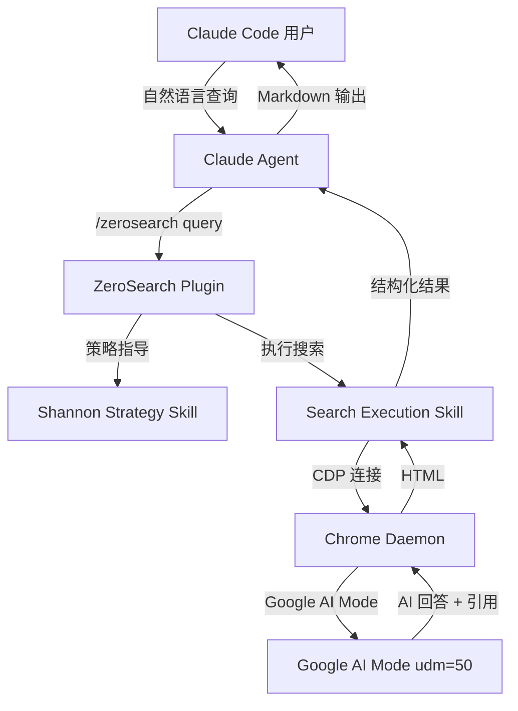
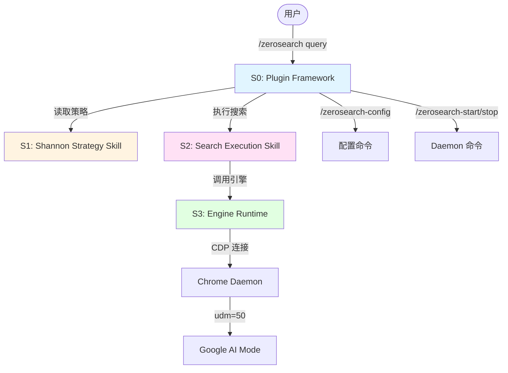

# 系统架构总览 (Architecture Overview)

**项目**: ZeroSearch v0.4
**日期**: 2026-05-22
**前序版本**: v0.3 (Chrome Daemon)

---

## 1. 系统上下文 (System Context)

### 1.1 C4 Level 1 — 系统上下文图



### 1.2 关键用户 (Key Users)

- **Claude Code 用户**: 通过 `/zerosearch` 发起搜索，获得 AI 综合回答
- **Claude Agent**: 实际执行搜索的 AI，受 Shannon Strategy Skill 指导

### 1.3 外部系统 (External Systems)

- **Google AI Mode** (udm=50): Google 搜索的 AI 模式，自动综合 100+ 网站生成结构化回答
- **Chrome 浏览器** (via Chrome Daemon): 渲染页面、执行 JS、通过 CDP 暴露控制接口
- **Claude Code Plugin 框架**: 宿主环境，加载 plugin.json 并路由命令/技能

---

## 2. 系统清单 (System Inventory)

### System 0: Plugin Framework (插件框架)

**系统ID**: `plugin-framework`

**职责 (Responsibility)**:
- 声明 Plugin 元数据 (plugin.json)
- 定义所有命令入口 (`/zerosearch`, `/zerosearch-config`, `/zerosearch-start`, `/zerosearch-stop`)
- 管理 Hook 生命周期（如配置首次安装引导）
- 确保 AI 按需读取文件——每个命令只加载相关的 skill 文件

**边界 (Boundary)**:
- **输入**: 用户命令触发 (`/zerosearch <query>`, `/zerosearch-config` 等)
- **输出**: 路由到对应的 Skill/Agent
- **依赖**: Shannon Strategy Skill, Search Execution Skill

**关联需求**: [REQ-020] Plugin 脚手架, [REQ-021] 模块化命令, [REQ-025] 配置管理, [REQ-026] Daemon 控制

**物理结构**:
```
.claude-plugin/
  plugin.json            # Plugin 声明 (标准位置，非根目录)
commands/
  zerosearch.md          # /zerosearch 命令定义
  zerosearch-config.md   # /zerosearch-config 命令定义
  zerosearch-start.md    # /zerosearch-start 命令定义
  zerosearch-stop.md     # /zerosearch-stop 命令定义
hooks/
  hooks.json             # Hook 配置 (JSON 格式)
```

**技术栈**: Claude Code Plugin 规范 (Markdown + YAML frontmatter + JSON)

---

### System 1: Shannon Search Strategy Skill (香农搜索策略技能)

**系统ID**: `shannon-strategy-skill`

**职责 (Responsibility)**:
- 指导 Claude 如何将用户自然语言查询转化为高信息量搜索提示词
- 内置香农信息论搜索框架：I(x) = -log₂P(x)
- 提供关键词信息量评估矩阵
- 执行语言匹配原则（查询语言与目标内容语言一致）
- 提供容错搜索思维

**边界 (Boundary)**:
- **输入**: 用户原始查询（自然语言）
- **输出**: 优化后的搜索查询（高信息量关键词组合）
- **依赖**: 无（纯提示词工程，不依赖任何代码）

**关联需求**: [REQ-022] 香农搜索策略 Skill

**核心原则（从快速搜索策略.md 提取）**:

1. **关键词信息量**: I(关键词) = -log₂P(关键词)，选择 P 最小的词
2. **联合信息量**: I(x,y,z) = I(x) + I(y) + I(z)，组合独立维度词
3. **贝叶斯更新**: H(目标|证据) 逐步降低（由用户手动触发追轮，非自动）
4. **语言匹配**: 目标内容 → 对应语言查询
5. **容错性**: 高信息量关键词即使有偏差，效果仍优于精准通用词

**关键词评估矩阵**:
| 类型 | 示例 | 信息量 | 优先级 |
|------|------|--------|:--:|
| 具体公式 | `I(x) = -log p(x)` | 极高 | 1 |
| 专业术语 | `TF-IDF`、`互信息` | 高 | 2 |
| 独特表述 | `马都工`、`山楂糕枣泥饼` | 高 | 3 |
| 具体数字 | `15个人诱导40%人群` | 高 | 4 |
| 型号/版本 | `React 19 Server Components` | 高 | 5 |
| ~~通用词~~ | ~~`信息`、`方法`、`怎么`~~ | ~~极低~~ | ~~避免~~ |

**物理结构**:
```
skills/shannon-strategy/
  SKILL.md                  # 香农搜索策略（几乎照搬 搜索策略/快速搜索策略.md）
```

**技术栈**: 纯 Markdown（Claude Code Skill 定义），零代码依赖

---

### System 2: Search Execution Skill (搜索执行技能)

**系统ID**: `search-execution-skill`

**职责 (Responsibility)**:
- 接收 Shannon Strategy Skill 优化后的查询
- 调用 Engine Runtime 执行实际搜索
- 编排搜索流程：BrowserEngine → ContentExtractor → MarkdownConverter
- 管理 LRU 缓存和错误降级（继承 v0.3 SearchEngine）
- 返回结构化搜索结果

**边界 (Boundary)**:
- **输入**: 优化后的搜索查询字符串
- **输出**: 结构化搜索结果（AI 回答 + 引用脚注 + 元数据）
- **依赖**: Engine Runtime (BrowserEngine, SearchEngine, ContentExtractor, MarkdownConverter)

**关联需求**: [REQ-023] Google AI Mode 执行 Skill, [REQ-024] 统一搜索入口

**搜索流程**:
```
Step 1: Daemon 状态检测 + 冷启动/热连接
Step 2: 创建标签页 → 导航 Google AI Mode (udm=50)
Step 3: 等待 AI 完成检测 → ContentExtractor 提取
Step 4: MarkdownConverter 格式化 → 返回结果
Step 5: 关闭标签页（Chrome 保持存活）
```

**物理结构**:
```
skills/search-execution/
  SKILL.md                    # Skill 定义文件（指导 Claude 如何调用引擎）
src/
  search/engine.py           # 搜索编排层（从 v0.3 迁移）
  search/cache.py            # LRU 缓存（从 v0.3 迁移）
  search/errors.py           # 6 级退出码（从 v0.3 迁移）
  search/run.py              # Patchright CLI 入口 (--query/--start/--stop)
  browser/daemon.py          # Chrome Daemon（从 v0.3 迁移）
  extractor/extractor.py     # ContentExtractor（从 v0.3 迁移）
  converter/converter.py     # MarkdownConverter（从 v0.3 迁移）
```

**技术栈**: Python ≥3.10, Patchright ≥1.55, BeautifulSoup4, html-to-markdown

---

### System 3: Engine Runtime (引擎运行时)

**系统ID**: `engine-runtime`

**职责 (Responsibility)**:
- **BrowserEngine**: Chrome Daemon 进程生命周期、CDP 连接、反检测、孤儿 Chrome 恢复（端口扫描 + 自动重连）
- **SearchEngine**: 全流程编排、LRU 缓存 (50条/5min TTL)、6 级错误降级、Daemon 状态检测、StealthUtils 反检测延迟注入
- **ContentExtractor**: AI 完成检测、17 选择器引用提取、DOM + UI 噪音清洗、90+ 模式去噪
- **MarkdownConverter**: HTML→Markdown 三库 Fallback、[N] 脚注格式化、紧凑输出

**边界 (Boundary)**:
- **输入**: search-execution-skill 的调用
- **输出**: 结构化搜索结果
- **依赖**: Chrome 浏览器 (CDP)、Google AI Mode (udm=50)

**关联需求**: [REQ-027] v0.3 代码零破坏迁移, [REQ-024] 统一搜索入口

**约束**:
- **零逻辑修改**: 所有子系统完整从 v0.3 迁移，不修改业务逻辑
- **路径变更**: `src/` → Plugin `src/`，import 路径对应更新
- **测试完整性**: 全部 45 个 v0.3 测试通过

**子系统清单**:
| 子系统 | 文件 | 性能预算 | 从 v0.3 变更 |
|--------|------|:--:|:--:|
| BrowserEngine | `src/browser/daemon.py` | <5s 冷启动 | 无（纯迁移） |
| SearchEngine | `src/search/engine.py` | 编排层 | 无（纯迁移） |
| ContentExtractor | `src/extractor/extractor.py` | <300ms | 无（纯迁移） |
| MarkdownConverter | `src/converter/converter.py` | <200ms | 无（纯迁移） |

**物理结构**:
```
src/
  browser/
    daemon.py            # Chrome Daemon + CDP + 反检测
    daemon_state.py      # Daemon 状态文件管理
  search/
    engine.py            # 搜索全流程编排
    cache.py             # LRU 缓存 (OrderedDict + TTL)
    errors.py            # 6 级退出码定义
    cli.py               # CLI 入口 (--query, --save, --debug 等)
    run.py               # Patchright 启动/连接入口
  extractor/
    extractor.py         # AI 完成检测 + 引用提取 + 噪音清洗
  converter/
    converter.py         # HTML→MD 三库 Fallback + 脚注
tests/                   # pytest 45 tests（从 v0.3 迁移）
```

**技术栈**: Python ≥3.10, Patchright ≥1.55, BeautifulSoup4, html-to-markdown/markdownify/html2text

---

## 3. 系统边界矩阵 (System Boundary Matrix)

| 系统 | 输入 | 输出 | 依赖系统 | 被依赖系统 | 关联需求 |
|------|------|------|---------|----------|---------|
| Plugin Framework | 用户命令 | 路由到 Skill | S1, S2 | — | REQ-020,021,025,026 |
| Shannon Strategy | 用户原始查询 | 优化后查询 | — | Plugin Framework | REQ-022 |
| Search Execution | 优化后查询 | 结构化结果 | Engine Runtime | Plugin Framework | REQ-023,024 |
| Engine Runtime | Skill 调用 | HTML/结果/缓存 | Chrome, Google | Search Execution | REQ-027 |

---

## 4. 系统依赖图 (System Dependency Graph)



**依赖关系说明**:
- **Plugin Framework** 是用户入口，路由所有命令
- **Shannon Strategy** 无代码依赖，纯提示词工程（Markdown Skill）
- **Search Execution** 依赖 Engine Runtime 的 Python 模块
- **Engine Runtime** 是唯一有外部依赖（Chrome, Google）的系统
- 所有依赖单向，无循环依赖

---

## 5. 技术栈总览 (Technology Stack Overview)

| Layer | Technology | Used By | v0.4 变更 |
|-------|-----------|---------|:--:|
| **Plugin 框架** | Claude Code Plugin (plugin.json + Markdown) | S0 | 新增 |
| **搜索策略** | Markdown Skill (纯文本，零代码) | S1 | 新增 |
| **搜索执行** | Markdown Skill + Python 编排 | S2 | 新增 |
| **浏览器引擎** | Patchright ≥1.55,<2 (Chromium) | S3 | 复用 |
| **HTML 解析** | BeautifulSoup4 | S3 | 复用 |
| **MD 转换** | html-to-markdown → markdownify → html2text | S3 | 复用 |
| **缓存** | collections.OrderedDict + TTL | S3 | 复用 |
| **测试** | pytest (45 tests) | S3 | 复用 |

**零新 Python 依赖** — 所有变更限于 Plugin 层（Markdown/YAML）和路径重组。

---

## 6. 拆分原则与理由 (Decomposition Rationale)

### 为什么拆分为 4 个系统？

**技术栈维度**:
- Plugin Framework (Markdown/YAML) vs Engine Runtime (Python) → 技术栈完全不同
- Shannon Strategy (纯文本技能) vs Search Execution (技能 + Python 编排) → 一个是"思考层"一个是"执行层"

**职责维度**:
- **Shannon Strategy** 回答"搜什么、怎么搜"（搜索思维）
- **Search Execution** 回答"怎么执行"（技术编排）
- **Engine Runtime** 回答"底层怎么做"（浏览器控制、数据提取）

**变化频率**:
- Shannon Strategy 变化频繁（搜索策略迭代优化）→ 独立系统，不影响引擎
- Engine Runtime 极其稳定（v0.3 已验证）→ 独立系统，不受上层策略变化影响

**AI 上下文效率**:
- 执行 `/zerosearch` 时，AI 读取：S0 命令文件 + S1 策略 + S2 执行 + S3 必要模块
- 执行 `/zerosearch-config` 时，AI 只读 S0 配置命令文件
- 执行 `/zerosearch-start` 时，AI 只读 S0 Daemon 命令文件

### 为什么不进一步拆分？

**S3 Engine Runtime 为什么不合并在 Search Execution？**
- Engine Runtime 是稳定的 Python 代码，Search Execution 是 Skill（Markdown + 编排逻辑）
- 分离后，修改 Shannon Strategy 不需要接触 Python 代码
- 修改 Engine Runtime（如升级 Patchright）不影响 Skill 定义

**为什么 4 个命令不各自独立成系统？**
- 它们共享同一 Plugin 框架和生命周期
- 拆分为独立系统会增加不必要的复杂度（系统从 4 → 7）

---

## 7. 系统复杂度评估 (Complexity Assessment)

**系统数量**: 4 个系统

**评估**:
- ✅ 数量合理 (3-10 范围)
- ✅ 边界清晰，无职责重叠
- ✅ 依赖单向，无循环依赖
- ✅ 每个系统依赖数 ≤ 2

**与 v0.3 对比**:
| | v0.3 | v0.4 |
|------|------|------|
| 系统数 | 5 (SKILL + 4 engines) | **4** (Plugin + 2 skills + engine) |
| 架构入口 | 单 SKILL.md | **plugin.json + 4 命令** |
| 搜索策略 | 无（裸查） | **Shannon Strategy Skill** |
| 底层引擎 | 独立 Python 模块 | **完整复用** |
| AI 文件读取 | 读全部 SKILL.md | **按需读取** |

---

## 8. 物理代码结构 (Physical Structure)

> 遵循 Claude Code Plugin 标准规范（`.claude-plugin/` + skills 子目录 + hooks.json）

```text
zerosearch/                                    # Plugin 根目录
├── .claude-plugin/
│   └── plugin.json                            # S0: Plugin 声明 (标准位置)
├── commands/                                  # S0: 命令定义 (AI 按需读取)
│   ├── zerosearch.md                          #    /zerosearch
│   ├── zerosearch-config.md                   #    /zerosearch-config
│   ├── zerosearch-start.md                    #    /zerosearch-start
│   └── zerosearch-stop.md                     #    /zerosearch-stop
├── skills/                                    # S1 + S2: Skill 定义 (子目录结构)
│   ├── shannon-strategy/
│   │   └── SKILL.md                           # S1: 香农搜索策略 (几乎照搬快速搜索策略.md)
│   └── search-execution/
│       └── SKILL.md                           # S2: 搜索执行 (编排引擎)
├── hooks/
│   └── hooks.json                             # S0: Hook 配置 (JSON 格式)
├── scripts/                                   # 引擎脚本
│   ├── run_search.py                          #   搜索入口
│   ├── daemon_start.py                        #   Daemon 启动
│   ├── daemon_stop.py                         #   Daemon 停止
│   └── check_daemon.py                        #   Daemon 存活检测
├── src/                                       # S3: Engine Runtime (从 v0.3 完整迁移)
│   ├── browser/
│   │   ├── daemon.py                          #   Chrome Daemon + CDP
│   │   └── daemon_state.py                    #   状态文件管理
│   ├── search/
│   │   ├── engine.py                          #   搜索编排
│   │   ├── cache.py                           #   LRU 缓存
│   │   ├── errors.py                          #   6 级退出码
│   │   ├── cli.py                             #   CLI 入口
│   │   └── run.py                             #   Patchright 启动
│   ├── extractor/
│   │   └── extractor.py                       #   内容提取 + 去噪
│   └── converter/
│       └── converter.py                       #   HTML→MD + 脚注
├── tests/                                     # pytest 45 tests (从 v0.3 迁移)
├── setup.sh                                   # 安装脚本
├── requirements.txt                           # Python 依赖 (不变)
├── README.md
├── AGENTS.md
├── LICENSE
├── 搜索策略/
│   └── 快速搜索策略.md                          # 香农信息论策略原文 (策略依据)
└── .anws/v4/                                  # 架构文档
```

**与 v0.3 结构的关键差异**:
- `SKILL.md`(单文件) → `.claude-plugin/plugin.json` + `commands/` + `skills/<name>/SKILL.md` + `hooks/hooks.json`
- `skills/` 采用子目录结构（每个 Skill 独立目录含 `SKILL.md`）— Claude Code Plugin 标准
- `hooks/` 使用 JSON 配置格式 — 非 Markdown
- `scripts/` 新增 — 引擎入口脚本，供命令/技能通过 Bash 调用
- `src/` 保持目录结构但从 `src/` 迁至 Plugin 根下 `src/`

---

*架构总览完成。下一步: ADR 决策 (Step 5) → 系统详细设计 (/design-system)*
