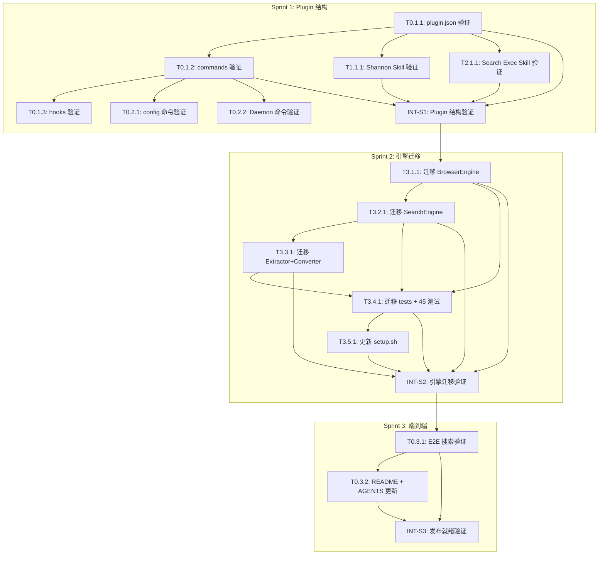

# ZeroSearch v0.4 — 任务清单 (Tasks)

**架构版本**: `.anws/v4`
**生成日期**: 2026-05-22
**关联 PRD**: `.anws/v4/01_PRD.md`
**关联架构**: `.anws/v4/02_ARCHITECTURE_OVERVIEW.md`

---

## 📊 Sprint 路线图

| Sprint | 代号 | 核心任务 | 退出标准 | 预估 |
|--------|------|---------|---------|:--:|
| S1 | Plugin 结构 | S0+S1+S2 文件验证 | plugin.json 结构合法 + 4 命令独立可读 + 2 Skills 内容完整 | 2-3h |
| S2 | 引擎迁移 | S3 代码迁移 + 测试回归 | 全部 45 个 v0.3 测试通过 + setup.sh 可用 | 4-6h |
| S3 | 端到端 | E2E 搜索验证 + 文档更新 | `/zerosearch:zerosearch` 完整搜索链路可运行 + README 更新 | 2-3h |
| S4 | 反检测加固 | 反检测漏洞修复 + Bug 修复 | 126 tests pass + 9 类 JS 覆盖 + 14 flags + 文档同步 | 3-4h |

**总预估工时**: 11-16h (2-3 工作日)

---

## 🗺️ 依赖图总览

---

## System 0: Plugin Framework (插件框架)

> **关联**: `02_ARCHITECTURE_OVERVIEW.md` §2 System 0
> **涉及需求**: REQ-020, REQ-021, REQ-025, REQ-026

### Phase 1: Foundation — 插件结构就位

- [x] **T0.1.1** [REQ-020]: 验证 plugin.json 结构合法性
  - **描述**: 验证 `.claude-plugin/plugin.json` 符合 Claude Code Plugin 规范（name、version、description），命名空间为 `zerosearch`
  - **输入**: `.anws/v4/02_ARCHITECTURE_OVERVIEW.md` §8 物理结构, `.anws/v4/03_ADR/ADR_003_PLUGIN_ARCHITECTURE.md`
  - **输出**: plugin.json 验证通过（`claude plugin validate` 或手动对照官方文档结构检查）
  - **验收标准**:
    - [ ] `name` 字段为 `zerosearch` (kebab-case)
    - [ ] `version` 字段为合法 semver `0.4.0`
    - [ ] `.claude-plugin/` 目录仅含 `plugin.json`（不含 commands/skills/hooks）
  - **验证类型**: 手动验证
  - **验证说明**: 对照 `code.claude.com/docs/en/plugins` 官方文档检查 manifest schema；`jq . .claude-plugin/plugin.json` 确认 JSON 合法
  - **估时**: 0.5h
  - **依赖**: 无
  - **优先级**: P0

- [x] **T0.1.2** [REQ-021]: 验证 4 个命令文件完整性
  - **描述**: 验证 `commands/` 下 4 个命令文件（zerosearch、zerosearch-config、zerosearch-start、zerosearch-stop）均包含必要 frontmatter + 执行步骤
  - **输入**: `.anws/v4/01_PRD.md` US-021 验收标准, `.anws/v4/02_ARCHITECTURE_OVERVIEW.md` §2 System 0
  - **输出**: 4 个命令文件验证清单（frontmatter 字段完整、执行步骤清晰、allowed-tools 合理）
  - **验收标准**:
    - [ ] 每个命令含 `name`、`description`、`allowed-tools` frontmatter
    - [ ] `/zerosearch:zerosearch` 含 How It Works + 首次运行检测 + 5 步执行流程
    - [ ] `/zerosearch:zerosearch-config` 含 AskUserQuestion 3 选项引导
    - [ ] `/zerosearch:zerosearch-start/stop` 含 Daemon 启停逻辑
    - [ ] 所有 Bash 引用指向 `src/search/run.py`（非 scripts/）
  - **验证类型**: 手动验证
  - **验证说明**: 逐个读取 4 个命令文件，检查 frontmatter 完整性 + Bash 引用路径正确性
  - **估时**: 1h
  - **依赖**: T0.1.1
  - **优先级**: P0

- [x] **T0.1.3** [基础]: 验证 hooks.json 格式 + Hook 脚本
  - **描述**: 验证 `hooks/hooks.json` 符合官方格式（含外层 `"hooks"` 键），确认 Hook 脚本可执行
  - **输入**: `code.claude.com/docs/en/plugins` Hook 迁移指南, `.anws/v4/07_CHALLENGE_REPORT.md` CH-03
  - **输出**: hooks.json 格式验证通过 + `post-install.sh` 可执行 + `check_daemon.py` 可运行
  - **验收标准**:
    - [ ] `hooks.json` 含外层 `"hooks"` 键包装所有事件处理器
    - [ ] `PostToolUse` 匹配 `Bash.*setup\\.sh` 正则正确
    - [ ] `SessionStart` 调用 `check_daemon.py` 路径使用 `${CLAUDE_PLUGIN_ROOT}`
    - [ ] `hooks/scripts/post-install.sh` 有执行权限
    - [ ] `scripts/check_daemon.py` 语法正确 (`python3 -c "import py_compile; py_compile.compile('scripts/check_daemon.py', doraise=True)"`)
  - **验证类型**: 编译检查 + 手动验证
  - **验证说明**: `jq . hooks/hooks.json` 确认 JSON 合法 + `chmod +x hooks/scripts/post-install.sh` + Python 编译检查
  - **估时**: 0.5h
  - **依赖**: T0.1.2
  - **优先级**: P0

### Phase 2: Integration — 命令交互验证

- [x] **T0.2.1** [REQ-025]: 验证 zerosearch-config 交互流程
  - **描述**: 验证 `commands/zerosearch-config.md` 的 AskUserQuestion 流程覆盖 Profile 选择 + 默认搜索工具注册 + config.json 写入
  - **输入**: `.anws/v4/01_PRD.md` US-025 验收标准, `commands/zerosearch-config.md`
  - **输出**: 配置命令验证报告（3 个 AskUserQuestion dialog 正确）
  - **验收标准**:
    - [ ] Profile 选择：A/B/C 三选项描述清晰
    - [ ] 默认搜索注册：用户级/项目级/否三选项描述清晰
    - [ ] 配置结果写入路径 `~/.cache/zerosearch/config.json` 明确
  - **验证类型**: 手动验证
  - **验证说明**: 阅读 `commands/zerosearch-config.md` 对照 PRD US-025 验收标准逐条检查
  - **估时**: 0.5h
  - **依赖**: T0.1.2
  - **优先级**: P1

- [x] **T0.2.2** [REQ-026]: 验证 Daemon 命令功能完整性
  - **描述**: 验证 `commands/zerosearch-start.md` 和 `zerosearch-stop.md` 覆盖启停全流程（状态检测、幂等、SIGTERM→SIGKILL 降级）
  - **输入**: `.anws/v4/01_PRD.md` US-026 验收标准, `commands/zerosearch-start.md`, `commands/zerosearch-stop.md`
  - **输出**: Daemon 命令验证报告（启停幂等 + 错误处理完整）
  - **验收标准**:
    - [ ] start: 已运行→提示 + 退出码0；未运行→冷启动
    - [ ] stop: 已运行→SIGTERM→3s→SIGKILL + 清理状态文件；未运行→提示 + 退出码0
    - [ ] 两个命令均引用 `src/search/run.py --start/--stop`
  - **验证类型**: 手动验证
  - **验证说明**: 对比 v0.3 SKILL.md (已废弃) 中 Daemon Management 节的行为描述，检查是否一致
  - **估时**: 0.5h
  - **依赖**: T0.1.2
  - **优先级**: P2

---

## System 1: Shannon Strategy Skill (香农搜索策略)

> **关联**: `02_ARCHITECTURE_OVERVIEW.md` §2 System 1
> **涉及需求**: REQ-022

### Phase 1: Foundation — 策略内容完整

- [x] **T1.1.1** [REQ-022]: 验证 Shannon Strategy SKILL.md 内容完整性
  - **描述**: 确认 `skills/shannon-strategy/SKILL.md` 完整覆盖 `搜索策略/快速搜索策略.md` 的全部内容（9 个章节），作为 Claude 可消费的搜索策略 Skill
  - **输入**: `搜索策略/快速搜索策略.md`（源文档）, `.anws/v4/01_PRD.md` US-022 验收标准
  - **输出**: 内容覆盖检查清单（9/9 章节通过）
  - **验收标准**:
    - [ ] 核心原则（关键词不怕错，就怕太普通）✅
    - [ ] 香农信息论速查（自信息/联合信息/条件熵公式）✅
    - [ ] 迭代搜索法（贝叶斯更新流程）✅
    - [ ] 关键词设计速查（高信息量 vs 低信息量表）✅
    - [ ] 组合搜索技巧（山楂糕枣泥饼案例）✅
    - [ ] 迭代优化策略（Round 1→2→3 + 终止条件）✅
    - [ ] 语言匹配原则（4 行对照表）✅
    - [ ] 容错性（马都工/马杜工案例）✅
    - [ ] Skill frontmatter 含触发词（搜索、search、查一下等）✅
  - **验证类型**: 手动验证
  - **验证说明**: 逐章对比 `skills/shannon-strategy/SKILL.md` 与 `搜索策略/快速搜索策略.md`，确认无删减
  - **估时**: 0.5h
  - **依赖**: T0.1.1
  - **优先级**: P0

---

## System 2: Search Execution Skill (搜索执行)

> **关联**: `02_ARCHITECTURE_OVERVIEW.md` §2 System 2
> **涉及需求**: REQ-023, REQ-024

### Phase 1: Foundation — 执行编排完整

- [x] **T2.1.1** [REQ-023]: 验证 Search Execution SKILL.md 内容完整性
  - **描述**: 确认 `skills/search-execution/SKILL.md` 包含 Rate Limiting、5 步执行流程、6 级退出码处理、CAPTCHA 操作指引、Output Format 示例
  - **输入**: `.anws/v4/01_PRD.md` US-023/024 验收标准, `.anws/v4/07_CHALLENGE_REPORT.md` CH-12/14/15
  - **输出**: 内容覆盖检查清单（8/8 项通过）
  - **验收标准**:
    - [ ] Rate Limiting 节（3 秒间隔 + LRU 缓存说明）✅
    - [ ] Step 1: LRU 缓存检查逻辑 ✅
    - [ ] Step 2: Daemon 状态检测（冷启动/热连接分支）✅
    - [ ] Step 3: `src/search/run.py --query` CLI 调用 ✅
    - [ ] Step 4: 6 级退出码表含 CAPTCHA 操作指引 ✅
    - [ ] Step 5: Output Format 示例（AI 回答 + Sources 脚注）✅
    - [ ] 引擎内部流程说明（BrowserEngine→Extractor→Converter）✅
    - [ ] Skill frontmatter 含 `name: search-execution` ✅
  - **验证类型**: 手动验证
  - **验证说明**: 逐节阅读 `skills/search-execution/SKILL.md` 对照清单检查
  - **估时**: 0.5h
  - **依赖**: T0.1.1
  - **优先级**: P0

---

## Sprint 1 集成验证

- [x] **INT-S1** [MILESTONE]: S1 集成验证 — Plugin 结构就位
  - **描述**: 验证 S1 退出标准：plugin.json 结构合法 + 4 命令独立可读 + 2 Skills 内容完整
  - **输入**: T0.1.1, T0.1.2, T0.1.3, T1.1.1, T2.1.1, T0.2.1, T0.2.2 产出
  - **输出**: S1 集成验证报告（PASS/FAIL + 问题清单）
  - **验收标准**:
    - [ ] `.claude-plugin/plugin.json` 结构合法（name=zerosearch, version=0.4.0）
    - [ ] 4 个命令文件 frontmatter 完整 + Bash 引用路径正确
    - [ ] `hooks/hooks.json` 格式正确（含外层 "hooks" 键）
    - [ ] Shannon Strategy SKILL.md 覆盖 9 章节（vs 快速搜索策略.md）
    - [ ] Search Execution SKILL.md 覆盖 8 项（Rate Limiting + 5 步流程 + CAPTCHA + Output）
    - [ ] 所有文件路径使用 `${CLAUDE_PLUGIN_ROOT}` 或正确相对路径
  - **验证类型**: 冒烟测试
  - **验证说明**: 
    1. `jq . .claude-plugin/plugin.json` 确认 JSON 合法
    2. `ls commands/ skills/shannon-strategy/SKILL.md skills/search-execution/SKILL.md hooks/hooks.json` 确认文件存在
    3. `grep -r "scripts/" commands/ skills/` 确认无残留 scripts/ 引用
    4. 逐条核对 S1 退出标准
  - **估时**: 1h
  - **依赖**: T0.1.1, T0.1.2, T0.1.3, T1.1.1, T2.1.1, T0.2.1, T0.2.2

---

## System 3: Engine Runtime (引擎运行时)

> **关联**: `02_ARCHITECTURE_OVERVIEW.md` §2 System 3
> **涉及需求**: REQ-027
> **⚠️ 核心约束**: 零逻辑修改 — 仅做路径迁移 + import 更新

### Phase 1: BrowserEngine 迁移

- [x] **T3.1.1** [REQ-027]: 迁移 BrowserEngine + 更新 import 路径
  - **描述**: 将 `src/browser/` 从 v0.3 工作树迁移到 Plugin 的 `src/browser/` 目录，更新所有 Python import 路径使其能在 Plugin 目录下正确导入
  - **输入**: v0.3 `src/browser/daemon.py` 和 `src/browser/daemon_state.py`（当前位于 feature/v0.4 分支的 `src/browser/`）, `.anws/v4/03_ADR/ADR_002_DAEMON_CDP.md`
  - **输出**: `src/browser/daemon.py` + `src/browser/daemon_state.py` import 路径更新后版本
  - **📎 参考**: `.anws/v4/03_ADR/ADR_002_DAEMON_CDP.md` — CDP 连接策略
  - **验收标准**:
    - [ ] `src/browser/daemon.py` 和 `daemon_state.py` 的 import 路径从 `from src.browser...` 更新为 Plugin 内相对导入
    - [ ] `src/browser/daemon_state.py` 中的 `DAEMON_STATE_PATH` 常量指向 `~/.cache/zerosearch/daemon.json`（与 v0.3 一致）
    - [ ] 所有 import 可被 Python 解释器在 `src/` 为根目录时解析
    - [ ] 不做任何业务逻辑修改（diff 与 v0.3 比对仅含 import 路径变更）
  - **验证类型**: 编译检查
  - **验证说明**: `python3 -c "from src.browser.daemon import ..."` 或在 `src/` 目录下 `python3 -m browser.daemon` 检查导入无 ModuleNotFoundError；`git diff main -- src/browser/` 确认仅 import 变更
  - **估时**: 1.5h
  - **依赖**: INT-S1
  - **优先级**: P0

### Phase 2: SearchEngine 迁移

- [x] **T3.2.1** [REQ-027]: 迁移 SearchEngine + 更新 import 路径
  - **描述**: 将 `src/search/` 下 engine.py、cache.py、errors.py、cli.py、run.py 迁移到 Plugin 目录，更新所有跨模块 import 路径
  - **输入**: v0.3 `src/search/*.py`, `.anws/v4/01_PRD.md` §8 非功能需求（性能/缓存要求）
  - **输出**: `src/search/` 下 5 个文件 import 路径更新后版本
  - **验收标准**:
    - [ ] `engine.py`: `from src.browser...` → Plugin 内相对导入
    - [ ] `cache.py`: 零外部依赖变更（仅 `OrderedDict` + `time` 标准库）
    - [ ] `errors.py`: 6 级退出码常量定义不变
    - [ ] `cli.py`: `_setup_import_path()` 中的 `parent.parent` 回溯深度适配 Plugin 目录
    - [ ] `run.py`: venv 包装逻辑不变，项目根定位逻辑适配 Plugin 结构
    - [ ] 不做任何业务逻辑修改
  - **验证类型**: 编译检查
  - **验证说明**: 对每个 .py 文件执行 `python3 -c "import py_compile; py_compile.compile('src/search/<file>', doraise=True)"`；`git diff main -- src/search/` 确认仅 import 变更
  - **估时**: 2h
  - **依赖**: T3.1.1
  - **优先级**: P0

### Phase 3: Extractor + Converter 迁移

- [x] **T3.3.1** [REQ-027]: 迁移 ContentExtractor + MarkdownConverter + 更新 import 路径
  - **描述**: 将 `src/extractor/extractor.py` 和 `src/converter/converter.py` 迁移到 Plugin 目录，更新 import 路径。这两个模块无跨系统 Python import 依赖（仅依赖 BeautifulSoup4 和 html-to-markdown 外部库），迁移最轻量
  - **输入**: v0.3 `src/extractor/extractor.py`, `src/converter/converter.py`
  - **输出**: `src/extractor/extractor.py` + `src/converter/converter.py` import 路径更新后版本
  - **验收标准**:
    - [ ] `extractor.py`: 17 选择器 + 90+ 去噪模式逻辑不变
    - [ ] `converter.py`: HTML→MD 三库 Fallback 逻辑不变
    - [ ] 两个文件的 import 路径适配 Plugin 目录
    - [ ] 不做任何业务逻辑修改
  - **验证类型**: 编译检查
  - **验证说明**: `python3 -c "from src.extractor.extractor import ...; from src.converter.converter import ..."` 导入检查；`git diff` 确认仅 import 变更
  - **估时**: 1h
  - **依赖**: T3.2.1
  - **优先级**: P0

### Phase 4: 测试回归

- [x] **T3.4.1** [REQ-027]: 迁移 tests/ 并运行全部 45 个测试
  - **描述**: 将 v0.3 的 `tests/` 目录迁移到 Plugin 目录，更新测试文件中的 import 路径，运行 `pytest` 确保 45 个测试全部通过
  - **输入**: v0.3 `tests/` 全部文件（45 tests）, `.anws/v4/01_PRD.md` US-027 验收标准
  - **输出**: pytest 报告（45/45 PASS）+ 修复的测试 import 路径
  - **验收标准**:
    - [ ] 所有测试文件的 import 路径适配 Plugin 目录
    - [ ] `python -m pytest tests/ -v` 全部 45 个测试通过
    - [ ] 无 skip/xfail 增长（与 v0.3 基线对比）
  - **验证类型**: 回归测试
  - **验证说明**: `python -m pytest tests/ -v --tb=short` 输出 45 passed；如有失败，修复后重新运行直到全绿
  - **估时**: 1.5h
  - **依赖**: T3.1.1, T3.2.1, T3.3.1
  - **优先级**: P0

### Phase 5: 安装脚本更新

- [x] **T3.5.1** [基础]: 更新 setup.sh 为 Plugin 模式安装流程
  - **描述**: 更新 `setup.sh` 支持 Plugin 模式安装（保留 Standalone 兼容）。增加 Plugin 安装步骤说明、venv 创建确认、Chrome 检测
  - **输入**: v0.3 `setup.sh`, `.anws/v4/01_PRD.md` §5 与 v0.3 的关系
  - **输出**: 更新后的 `setup.sh`
  - **验收标准**:
    - [ ] `setup.sh` 创建 `.venv` + pip install -r requirements.txt
    - [ ] `setup.sh` 检测 Chrome 安装并提示
    - [ ] `setup.sh` 输出 Plugin 模式使用说明（`claude --plugin-dir ./`）
    - [ ] `setup.sh` 保留 Standalone 模式兼容性
    - [ ] `setup.sh` 可重复执行（幂等）
  - **验证类型**: 手动验证
  - **验证说明**: `bash setup.sh` 执行后检查 `.venv/bin/python` 存在 + `python -m patchright --version` 正常 + 输出含 Plugin 使用说明
  - **估时**: 1h
  - **依赖**: T3.4.1
  - **优先级**: P1

---

## Sprint 2 集成验证

- [x] **INT-S2** [MILESTONE]: S2 集成验证 — 引擎迁移完成
  - **描述**: 验证 S2 退出标准：全部 45 个 v0.3 测试通过 + setup.sh 可用 + CLI 入口可执行
  - **输入**: T3.1.1, T3.2.1, T3.3.1, T3.4.1, T3.5.1 产出
  - **输出**: S2 集成验证报告（PASS/FAIL + 性能基线对比）
  - **验收标准**:
    - [ ] `python -m pytest tests/ -v` 45/45 passed（零失败）
    - [ ] `bash setup.sh` 成功创建 venv + 安装依赖
    - [ ] `python src/search/run.py --help` 输出帮助信息（验证 CLI 入口可执行）
    - [ ] `python src/search/run.py --query "test" --save --debug` 不报 ModuleNotFoundError（不要求搜索成功，只验证引擎可启动）
    - [ ] `git diff main -- src/` 确认仅 import 变更 + setup.sh 更新
  - **验证类型**: 回归测试 + 冒烟测试
  - **验证说明**:
    1. 运行全量测试套件 `pytest tests/ -v --tb=short`，断言 45 passed
    2. 执行 `bash setup.sh`，检查退出码 0 + venv 创建
    3. `git diff main --stat` 确认变更文件范围在预期内
    4. 如有测试失败，记录并触发修复波次
  - **估时**: 1.5h
  - **依赖**: T3.4.1, T3.5.1

---

## Sprint 3: 端到端验证

### Phase 1: 搜索功能验证

- [x] **T0.3.1** [REQ-024]: E2E 搜索链路验证
  - **描述**: 在 Claude Code 中加载 Plugin（`--plugin-dir`），验证完整的搜索链路：`/zerosearch:zerosearch <query>` → Shannon 策略优化 → Google AI Mode 搜索 → 结构化结果返回
  - **输入**: `.anws/v4/01_PRD.md` US-024 验收标准, INT-S2 产出（引擎就位）
  - **输出**: E2E 测试报告（搜索成功 + 输出格式正确 + 性能达标）
  - **验收标准**:
    - [ ] Plugin 可被 Claude Code 加载（`claude --plugin-dir ./` 后 `/zerosearch:zerosearch` 出现在 `/help` 中）
    - [ ] 执行 `/zerosearch:zerosearch React hooks 2026` 返回 AI 综合回答 + Sources 脚注
    - [ ] 首次搜索冷启动 ≤5s（或报 CAPTCHA→用户手动验证后完成）
    - [ ] 第二次搜索热连接 <1s（复用 Daemon）
    - [ ] 缓存命中 <1ms（相同查询再次搜索）
    - [ ] Daemon 命令可用：`/zerosearch:zerosearch-stop` 关闭 Chrome
  - **验证类型**: E2E 测试
  - **验证说明**: 在 Claude Code 会话中逐步执行所有命令，记录耗时和输出；截图/录屏留存；如遇 CAPTCHA，验证 Ctrl+C 继续提取流程
  - **估时**: 1.5h
  - **依赖**: INT-S2
  - **优先级**: P0

### Phase 2: 文档收尾

- [x] **T0.3.2** [基础]: README + AGENTS.md 最终更新
  - **描述**: 确认 README.md 安装和使用文档与 Plugin 模式一致；更新 AGENTS.md 中版本号和任务完成状态
  - **输入**: `.anws/v4/05_TASKS.md`（本文件）, `README.md`, `AGENTS.md`
  - **输出**: 最终版 README.md + AGENTS.md
  - **验收标准**:
    - [ ] README 快速开始节描述的 Plugin 安装流程与实际一致
    - [ ] README 故障排查表完整（8 行）
    - [ ] README 命令表使用正确的命名空间前缀（`/zerosearch:xxx`）
    - [ ] AGENTS.md 当前状态反映 Sprint 完成情况
    - [ ] AGENTS.md 删除 `SKILL.md.deprecated` 引用
  - **验证类型**: 手动验证
  - **验证说明**: 逐项检查 README + AGENTS.md 内容一致性
  - **估时**: 0.5h
  - **依赖**: T0.3.1
  - **优先级**: P1

---

## Sprint 3 集成验证

- [x] **INT-S3** [MILESTONE]: S3 集成验证 — 发布就绪
  - **描述**: 验证 S3 退出标准：完整搜索链路可运行 + 文档反映实际状态 + 无已知阻塞 Bug
  - **输入**: T0.3.1, T0.3.2 产出
  - **输出**: S3 集成验证报告（PASS/FAIL + 发布检查清单）
  - **验收标准**:
    - [ ] 搜索链路 E2E 通过（含冷启动/热搜索/缓存命中三场景）
    - [ ] 4 个命令均可在 Claude Code 中触发
    - [ ] README.md 安装/使用/故障排查文档与实际行为一致
    - [ ] 清单中所有 [x] 任务均为实际完成（无未经验证的勾选）
    - [ ] `git status` 无意外未追踪文件（排除 `results/`）
  - **验证类型**: 冒烟测试 + 手动验证
  - **验证说明**:
    1. 逐条执行 S3 退出标准
    2. 最终检查 `git diff main --stat` 确认变更范围
    3. 生成发布检查清单（README、LICENSE、.gitignore、plugin.json 完整）
  - **估时**: 1h
  - **依赖**: T0.3.1, T0.3.2

---

## 🎯 User Story Overlay

### US-020: Plugin 脚手架替换 SKILL.md (P0)
**涉及任务**: T0.1.1 → T0.1.2 → T0.1.3
**关键路径**: T0.1.1 → T0.1.2
**独立可测**: ✅ S1 结束即可验证（plugin.json + commands + hooks + skills 结构就位）
**覆盖状态**: ✅ 完整

### US-021: 模块化命令分离 (P0)
**涉及任务**: T0.1.2 → T0.2.1 → T0.2.2
**关键路径**: T0.1.2 → T0.2.1
**独立可测**: ✅ S1 结束即可验证（4 命令独立文件存在且交互正确）
**覆盖状态**: ✅ 完整

### US-022: 香农搜索策略 Skill (P0)
**涉及任务**: T1.1.1
**关键路径**: T1.1.1
**独立可测**: ✅ S1 结束即可验证（对照快速搜索策略.md 逐章比对）
**覆盖状态**: ✅ 完整

### US-023: Google AI Mode 执行 Skill (P0)
**涉及任务**: T2.1.1
**关键路径**: T2.1.1
**独立可测**: ✅ S1 结束即可验证（8 项内容清单逐条通过）
**覆盖状态**: ✅ 完整

### US-024: 统一搜索入口 (P0)
**涉及任务**: T2.1.1 → INT-S2 → T0.3.1
**关键路径**: INT-S2 → T0.3.1
**独立可测**: ✅ S3 结束即可验证（E2E 搜索链路）
**覆盖状态**: ✅ 完整

### US-025: 搜索配置管理 (P1)
**涉及任务**: T0.2.1
**关键路径**: T0.2.1
**独立可测**: ✅ S1 结束即可验证（AskUserQuestion 三选项交互）
**覆盖状态**: ✅ 完整

### US-026: Daemon 手动控制 (P2)
**涉及任务**: T0.2.2
**关键路径**: T0.2.2
**独立可测**: ✅ S1 结束即可验证（启停行为与 v0.3 一致）
**覆盖状态**: ✅ 完整

### US-027: v0.3 代码零破坏迁移 (P0)
**涉及任务**: T3.1.1 → T3.2.1 → T3.3.1 → T3.4.1 → T3.5.1
**关键路径**: T3.1.1 → T3.2.1 → T3.4.1
**独立可测**: ✅ S2 结束即可验证（45/45 测试通过 + git diff 确认仅 import 变更）
**覆盖状态**: ✅ 完整

---

## 📊 任务统计

| 指标 | 数值 |
|------|:--:|
| 总任务数 | 18 |
| 已完成 | 9 (S1 全部) |
| P0 任务 | 9 |
| P1 任务 | 3 |
| P2 任务 | 1 |
| 里程碑 (INT) | 3 |
| Sprint 数 | 3 |
| 总预估剩余工时 | 9h |

**当前进度**: S1-S4 全部完成。反检测增强已就位。

---

## Sprint 4: 反检测加固 + Bug 修复

> **关联**: `07_CHALLENGE_REPORT.md` Round 5 (CH-32~CH-38)
> **触发**: v0.4 发布前 Code Review 发现 3 类反检测漏洞 + 6 个 Bug

### Phase 1: Daemon 反检测配置补全

- [x] **T4.1.1** [REQ-027]: daemon_runner.py 反检测配置与 browser_factory.py 对齐
  - **描述**: Daemon 模式下 Chrome 缺少 `ignore_default_args`、`locale`、`viewport`、`geolocation`、`extra_http_headers`，导致 `--enable-automation` 标记未移除
  - **输入**: `src/browser/stealth.py` StealthConfig, `src/browser/daemon_runner.py`
  - **输出**: daemon_runner 使用 StealthConfig 实例构建 launch_persistent_context 参数
  - **验收标准**:
    - [ ] `ignore_default_args` 传递给 launch_persistent_context ✅
    - [ ] `**stealth.to_context_kwargs()` 展开传递 ✅
    - [ ] 新增 TestDaemonRunnerStealthParity 2 tests ✅

### Phase 2: 反指纹脚本注入 (init_script)

- [x] **T4.2.1** [REQ-027]: StealthUtils 新增 get_init_script() 反指纹 JS 注入
  - **描述**: 通过 page.add_init_script() 注入 JS，覆盖 9 类浏览器指纹 API
  - **覆盖向量**: plugins, permissions, hardwareConcurrency, WebGL 1+2, chrome.runtime, Canvas, AudioContext, deviceMemory, screen
  - **输入**: `src/browser/stealth.py`, puppeteer-extra-plugin-stealth evasion 清单
  - **输出**: `_FINGERPRINT_SCRIPT_TEMPLATE` + `get_init_script()` 方法
  - **验收标准**:
    - [ ] TestFingerprintScriptInjection 11 tests ✅
    - [ ] hwConcurrency 每次调用随机化 ✅
    - [ ] navigator.plugins 正确赋值 ✅
    - [ ] WebGL 1.0 + 2.0 均覆盖 ✅
    - [ ] Permissions 存在性守卫 ✅

- [x] **T4.2.2** [REQ-027]: engine.py 搜索流水线注入 init_script
  - **描述**: `_run_search_pipeline` 中 page 创建后调用 `page.add_init_script(StealthUtils.get_init_script())`
  - **输入**: `src/search/engine.py`
  - **输出**: 每次搜索前自动注入反指纹脚本
  - **验收标准**:
    - [ ] `add_init_script` 出现在 engine.py ✅
    - [ ] StealthUtils 模块级导入 ✅

### Phase 3: 行为层增强

- [x] **T4.3.1** [REQ-027]: 视口随机化
  - **描述**: StealthConfig.viewport 从固定 1280x800 改为每次实例化随机
  - **输入**: `src/browser/stealth.py`
  - **输出**: 随机范围 1024-1920 × 768-1080
  - **验收标准**: TestViewportRandomization 3 tests ✅

- [x] **T4.3.2** [REQ-027]: 搜索间 jitter
  - **描述**: SearchEngine.search() 非缓存命中时注入 500-2000ms 随机延迟
  - **输入**: `src/search/engine.py`
  - **输出**: 缓存快速通过，非缓存搜索有间隔
  - **验收标准**: TestSearchJitter 2 tests ✅

- [x] **T4.3.3** [REQ-027]: BROWSER_ARGS 扩充 6→14
  - **描述**: 增加后台服务抑制、Keychain 绕过、IPC 抑制、合并 disable-features
  - **输入**: `src/browser/stealth.py`
  - **输出**: 14 个 flag，`--disable-features` 合并为一条
  - **验收标准**: TestBrowserArgsCompleteness 6 tests ✅

### Phase 4: Bug 修复

- [x] **T4.4.1** [Bug Fix]: CAPTCHA 等待循环增加 page.is_closed() 检测
  - **描述**: 用户关窗后自动退出，不再无限等待；缩短超时 600s→60s；增加自动重检
  - **验收标准**: TestCaptchaWaitResilience 3 tests ✅

- [x] **T4.4.2** [Bug Fix]: init_script Bug 修复（6 项）
  - **描述**: hwConcurrency 固化、navigator.plugins 未赋值、Permissions 无守卫、WebGL2 缺失、StealthUtils 作用域错误、步骤编号重复
  - **验收标准**: 新增 5 tests（含 false positive 修正），全量 126 passed ✅

### Phase 5: 文档同步

- [x] **T4.5.1**: 设计文档同步反检测增强
  - **描述**: PRD §5 表格更新、NG7 修正、测试数 45→126、架构文档增加反检测层次表、05_TASKS 增加 S4
  - **验收标准**:
    - [ ] PRD NG7 反映真实变更 ✅
    - [ ] PRD 测试数 45→126 ✅
    - [ ] Architecture §2 增加反检测层次表 ✅
    - [ ] Architecture §8 物理结构补全 ✅

---

## 📊 任务统计 (更新)

| 指标 | 数值 |
|------|:--:|
| 总任务数 | 27 (原 18 + S4 9) |
| 已完成 | 27 (S1-S4 全部) |
| P0 任务 | 9 |
| P1 任务 | 3 |
| P2 任务 | 1 |
| 里程碑 (INT) | 3 |
| Sprint 数 | 4 |
| 总测试数 | 126 (97 原有 + 29 增强) |
